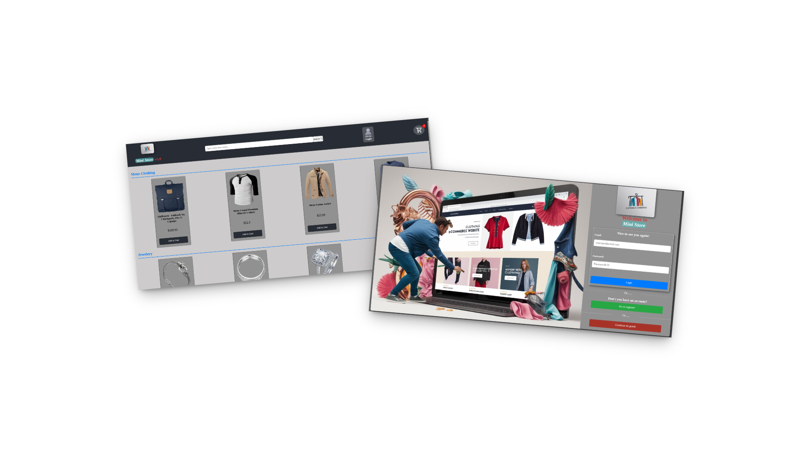

# Mini-Store E-Commerce Application
## Preview



  
A modern React-based shopping platform with Redux state management and responsive design.

## 📋 Table of Contents
- [System Architecture](#-system-architecture)
- [Core Components](#-core-components)
- [Tech Stack](#-tech-stack)
- [Features](#-features)
- [Installation](#-installation)
- [Documentation](#-documentation)

## 🏗 System Architecture
Single-Page Application (SPA) with:
- Client-side routing (React Router)
- Centralized state management (Redux Toolkit)
- Component-based UI structure
- REST API integration (Fake Store API)

## 🧩 Core Components
| Component | Purpose |
|-----------|---------|
| `Login/Register` | User authentication flows |
| `ProductList` | Displays catalog with search/filter |
| `Cart` | Manages shopping cart operations |
| `Checkout` | Handles purchase workflow |
| `Header` | Global navigation with cart toggle |

**Custom Hooks:**
- `useAuth` - Authentication logic
- `useProduct` - Product data fetching
- `useCart` - Cart operations

## 🛠 Tech Stack

**Frontend:**
- React 18 (Functional Components + Hooks)
- Redux Toolkit (State Management)
- Styled Components (CSS-in-JS)
- React Router v6 (Navigation)

**Backend Integration:**
- Fake Store API (Product data)
- Redux Persist (LocalStorage)

**Tooling:**
- Create React App (Boilerplate)
- Jest + React Testing Library (Testing)
- GitHub Pages (Deployment)

## ✨ Features

### 🔐 User Authentication
```jsx
// Example auth slice
const authSlice = createSlice({
  name: 'auth',
  initialState: { isLoggedIn: false },
  reducers: {
    login: (state) => { state.isLoggedIn = true }
  }
})
```

>[!Note]
>You can check the full documentation [Here](https://deepwiki.com/YisusDU/ebac-ea-third-proyect/1-overview)
