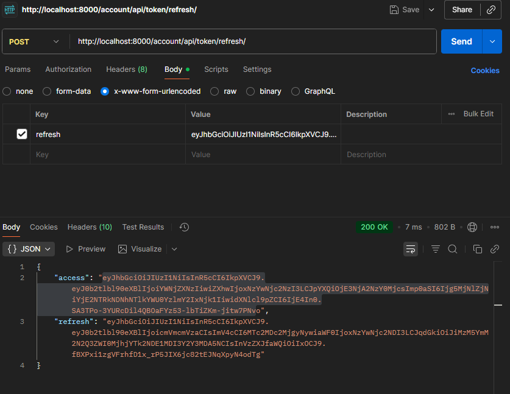
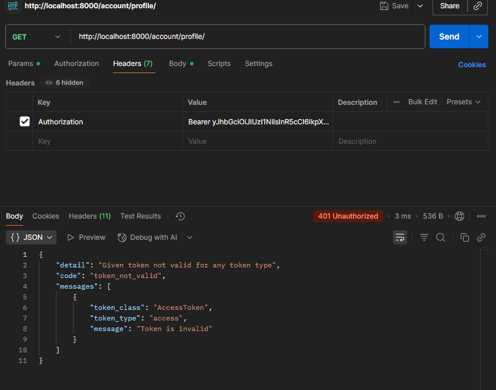

## ¿Qué tal practicar?

#### ¡Bienvenidos a la actividad práctica del módulo!

**Objetivo**

El objetivo de esta actividad es que implementes la autenticación para tu eCommerce de tal forma que solo el usuario pueda ver su perfil de usuario.

**Paso a paso:**

* Elige uno de los 2 tipos de autenticación con token que vimos:
  * TokenAuthentication
  * JWTAuthentication
* Crea una vista donde cada usuario pueda ver los datos de su perfil de usuario.
* Protege está vista usando autenticación y permisos de tal forma que solo usuarios que hayan hecho login puedan verla y que muestre solo el perfil del usuario logueado.
* Realiza distintas pruebas para asegurarte que funciona a la perfección, haz pruebas con distintos usuarios y también sin estar logueado.
* Añade el código de tu proyecto de Github con el nombre “Autenticación en Django Rest Framework”.
* En un archivo de Word pon el link a tu repositorio y copia y pega el código que creaste en VSCode.

**¿Cómo presentar su entrega?**

Un Word con los siguientes puntos:

* Link a tu repositorio de Github con el Jupyter Notebook
* Copia y pega tu código en el archivo de Word

**Tiempo estimado de resolución: **120 minutos

---

## Comenzando

### 08-practice-m64\requirements.txt

Lo primero que hicimos fue agregar la dependencia necesaria para la autenticación por JWT

```toml
asgiref==3.9.1
Django==5.2.6
pillow==11.3.0
sqlparse==0.5.3
tzdata==2025.2
djangorestframework==3.16.1
djangorestframework-simplejwt==5.5.1
```

Y corremos los comandos para crear el ambiente virtual

```
powershell -ExecutionPolicy Bypass
python -m venv .venv
pip install -r requirements.txt
.\.venv\Scripts\Activate
cd .\ecommerce_project\
```

### ecommerce_project\ecommerce_project\settings.py

En actividades pasadas, cree una app llamada user que sólo contenía el serializer, en esta ocasión la vamos a aprovechar

Agregamos la configuración de JWT en settings, adicionalmente, descomentamos el renderer JSON

```python
# Application definition

INSTALLED_APPS = [
    "rest_framework",
    "django.contrib.admin",
    "django.contrib.auth",
    "django.contrib.contenttypes",
    "django.contrib.sessions",
    "django.contrib.messages",
    "django.contrib.staticfiles",
    "api",
    "address",
    "billing_profile",
    "cart",
    "order",
    "product",
    "users" # <-- add this new app
]

# Configuración de Django REST Framework
REST_FRAMEWORK = {
    'DEFAULT_RENDERER_CLASSES': [
        'rest_framework.renderers.JSONRenderer',
    ]
}

REST_FRAMEWORK = {
    'DEFAULT_AUTHENTICATION_CLASSES': [
        'rest_framework_simplejwt.authentication.JWTAuthentication',
    ]
}

SIMPLE_JWT = {
    "ROTATE_REFRESH_TOKENS": True,
}
```

### \ecommerce_project\ecommerce_project\urls.py

Añadimos los urls locales de user a los globales

```python
urlpatterns = [
    path("admin/", admin.site.urls),
    path("sales/", include("sales.urls")),
    path("register/", include("forms.urls")),
    path("products/", include("product.urls")), 
    path("api/v1/", include("api.urls")),
    path("account/", include("users.urls")) # <--- add the urls from user
]

```

### \ecommerce_project\users\views.py

Creamos la base para la vista, el logout, registro para que acepte el token y la vista del usuario

```python
from rest_framework.decorators import api_view
from rest_framework.response import Response
from rest_framework.authtoken.models import Token 
from rest_framework import status  
from rest_framework_simplejwt.tokens import RefreshToken

from .serializers import UserSerializer
from rest_framework import generics
from rest_framework.permissions import IsAuthenticated 


@api_view(['POST'])
def registration_view(request):

    if request.method == "POST":
        serializer = UserSerializer(data=request.data)

        data = {}


        if serializer.is_valid():
            account = serializer.save()
            data["response"] = "Registro  Exitoso!"
            data["username"] = account.username
            data["email"] = account.email
            refresh_token = RefreshToken.for_user(account) # Con esto nos regresa el nuevo token
            data["token"] = {
                "refresh": str(refresh_token),
                "access": str(refresh_token.access_token)
            }
        else:
            data = serializer.errors

        return Response(data)
  
# Vista del perfil de usuario
class UserProfileView(generics.ListAPIView):
    permission_classes = [IsAuthenticated]

    def get(self, request):
        user = request.user
        data = {
            "username": user.username,
            "email": user.email,
        }
        return Response(data)
```

### \ecommerce_project\users\urls.py

Creamos un archivo urls.py

```python
from django.urls import path
from rest_framework.authtoken.views import obtain_auth_token
from rest_framework_simplejwt.views import TokenObtainPairView, TokenRefreshView 

from .views import registration_view, UserProfileView

urlpatterns = [
    path("register/", registration_view),
    path("api/token/", TokenObtainPairView.as_view()),
    path("api/token/refresh/", TokenRefreshView.as_view()),
    path("user-profile/", UserProfileView.as_view())
]
```

## Probando con Postman

Estos son los usuarios que tengo actualmente registrados


### Probando registro de usuarios

- http://localhost:8000/account/register/

method: POST

Label: Body

Opcion: form-data

username: test7

email: test7@test.com

password: clavesecreta


Y revizamos nuevamente el admin


### Probando a obtener los token access y refresh

- http://localhost:8000/account/api/token/

method: POST

Label: Body

Opcion: form-data

username: test7

password: clavesecreta


### Probando a hacer refresh al token

- http://localhost:8000/account/api/token/refresh/

method: POST

Label: Body

Opcion: x-www-form-urlencoded

key: refresh

value: refresh token



## Probando la vista protegida del perfil de usuario

- http://localhost:8000/account/profile/


### Probamos con un token expirado


### Probamos con un token incompleto



### Probamos con un token válido y vigente


### Probamos sin token


### Probando con contraseña errada

- http://localhost:8000/account/api/token/


### Probando con usuario errado

- http://localhost:8000/account/api/token/


