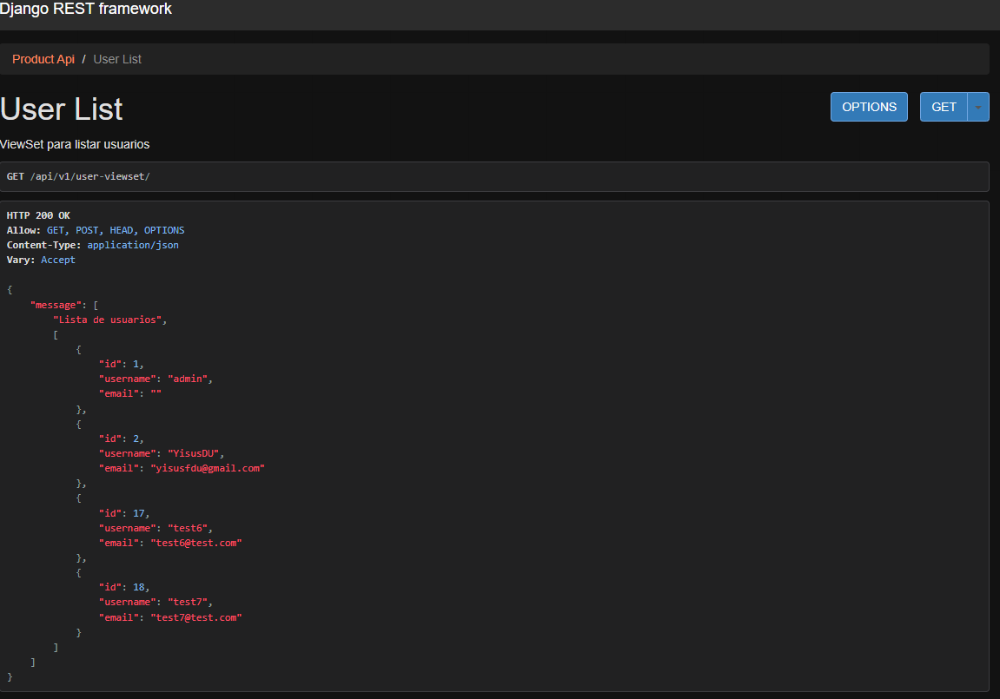
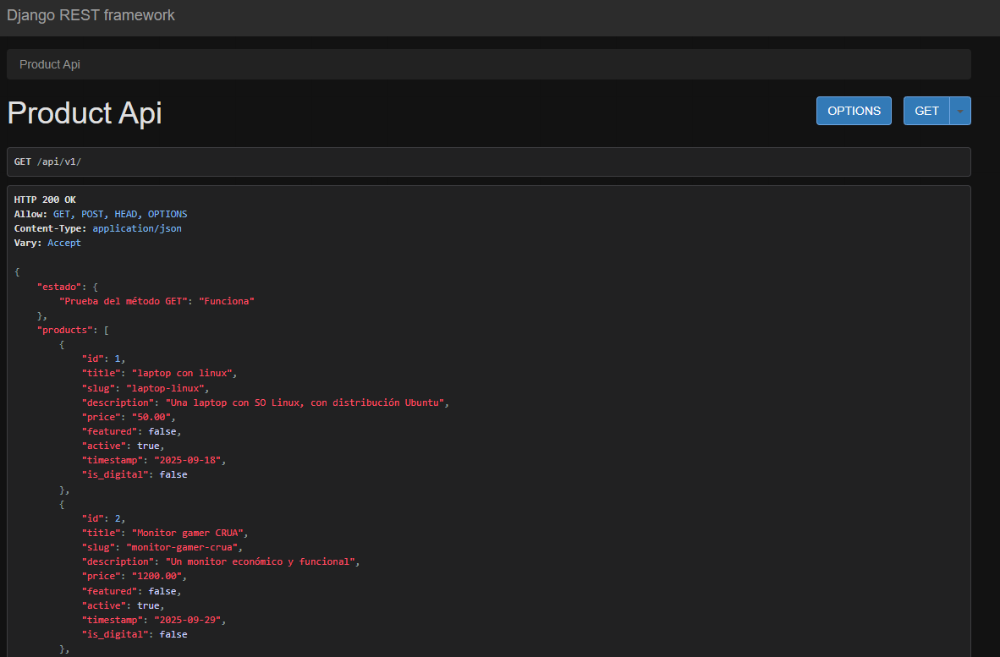
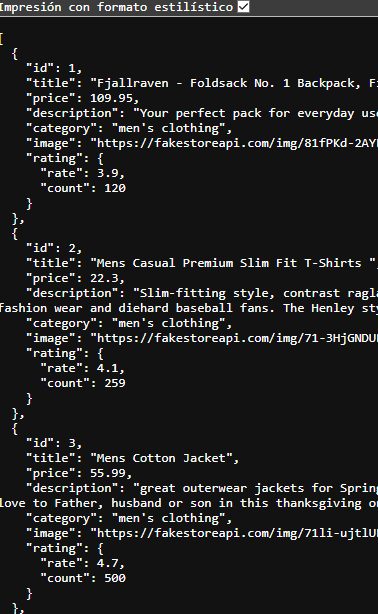

# Entrega del quinto proyecto m66

## ¿Qué tal practicar?

**Objetivo**

Con lo aprendido a lo largo de la profesión el alumno integrará todos los elementos desarrollados para tener un e-commerce funcional.

**Antes de comenzar**

Considera que este proyecto es la continuación del proyecto entregado en la parte de Frontend y en el módulo anterior, por lo que será necesario que lo tengas a la mano pues en el siguiente módulo se utilizará

**Paso a paso:**

Hasta ahorita ya desarrollaste la estructura y estilos de tu e-commerce y la interactividad. Además, ya creaste la estructura para almacenar los datos, los usuarios, los productos y la funcionalidad de tu e-commerce. Ahora es momento de integrar. Sigue las instrucciones:

* En el lado del frontend empezaremos a realizar peticiones HTTP a los distintos endpoints del backend para poder realizar las diferentes funciones como el registro de usuarios o la obtención de datos.
* Usaremos Axios para realizar las peticiones al backend.
* Puedes crear un custom hook en React para el manejo de las peticiones o realizarlas aisladamente en cada componente según lo necesario.
* En los request GET recuerda usar los fundamentos de listas y keys dentro de React para poder desplegar los datos correctamente.
* El uso de useEffect en los request es fundamental, asegura que los ciclos de vida de tus componentes se ejecuten adecuadamente con relación al flujo de los requests y de los momentos en que se tienen que realizar.

#### Backend

* En lado del Backend integra los modelos que creaste para las distintas aplicaciones:

  * Accounts - Cuentas
  * Addresses - direcciones
  * Analytics - métricas
  * Billing - pagos
  * Order - órdenes
  * Products - productos
* Agrega las vistas que creaste con sus endpoints correspondientes.
* Añade el código de tu proyecto de Github con el nombre “e-commerce completo”.
* En un archivo de Pdf pon el link a tu repositorio y copia y pega el código que creaste y súbelo a la plataforma.

**¿Cómo presentar su entrega?**

Enlace a GitHub

**Tiempo estimado de resolución: **180 minutos

---

## Comenzando

Lo primero fue hacer un pull de los repositorios correspondientes al frontend y backend, en sus últimas versiones, claro, eliminar el archivo .git de cada uno y unir la data en el contenedor e-commerce-completo

### Instalación de dependencias

Adicionalmente instalé las dependencias del frontend:

- \e-commerce-completo\01-frontend\mini-store

```
npm install
```

Y las del backend, activando el ambiente virtual, el comando de activación varea un poco de las versiones pasadas, pues antes mi terminal por defecto en VS code era Powershell, y ahora es git bash

- \e-commerce-completo\02-backend

```
python -m venv .venv
source .venv/Scripts/activate
pip install -r requirements.txt
cd ecommerce_project/
python manage.py runserver
```

Como pueden ver, al final de los comandos para backen ejecuté el servidor en local para comprobar que estaba funcionando bien

- http://127.0.0.1:8000/api/v1/user-viewset/



- http://127.0.0.1:8000/api/v1/



## Refactorizar la estructura de la respuesta API ?

Como vimos en las imágenes pasadas, mis productos están dentro de la key products y mis usuarios están dentro de messages, pero en la api que consumía antes, se veía así:



Por lo que considero necesario estandarizar la forma en que responde la api

- \e-commerce-completo\02-backend\ecommerce_project\api\views.py

```python
from django.shortcuts import render
from rest_framework import views, status 
from rest_framework.response import Response 
from rest_framework.viewsets import ViewSet #<-- import ViewSet
from django.shortcuts import get_object_or_404 #<-- import get_object_or_404

from product.models import Product 
from django.contrib.auth.models import User #<-- import User model
from product.serializers import ProductSerializer
from users.serializers import UserSerializer #<-- import UserSerializer

class ProductAPIView(views.APIView):
    def get(self, request):
        # Get all products
        products = Product.objects.all() 
        serializer = ProductSerializer(products, many=True) #<-- serialize them
        content = serializer.data #<-- return the serialized data
      
        return Response(content, status=status.HTTP_200_OK)
  
    def post(self, request):
        # Create a new product
        serializer = ProductSerializer(data=request.data)
        if serializer.is_valid():
            serializer.save()
            content = {
                "Prueba del método POST": "Funciona",
                "product": serializer.data,
            }
            return Response(serializer.data, status=status.HTTP_201_CREATED)
        content = {"error": serializer.errors}
        return Response(content, status=status.HTTP_400_BAD_REQUEST)
  
  

class ProductAPIModify(views.APIView):
    def get(self, request, pk=None):
        try:
            product = Product.objects.get(pk=pk)
            serializer = ProductSerializer(product)  
            return Response(serializer.data, status= status.HTTP_200_OK)  
        except Product.DoesNotExist:
            content = {"error": f"Producto con pk {pk} no encontrado"}
            return Response(content, status=status.HTTP_404_NOT_FOUND)  
      
    def put(self, request, pk):
        # Update a product
        product = Product.objects.get(pk=pk) or None
        if product is None:
            content = {"error":f"Producto con ID {pk} no encontrado"}
            return Response(content, status=status.HTTP_404_NOT_FOUND)
      
        serializer = ProductSerializer(product, data=request.data)
        if serializer.is_valid():
            serializer.save()
            return Response(serializer.data, status=status.HTTP_200_OK)
      
        content = {"error": serializer.errors}
        return Response(content, status=status.HTTP_400_BAD_REQUEST)
  
    def delete(self, request, pk):
        # Delete a product
        product = Product.objects.get(pk=pk)
        if not product:
            content = {"error": f"Producto con ID {pk} no encontrado"}
            return Response(content, status=status.HTTP_404_NOT_FOUND)
      
        product_name = product.title
        product.delete()
        content = {"error": f"El producto {product_name} ha sido eliminado"}
      
        return Response(content, status=status.HTTP_200_OK)
      

# ViewSet for User model
class UserViewSet(ViewSet):
    """ViewSet para listar usuarios"""
    serializer_class = UserSerializer #<-- we can use the ProductSerializer for simplicity
    def list(self, request):
        """Lista todos los usuarios"""
        users = User.objects.all()
        serializer = self.serializer_class(users, many=True)
      
        return Response(serializer.data, status=status.HTTP_200_OK)

    def create(self, request):
        """Crea un mensaje de saludo"""
        serializer = self.serializer_class(data = request.data)
        if serializer.is_valid():
            serializer.save()
            return Response(serializer.data, status=status.HTTP_201_CREATED)
        content = {"error": serializer.errors}
        return Response(content, status=status.HTTP_400_BAD_REQUEST)
      
    def retrieve(self, request, pk=None):
        """Maneja obtener un objeto por su ID"""
        user = get_object_or_404(User, pk=pk)
        serializer = UserSerializer(user)
        return Response(serializer.data, status=status.HTTP_200_OK)
  

    def update(self, request, pk=None):
        """Maneja la actualización completa de un objeto por su ID"""
        user = get_object_or_404(User, pk=pk)
        serializer = self.serializer_class(user, data=request.data, partial=False)
      
        if not serializer.is_valid():
            content = {"error": serializer.errors}
            return Response(
                content, 
                status=status.HTTP_400_BAD_REQUEST
            )
      
        user = serializer.save()
        return Response(serializer.data, status=status.HTTP_200_OK)


    def partial_update(self, request, pk=None):
        """Maneja la actualización parcial de un objeto por su ID"""
        user = get_object_or_404(User, pk=pk)
        serializer = self.serializer_class(user, data=request.data, partial=True)

        if not serializer.is_valid():
            content = {"error": serializer.errors}
            return Response(content, status=status.HTTP_400_BAD_REQUEST)
        serializer.save()
      
        return Response(serializer.validated_data, status=status.HTTP_200_OK)
  
    def destroy(self, request, pk=None):
        """Maneja la eliminación de un objeto por su ID"""
        user = get_object_or_404(User, pk=pk)
        user.delete()
        message = {"message":f"Eliminando el usuario con ID {pk}"}
        return Response( message, status=status.HTTP_200_OK)
```

Tambíen cambié en endpoint para usuarios, dejandolo simplemente en users:

- \e-commerce-completo\02-backend\ecommerce_project\api\urls.py

```python
from django.urls import path, include #<-- import include
from rest_framework.routers import DefaultRouter #<-- import DefaultRouter
from .views import (
    ProductAPIView, 
    ProductAPIModify,
    UserViewSet, #<-- import UserViewSet
)

# Create a router and register our viewsets with it.
router = DefaultRouter()
router.register("users", UserViewSet, basename="users") #<-- register the UserViewSet with the router

urlpatterns = [
    path("", ProductAPIView.as_view(), name="product-api"),
    path("<int:pk>/", ProductAPIModify.as_view(), name="product-api-modify"),
    path("", include(router.urls)), #<-- include the router URLs
]
```
