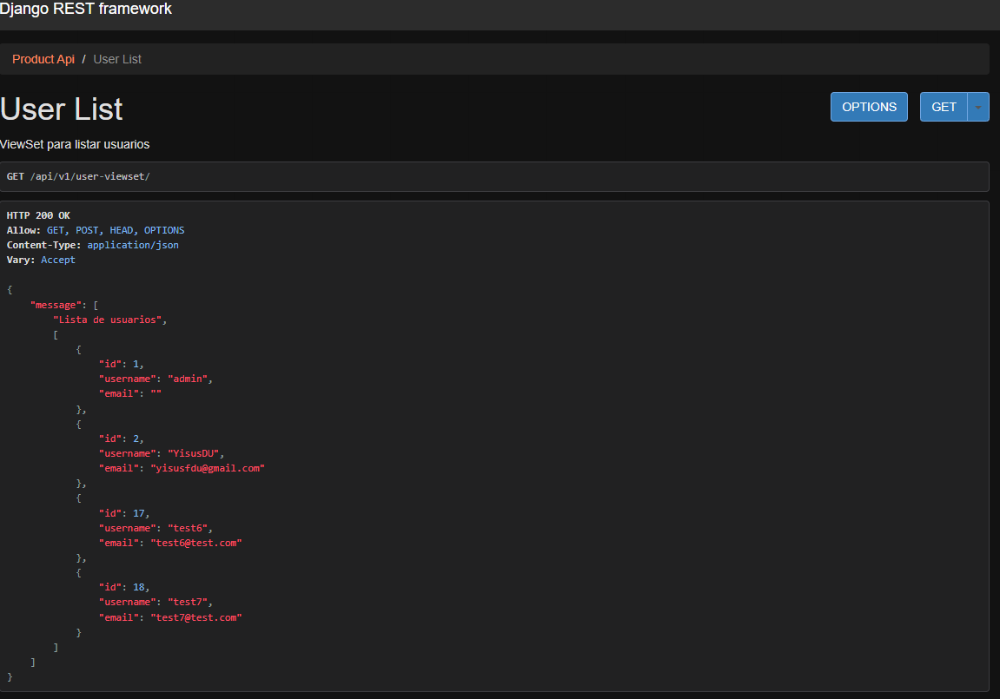
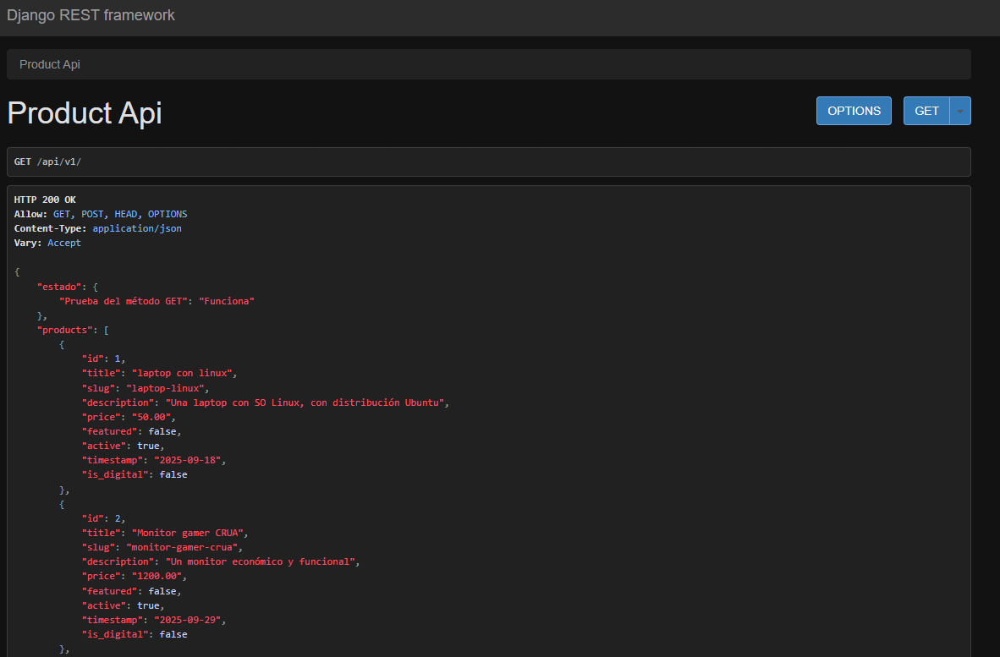
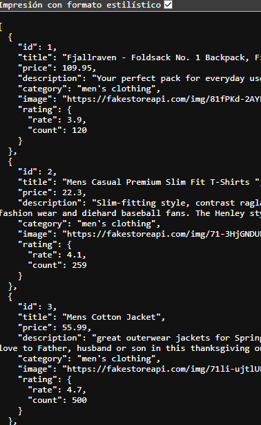
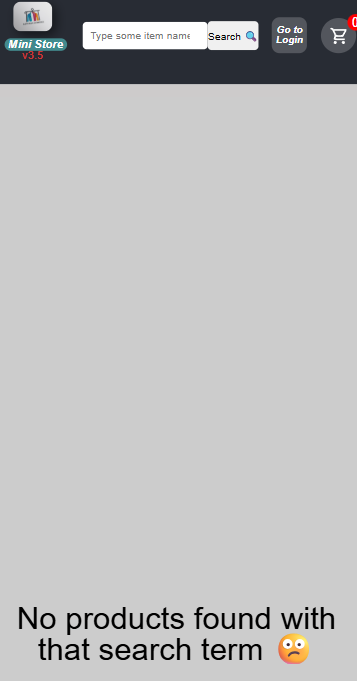
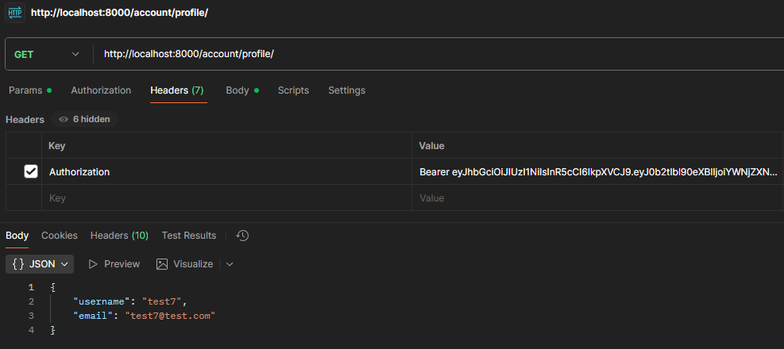

# Entrega del quinto proyecto m66

## ¿Qué tal practicar?

**Objetivo**

Con lo aprendido a lo largo de la profesión el alumno integrará todos los elementos desarrollados para tener un e-commerce funcional.

**Antes de comenzar**

Considera que este proyecto es la continuación del proyecto entregado en la parte de Frontend y en el módulo anterior, por lo que será necesario que lo tengas a la mano pues en el siguiente módulo se utilizará

**Paso a paso:**

Hasta ahorita ya desarrollaste la estructura y estilos de tu e-commerce y la interactividad. Además, ya creaste la estructura para almacenar los datos, los usuarios, los productos y la funcionalidad de tu e-commerce. Ahora es momento de integrar. Sigue las instrucciones:

* En el lado del frontend empezaremos a realizar peticiones HTTP a los distintos endpoints del backend para poder realizar las diferentes funciones como el registro de usuarios o la obtención de datos.
* Usaremos Axios para realizar las peticiones al backend.
* Puedes crear un custom hook en React para el manejo de las peticiones o realizarlas aisladamente en cada componente según lo necesario.
* En los request GET recuerda usar los fundamentos de listas y keys dentro de React para poder desplegar los datos correctamente.
* El uso de useEffect en los request es fundamental, asegura que los ciclos de vida de tus componentes se ejecuten adecuadamente con relación al flujo de los requests y de los momentos en que se tienen que realizar.

#### Backend

* En lado del Backend integra los modelos que creaste para las distintas aplicaciones:

  * Accounts - Cuentas
  * Addresses - direcciones
  * Analytics - métricas
  * Billing - pagos
  * Order - órdenes
  * Products - productos
* Agrega las vistas que creaste con sus endpoints correspondientes.
* Añade el código de tu proyecto de Github con el nombre “e-commerce completo”.
* En un archivo de Pdf pon el link a tu repositorio y copia y pega el código que creaste y súbelo a la plataforma.

**¿Cómo presentar su entrega?**

Enlace a GitHub

**Tiempo estimado de resolución: **180 minutos

---

## Comenzando

Lo primero fue hacer un pull de los repositorios correspondientes al frontend y backend, en sus últimas versiones, claro, eliminar el archivo .git de cada uno y unir la data en el contenedor e-commerce-completo

### Instalación de dependencias

Adicionalmente instalé las dependencias del frontend:

- \e-commerce-completo\01-frontend\mini-store

```
npm install
```

Y las del backend, activando el ambiente virtual, el comando de activación varea un poco de las versiones pasadas, pues antes mi terminal por defecto en VS code era Powershell, y ahora es git bash

- \e-commerce-completo\02-backend

```
python -m venv .venv
source .venv/Scripts/activate
pip install -r requirements.txt
cd ecommerce_project/
python manage.py runserver
```

Como pueden ver, al final de los comandos para backen ejecuté el servidor en local para comprobar que estaba funcionando bien

- http://127.0.0.1:8000/api/v1/user-viewset/



- http://127.0.0.1:8000/api/v1/



## Refactorizar la estructura de la respuesta API ?

Como vimos en las imágenes pasadas, mis productos están dentro de la key products y mis usuarios están dentro de messages, pero en la api que consumía antes, se veía así:



Por lo que considero necesario estandarizar la forma en que responde la api

- \e-commerce-completo\02-backend\ecommerce_project\api\views.py

```python
from django.shortcuts import render
from rest_framework import views, status 
from rest_framework.response import Response 
from rest_framework.viewsets import ViewSet #<-- import ViewSet
from django.shortcuts import get_object_or_404 #<-- import get_object_or_404

from product.models import Product 
from django.contrib.auth.models import User #<-- import User model
from product.serializers import ProductSerializer
from users.serializers import UserSerializer #<-- import UserSerializer

class ProductAPIView(views.APIView):
    def get(self, request):
        # Get all products
        products = Product.objects.all() 
        serializer = ProductSerializer(products, many=True) #<-- serialize them
        content = serializer.data #<-- return the serialized data
  
        return Response(content, status=status.HTTP_200_OK)
  
    def post(self, request):
        # Create a new product
        serializer = ProductSerializer(data=request.data)
        if serializer.is_valid():
            serializer.save()
            content = {
                "Prueba del método POST": "Funciona",
                "product": serializer.data,
            }
            return Response(serializer.data, status=status.HTTP_201_CREATED)
        content = {"error": serializer.errors}
        return Response(content, status=status.HTTP_400_BAD_REQUEST)
  
  

class ProductAPIModify(views.APIView):
    def get(self, request, pk=None):
        try:
            product = Product.objects.get(pk=pk)
            serializer = ProductSerializer(product)  
            return Response(serializer.data, status= status.HTTP_200_OK)  
        except Product.DoesNotExist:
            content = {"error": f"Producto con pk {pk} no encontrado"}
            return Response(content, status=status.HTTP_404_NOT_FOUND)  
  
    def put(self, request, pk):
        # Update a product
        product = Product.objects.get(pk=pk) or None
        if product is None:
            content = {"error":f"Producto con ID {pk} no encontrado"}
            return Response(content, status=status.HTTP_404_NOT_FOUND)
  
        serializer = ProductSerializer(product, data=request.data)
        if serializer.is_valid():
            serializer.save()
            return Response(serializer.data, status=status.HTTP_200_OK)
  
        content = {"error": serializer.errors}
        return Response(content, status=status.HTTP_400_BAD_REQUEST)
  
    def delete(self, request, pk):
        # Delete a product
        product = Product.objects.get(pk=pk)
        if not product:
            content = {"error": f"Producto con ID {pk} no encontrado"}
            return Response(content, status=status.HTTP_404_NOT_FOUND)
  
        product_name = product.title
        product.delete()
        content = {"error": f"El producto {product_name} ha sido eliminado"}
  
        return Response(content, status=status.HTTP_200_OK)
  

# ViewSet for User model
class UserViewSet(ViewSet):
    """ViewSet para listar usuarios"""
    serializer_class = UserSerializer #<-- we can use the ProductSerializer for simplicity
    def list(self, request):
        """Lista todos los usuarios"""
        users = User.objects.all()
        serializer = self.serializer_class(users, many=True)
  
        return Response(serializer.data, status=status.HTTP_200_OK)

    def create(self, request):
        """Crea un mensaje de saludo"""
        serializer = self.serializer_class(data = request.data)
        if serializer.is_valid():
            serializer.save()
            return Response(serializer.data, status=status.HTTP_201_CREATED)
        content = {"error": serializer.errors}
        return Response(content, status=status.HTTP_400_BAD_REQUEST)
  
    def retrieve(self, request, pk=None):
        """Maneja obtener un objeto por su ID"""
        user = get_object_or_404(User, pk=pk)
        serializer = UserSerializer(user)
        return Response(serializer.data, status=status.HTTP_200_OK)
  

    def update(self, request, pk=None):
        """Maneja la actualización completa de un objeto por su ID"""
        user = get_object_or_404(User, pk=pk)
        serializer = self.serializer_class(user, data=request.data, partial=False)
  
        if not serializer.is_valid():
            content = {"error": serializer.errors}
            return Response(
                content, 
                status=status.HTTP_400_BAD_REQUEST
            )
  
        user = serializer.save()
        return Response(serializer.data, status=status.HTTP_200_OK)


    def partial_update(self, request, pk=None):
        """Maneja la actualización parcial de un objeto por su ID"""
        user = get_object_or_404(User, pk=pk)
        serializer = self.serializer_class(user, data=request.data, partial=True)

        if not serializer.is_valid():
            content = {"error": serializer.errors}
            return Response(content, status=status.HTTP_400_BAD_REQUEST)
        serializer.save()
  
        return Response(serializer.validated_data, status=status.HTTP_200_OK)
  
    def destroy(self, request, pk=None):
        """Maneja la eliminación de un objeto por su ID"""
        user = get_object_or_404(User, pk=pk)
        user.delete()
        message = {"message":f"Eliminando el usuario con ID {pk}"}
        return Response( message, status=status.HTTP_200_OK)
```

Tambíen cambié en endpoint para usuarios, dejandolo simplemente en users:

- \e-commerce-completo\02-backend\ecommerce_project\api\urls.py

```python
from django.urls import path, include #<-- import include
from rest_framework.routers import DefaultRouter #<-- import DefaultRouter
from .views import (
    ProductAPIView, 
    ProductAPIModify,
    UserViewSet, #<-- import UserViewSet
)

# Create a router and register our viewsets with it.
router = DefaultRouter()
router.register("users", UserViewSet, basename="users") #<-- register the UserViewSet with the router

urlpatterns = [
    path("", ProductAPIView.as_view(), name="product-api"),
    path("<int:pk>/", ProductAPIModify.as_view(), name="product-api-modify"),
    path("", include(router.urls)), #<-- include the router URLs
]
```

## Armar Frontend

Ya tenemos suficiente información sobre la nueva estructura que recomendó el profe, así que iré componente por componente, tomando lo mejor de ambas versiones

### Login

Me parece sensato comenzar por el principio, de modo que he comentado todas las rutas del router, cabe resaltar que el archivo index de loginform, depende de un hook que valida el formulario e interactuaba con el store, será necesario modificarlo en el futuro

- \e-commerce-completo\01-frontend\mini-store\src\router\AppRouter.js

```js
import React from "react";
import { BrowserRouter as Router, Route, Routes } from "react-router-dom";
import LoginPage from "../pages/LoginPage";
// import RegisterPage from "../pages/RegisterPage";
// import HomePage from "../pages/HomePage";
// import CartPage from "../pages/CartPage";
// import CheckoutPage from "../pages/CheckoutPage";
// import PostCheckoutPage from "../pages/PostCheckoutPage";

const AppRouter = () => {
  return (
    <Router>
      <Routes>
        <Route path="/login" element={<LoginPage />} />
        {/* <Route path="/register" element={<RegisterPage />} />
        <Route path="/" element={<HomePage />} />
        <Route path="/cart" element={<CartPage />} />
        <Route path="/checkout" element={<CheckoutPage />} />
        <Route path="/post-checkout" element={<PostCheckoutPage />} /> */}
      </Routes>
    </Router>
  );
};

export default AppRouter;

```

Y así quedó mi componente vacío de login:

- \e-commerce-completo\01-frontend\mini-store\src\pages\LoginPage\index.js

```js
import React from "react";
import logo from "../../assets/img/logoEcomm.jpg";
import {
  LoginContainer,
  LogTitle,
  LogOptions,
  LoginImg,
  LoginSignIn,
  LoginFieldset,
} from "./styles";
import LoginForm from "../../components/LoginForm";

const LoginPage = () => {
  return (
    <LoginContainer>
      <LogOptions>
        <LoginImg />
        <LoginSignIn>
          <LogTitle>
            
            <h1>
              Welcome to <span>Mini Store</span>
            </h1>
          </LogTitle>
          <LoginForm />
        </LoginSignIn>
      </LogOptions>
    </LoginContainer>
  );
};

export default LoginPage;

```

Pero no se veía nada en la siguiente ruta, solo mensajes de error sobre los estilos

- http://localhost:3000/ebac-ea-third-proyect/login

#### styles

Como en el navegador me daba errores sobre los estilos, al revizar mi archivo app.js, podemos ver que solo tiene Global styles, pero yo anteriormente usaba un theme provider, así que envolvemos la App.js con el themeprovider

- \e-commerce-completo\01-frontend\mini-store\src\App.js

```js
import React from "react";
import GlobalStyles from "./styles/GlobalStyles";
import AppRouter from "./router/AppRouter";
import { ThemeProvider } from "styled-components";
import Theme from "./styles";

function App() {
  return (
    <div>
      <ThemeProvider theme={Theme}>
        <GlobalStyles />
        <AppRouter />
      </ThemeProvider>
    </div>
  );
}

export default App;

```

#### El archivo de router

Tuve que hacer algunos cambios para ir paso a paso y definí una ruta base:

- \e-commerce-completo\01-frontend\mini-store\src\router\AppRouter.js

```js
import React from "react";
import { BrowserRouter as Router, Route, Routes } from "react-router-dom";
import LoginPage from "../pages/LoginPage";
// import RegisterPage from "../pages/RegisterPage";
// import HomePage from "../pages/HomePage";
// import CartPage from "../pages/CartPage";
// import CheckoutPage from "../pages/CheckoutPage";
// import PostCheckoutPage from "../pages/PostCheckoutPage";

const AppRouter = () => {
  return (
    <Router basename="/e-commerce-completo">
      <Routes>
        <Route path="/login" element={<LoginPage />} />
        {/* <Route path="/register" element={<RegisterPage />} />
        <Route path="/" element={<HomePage />} />
        <Route path="/cart" element={<CartPage />} />
        <Route path="/checkout" element={<CheckoutPage />} />
        <Route path="/post-checkout" element={<PostCheckoutPage />} /> */}
      </Routes>
    </Router>
  );
};

export default AppRouter;

```

#### package.json - homepage

Al hacer el cambio anterior, también necesito actualizar el package.json, con la nueva ruta home

- \e-commerce-completo\01-frontend\mini-store\package.json

```js
{
  "name": "mini-store",
  "version": "0.1.0",
  "private": true,
  "homepage": "https://YisusDU.github.io/e-commerce-completo",
```

#### App.js

Tambien fue necesario corregir la app, para que utilizara los estilos

- \e-commerce-completo\01-frontend\mini-store\src\App.js

```js
import React from "react";
import GlobalStyles from "./styles/GlobalStyles";
import AppRouter from "./router/AppRouter";
import { ThemeProvider } from "styled-components";
import Theme from "./styles";

function App() {
  return (
    <div>
      <ThemeProvider theme={Theme}>
        <GlobalStyles />
        <AppRouter />
      </ThemeProvider>
    </div>
  );
}

export default App;

```

#### index.js

Habia un pequeño error al importar el provider de la store

- \e-commerce-completo\01-frontend\mini-store\src\index.js

```js
import React from "react";
import ReactDOM from "react-dom/client";
import App from "./App";
import { Provider } from "react-redux";
import store from "./redux/store";


const root = ReactDOM.createRoot(document.getElementById('root'));

root.render(
  <React.StrictMode>
    <Provider store={store}>
      <App />
    </Provider>
  </React.StrictMode>
);

```

#### LoginForm

y había que mezclar el loginform con las funcionalidades anterirores:

- \e-commerce-completo\01-frontend\mini-store\src\components\LoginForm\index.js

```js
import React, { useState } from "react";
import { useDispatch, useSelector } from "react-redux";
import { fetchUser } from "../../redux/slices/userSlice";
import { LoginFieldset, LoginFormContainer } from "./styles";
import Input from "../ui/Input";
import Button from "../ui/Button";
import { Link, useNavigate } from "react-router-dom";
import { ASYNC_STATUS } from "../../constants/asyncStatus";
import useAuth from "../../hooks/useAuth";

const LoginForm = () => {
  const {
    emailValid,
    passwordValid,
    validateInput,
    handleValidation,
    handleRegister,
    handleGuest,
  } = useAuth();

 
  return (
    <LoginFormContainer>
      <LoginFieldset>
        <h2>Nice to see you again!</h2>
        <form onSubmit={handleValidation}>
          <label htmlFor="email">Email:</label>
          <input
            id="email"
            name="email"
            type="email"
            placeholder="example@email.com"
            required
            className={
              emailValid === null ? "" : emailValid ? "valid" : "invalid"
            }
            onBlur={validateInput}
          />
          <span
            className={emailValid === false ? "error-message" : "message-space"}
          >
            {emailValid === false && "Incorrect Email"}
          </span>
          <label htmlFor="password">Password:</label>
          <input
            id="password"
            type="text"
            name="password"
            placeholder="Password123"
            minLength={8}
            required
            className={
              passwordValid === null ? "" : passwordValid ? "valid" : "invalid"
            }
            onBlur={validateInput}
          />
          <span
            className={
              passwordValid === false ? "error-message" : "message-space"
            }
          >
            {passwordValid === false && "Incorrect Password"}
          </span>
          <button type="submit">Login</button>
        </form>
      </LoginFieldset>
      <p>Or......</p>
      <h2 className="notAcount">Don't you have an account?</h2>
      <button onClick={handleRegister}>Go to register!</button>
      <p>Or......</p>
      <button className="guest" onClick={handleGuest}>
        Continue as guest
      </button>
    </LoginFormContainer>
  );
};

export default LoginForm;

```

No olvidemos el archivo de estilos, del cual generamos una nueva etiqueta contenedora

- \e-commerce-completo\01-frontend\mini-store\src\components\LoginForm\styles.js

```js
import styled from "styled-components";
import {
  flexColumn,
  buttonBase,
  darkModeText,
  buttonHover,
  flexCenter,
} from "../../styles/mixins";

const LoginFormContainer = styled.section`
  ${flexCenter}
  ${flexColumn}
  padding: 0px;
  margin: 0;
  width: 100%;
  button {
    width: 80%;
    margin-top: 10px;
    background-color: #28a745;
    border: 2px solid #28a745;
    padding: 12px 24px;
    color: white;
    border-radius: 5px;
    font-size: 16px;
    cursor: pointer;
    transition: all 0.3s ease;
  }

  .guest {
    width: 80%;
    margin-top: 10px;
    background-color: rgb(167, 51, 40);
    border: 2px solid rgb(167, 51, 40);
    padding: 12px 24px;
    color: #fff;
    border-radius: 5px;
    font-size: 16px;
    cursor: pointer;
    transition: all 0.3s ease;
  }

  @media (hover: hover) {
    button:hover {
      background-color: transparent;
      color: #28a745;
      transform: translateY(-2px);
      box-shadow: 0 5px 15px rgba(40, 167, 69, 0.3);
    }

    .guest:hover {
      background-color: transparent;
      color: rgb(167, 51, 40);
      transform: translateY(-2px);
      box-shadow: 0 5px 15px rgba(167, 51, 40, 0.3);
    }
  }

  @media (prefers-color-scheme: dark) {
    background-color: #919191;
    color: #fff;
    p {
      color: #fff;
    }

    .notAcount {
      color: #fff;
    }
    @media (hover: hover) {
      button:hover,
      .guest:hover {
        color: #fff;
      }
    }
  }
`;

const LoginFieldset = styled.fieldset`
  ${flexColumn}
  width: 90%;
  border-radius: 10px;
  box-sizing: border-box;
  padding: 10px;
  position: relative;
  z-index: 2;
  box-shadow: 5px 5px 13px rgba(0, 0, 0, 0.5);
  h2 {
    width: 100%;
    color: #000;
    font-weight: bold;
    font-size: 1.5em;
    text-align: center;
    margin: 0;
    font-size: clamp(15px, 23px, 22px);
    text-wrap: nowrap;
  }

  form {
    display: flex;
    flex-direction: column;
    gap: 15px;
    width: 100%;
    padding: 0px;

    label {
      font-weight: bold;
      margin-bottom: 5px;
      color: #000;
    }
    .error-message,
    .message-space {
      height: 20px;
      display: block;
      margin-top: 4px;
      font-size: 0.9rem;
    }

    .error-message {
      color: #f44336;
    }

    input {
      width: 100%;
      padding: 10px;
      border: 2px solid #ddd;
      border-radius: 5px;
      font-size: 16px;
      transition: border-color 0.3s ease;
      box-sizing: border-box;

      &:focus {
        outline: none;
        border-color: #007bff;
        box-shadow: 0 0 5px rgba(0, 123, 255, 0.3);
      }
      &.valid {
        border: 2px solid #4caf50;
      }

      &.invalid {
        border: 2px solid #f44336;
      }
    }
  }
  button {
    ${buttonBase}
    background-color: #007bff;
    border: 2px solid #007bff;
    color: white;
    width: 100%;
    margin: 0;
  }

  ${darkModeText}
  @media (hover: hover) and (pointer: fine) {
    button:hover {
      ${buttonHover}
      color: #007bff;
      box-shadow: 0 5px 15px rgba(0, 123, 255, 0.3);
    }
  }

  @media (prefers-color-scheme: dark) {
    h2,
    form label {
      color: #fff;
    }

    @media (hover: hover) and (pointer: fine) {
      button:hover {
        ${buttonHover}
        color: #fff;
        box-shadow: 0 5px 15px rgba(0, 123, 255, 0.3);
      }
    }
  }

  @media (max-width: 768px) {
    margin-top: 50px;
  }
`;

export { LoginFieldset, LoginFormContainer };

```

## index.html

Noté que podríamos establecer diseños para que se respetara mejor el tamaño de pantalla

- \e-commerce-completo\01-frontend\mini-store\public\index.html

```html
<!DOCTYPE html>
<html lang="en" style="width: 100dvw;">
  <head>
    <meta charset="utf-8" />
    <link rel="icon" href="%PUBLIC_URL%/favicon.ico" />
    <meta name="viewport" content="width=device-width, initial-scale=1" />
    <meta name="theme-color" content="#000000" />
    <meta
      name="description"
      content="Web site created using create-react-app"
    />
    <link rel="apple-touch-icon" href="%PUBLIC_URL%/logo192.png" />
   
    <link rel="manifest" href="%PUBLIC_URL%/manifest.json" />
  
    <title>Mini Store</title>
  </head>
  <body style="margin: 0; width: 100%;">
    <noscript>You need to enable JavaScript to run this app.</noscript>
    <div id="root"></div>
  
  </body>
</html>

```

## RegisterPage

Descomentamos RegisterPage del router

- \e-commerce-completo\01-frontend\mini-store\src\router\AppRouter.js

```js
import React from "react";
import { BrowserRouter as Router, Route, Routes } from "react-router-dom";
import LoginPage from "../pages/LoginPage";
import RegisterPage from "../pages/RegisterPage";
// import HomePage from "../pages/HomePage";
// import CartPage from "../pages/CartPage";
// import CheckoutPage from "../pages/CheckoutPage";
// import PostCheckoutPage from "../pages/PostCheckoutPage";

const AppRouter = () => {
  return (
    <Router basename="/e-commerce-completo">
      <Routes>
        <Route path="/login" element={<LoginPage />} />
         <Route path="/register" element={<RegisterPage />} />
        {/*<Route path="/" element={<HomePage />} />
        <Route path="/cart" element={<CartPage />} />
        <Route path="/checkout" element={<CheckoutPage />} />
        <Route path="/post-checkout" element={<PostCheckoutPage />} /> */}
      </Routes>
    </Router>
  );
};

export default AppRouter;

```

Y esta sería la base para el registerpage

- \e-commerce-completo\01-frontend\mini-store\src\pages\RegisterPage\index.js

```js
import React from "react";
import RegisterForm from "../../components/RegisterForm";
import { useDispatch } from "react-redux";
import { useNavigate } from "react-router-dom";
import logo from "../../assets/img/logoEcomm.jpg";
import {
  RegistryContent,
  RegistryImg,
  RegistryContainer,
  RegistryLogo,
  RegistryOptions,
} from "./styles.js";

const Registry = () => {
  return (
    <>
      <RegistryContainer>
        <RegistryOptions>
          <RegistryContent>
            <RegistryLogo>
              
              <span>Mini Store</span>
            </RegistryLogo>
            <RegisterForm />
          </RegistryContent>
          <RegistryImg />
        </RegistryOptions>
      </RegistryContainer>
    </>
  );
};

export default Registry;

```

Y el codigo del formulario de registro

- \e-commerce-completo\01-frontend\mini-store\src\components\RegisterForm\index.js

```js
import React, { useState } from "react";
import { useDispatch, useSelector } from "react-redux";
import { createUser } from "../../redux/slices/userSlice";
import { FormContaier, Form, Title, Label, Input, Button } from "./styled";
import { Link, useNavigate } from "react-router-dom";
import { ASYNC_STATUS } from "../../constants/asyncStatus";

const RegisterForm = () => {
  const [user, setUser] = useState("");
  const [email, setEmail] = useState("");
  const [password, setPassword] = useState("");
  const [confirmPassword, SetConfirmPassword] = useState("");
  const dispatch = useDispatch();
  const navigate = useNavigate();
  const { status, error } = useSelector((state) => state.user);

  const handleSubmit = (e) => {
    e.preventDefault();
    if (password !== confirmPassword) {
      alert("Passwords do not match ");
      return;
    }

    dispatch(createUser({ email, user, password }));
    navigate("/");
  };

  return (
    <FormContaier>
      <Form onSubmit={handleSubmit}>
        <Title>Register</Title>
        <Label>User</Label>
        <Input
          placeholder="Tu nombre de Usuario"
          type="text"
          value={user}
          onChange={(e) => setUser(e.target.value)}
          required
        />
        <Label>Email</Label>
        <Input
        placeholder="Añadetuemail@gmail.com"
          type="email"
          value={email}
          onChange={(e) => setEmail(e.target.value)}
          required
        />
        <Label>Password</Label>
        <Input
          placeholder="Escribe tu contraseña"
          type="password"
          value={password}
          onChange={(e) => setPassword(e.target.value)}
          required
        />
        <Label>Confirm Password</Label>
        <Input
          placeholder="Escribe tu contraseña"
          type="password"
          value={confirmPassword}
          onChange={(e) => SetConfirmPassword(e.target.value)}
          required
        />
        <Button type="submit">Register</Button>
        {status === ASYNC_STATUS.REJECTED && <p>Error: {error}</p>}
        <p>
          Already have an account? <Link to="/login">Login</Link>
        </p>
      </Form>
    </FormContaier>
  );
};

export default RegisterForm;

```

Con sus estilos claro

- \e-commerce-completo\01-frontend\mini-store\src\components\RegisterForm\styled.js

```js
import styled from "styled-components";
import {
  flexCenter,
  flexColumn,
  buttonBase,
  buttonHover,
  darkModeText
} from "../../styles/mixins";

const FormContaier = styled.section`
  ${flexColumn}
  width: 90%;
  border-radius: 10px;
  box-sizing: border-box;
  padding: 10px;
  position: relative;
  z-index: 2;
  box-shadow: 5px 5px 13px rgba(0, 0, 0, 0.5);

  p {
    font-weight: 400px;
  }
  ${darkModeText}
  @media (hover: hover) and (pointer: fine) {
    button:hover {
      ${buttonHover}
      color: #007bff;
      box-shadow: 0 5px 15px rgba(0, 123, 255, 0.3);
    }
  }

  @media (prefers-color-scheme: dark) {
    h2,
    form label {
      color: #fff;
    }

    @media (hover: hover) and (pointer: fine) {
      button:hover {
        ${buttonHover}
        color: #fff;
        box-shadow: 0 5px 15px rgba(0, 123, 255, 0.3);
      }
    }
  }

  @media (max-width: 768px) {
    margin-top: 50px;
  }
`;

const Form = styled.form`
  display: flex;
  flex-direction: column;
  gap: 15px;
  width: 100%;
  padding: 0px;
`;

const Title = styled.h1`
  width: 100%;
  color: #000;
  font-weight: bold;
  font-size: 1.5em;
  text-align: left;
  margin: 0;
  font-size: clamp(15px, 23px, 22px);
  text-wrap: nowrap;
`;

const Label = styled.label`
  font-weight: bold;
  margin-bottom: 5px;
  color: #000;
`;

const Input = styled.input`
  width: 100%;
  padding: 10px;
  border: 2px solid #ddd;
  border-radius: 5px;
  font-size: 16px;
  transition: border-color 0.3s ease;
  box-sizing: border-box;
`;

const Button = styled.button`
  ${buttonBase}
  ${buttonHover}
  background-color: #007bff;
  border: 2px solid #007bff;
  color: white;
  width: 100%;
  margin: 0;
`;

export { FormContaier, Form, Title, Label, Input, Button };

```

## HomePage

Bien bien, este será la página que importa los componentes interactivos, el header y la lista de productos e interactúan con el carrito

Claro que comenzamos descomentando el Approuter

- \e-commerce-completo\01-frontend\mini-store\src\router\AppRouter.js

```js
import React from "react";
import { BrowserRouter as Router, Route, Routes } from "react-router-dom";
import LoginPage from "../pages/LoginPage";
import RegisterPage from "../pages/RegisterPage";
// import HomePage from "../pages/HomePage";
// import CartPage from "../pages/CartPage";
// import CheckoutPage from "../pages/CheckoutPage";
// import PostCheckoutPage from "../pages/PostCheckoutPage";

const AppRouter = () => {
  return (
    <Router basename="/e-commerce-completo">
      <Routes>
        <Route path="/login" element={<LoginPage />} />
         <Route path="/register" element={<RegisterPage />} />
        <Route path="/" element={<HomePage />} />
        {/*<Route path="/cart" element={<CartPage />} />
        <Route path="/checkout" element={<CheckoutPage />} />
        <Route path="/post-checkout" element={<PostCheckoutPage />} /> */}
      </Routes>
    </Router>
  );
};

export default AppRouter;

```

El siguiente componente es el homePage/index.js

- e-commerce-completo\01-frontend\mini-store\src\-components\home\index.js

```js
import React from "react";
import ProductHeader from "../../components/Header";
import ProductList from "../../components/ProductList";
import Cart from "../../components/Cart";

const Home = () => {
  return (
    <>
      <ProductHeader />
      <ProductList />
      <Cart />
    </>
  );
};

export default Home;

```

### Partes de HomePage

Como se puede ver en el código de arriba, nuestro home depende de 3 componentes clave, el cart, que depende a su vez del header, y la lista de productos, dado que ya estaban bastate bien integrados, he decidido utilizarlos en la nueva versión, pero claro que tendré que retocarlos justo después, comenzando por el header

## Componente header

Parece que para que el header vuelva a funcionar, tengo que agregar algunos reducers extra a cada Slice correspondiente

### cartSlice.js

Comenzaré por el slice del carrito, del cual necesito extraer un listado de items para contarlos y actualizar así el contador junto al carrito en el header

Tenemos una función actual que añade la cantidad de cada producto añadido al carrito, lo dejaré con un length que cuenta los objetos dentro del carrito por el momento sin acceder a la prpiedad cantidad, hasta que lo escale cuando tenga un poco de tiempo

- \e-commerce-completo\01-frontend\mini-store\src\redux\slices\cartSlice.js

```js
import { createSlice } from "@reduxjs/toolkit";
import {
  loadCartFromLocalStorage,
  saveCartToLocalStorage,
} from "../../helpers/localStorageHelpers";

const cartSlice = createSlice({
  name: "cart",
  initialState: {
    items: loadCartFromLocalStorage(),
    isOpen: false,
  },
  reducers: {
    addToCart: (state, action) => {
      state.items.push(action.payload);
      saveCartToLocalStorage(state.items);
    },
    removeFromCart: (state, action) => {
      state.items = state.items.filter((item) => item.id !== action.payload.id);
      saveCartToLocalStorage(state.items);
    },
    clearCart: (state, action) => {
      state.items = [];
      saveCartToLocalStorage(state.items);
    },
    toggleCart: (state) => {
      state.isOpen = !state.isOpen;
    },
  },
});

export const { addToCart, removeFromCart, clearCart, toggleCart } =
  cartSlice.actions;
export default cartSlice.reducer;

```

### userSlice.js

En este slice solo agregamos el reducer para saber si un usuario está logeado o no

- \e-commerce-completo\01-frontend\mini-store\src\redux\slices\userSlice.js

```js
import { createSlice, createAsyncThunk } from "@reduxjs/toolkit";
import api from "../../api";
import { CREATE_USER, FETCH_USER } from "../../constants/actionTypes";
import { ASYNC_STATUS } from "../../constants/asyncStatus";

// Para list o retrive de usuarios
export const fetchUser = createAsyncThunk(FETCH_USER, async (userId) => {
  const response = await api.get(`/users/${userId}`);
  return response.data;
});

// Para Create de usuarios
export const createUser = createAsyncThunk(CREATE_USER, async (user) => {
  const response = await api.post("/users", {
    email: user.email,
    name: user.name,
    password: user.password,
  });

  return response.data;
});

const userSlice = createSlice({
  name: "user",
  initialState: {
    currentUser: {
      email: "",
      name: "",
    },
    status: "idle",
    error: null,
    isLogin: false,
  },
  reducers: {
    clearUser: (state) => {
      state.currentUser = { email: "", name: "" };
    },
    verifyLogin: (state, action) => {
      state.isLogin = action.payload;
    },
  },
  extraReducers: (builder) => {
    builder
      // Casos de fetchUser
      .addCase(fetchUser.pending, (state) => {
        state.status = ASYNC_STATUS.PENDING;
      })
      .addCase(fetchUser.fulfilled, (state, action) => {
        state.status = ASYNC_STATUS.FULFILLED;
        state.currentUser = action.payload;
      })
      .addCase(fetchUser.rejected, (state, action) => {
        state.status = ASYNC_STATUS.REJECTED;
        state.items = action.error.message;
      })
      //   Casos de createUser
      .addCase(createUser.pending, (state) => {
        state.status = ASYNC_STATUS.PENDING;
      })
      .addCase(createUser.fulfilled, (state, action) => {
        state.status = ASYNC_STATUS.FULFILLED;
        state.currentUser = action.payload;
      })
      .addCase(createUser.rejected, (state, action) => {
        state.status = ASYNC_STATUS.REJECTED;
        state.items = action.error.message;
      });
  },
});

export const { clearUser, verifyLogin } = userSlice.actions;
export default userSlice.reducer;

```

### productSlice.js

Aqui añadimos lo necesario para establecer un término de búsqueda o nada

- \e-commerce-completo\01-frontend\mini-store\src\redux\slices\productSlice.js

```js
import { createAsyncThunk, createSlice } from "@reduxjs/toolkit";
import api from "../../api";
import { FETCH_PRODUCTS } from "../../constants/actionTypes";
import { ASYNC_STATUS } from "../../constants/asyncStatus";

// Operaciones asíncronas
export const fetchProducts = createAsyncThunk(FETCH_PRODUCTS, async () => {
  const response = await api.get("/products");
  return response.data;
});

//  Estados de la petición: idle, pending, fulfilled, rejected
const productSlice = createSlice({
  name: "products",
  initialState: {
    items: [],
    status: "idle",
    error: null,
    serchTerm: "",
  },
  reducers: {
    setSearchTerm: (state, action) => {
      state.serchTerm = action.payload;
    },
  },
  // Los extrareducers se utilizan para manejar ops asíncronas
  extraReducers: (builder) => {
    builder
      .addCase(fetchProducts.pending, (state) => {
        state.status = ASYNC_STATUS.PENDING;
      })
      .addCase(fetchProducts.fulfilled, (state, action) => {
        state.status = ASYNC_STATUS.FULFILLED;
        state.items = action.payload;
      })
      .addCase(fetchProducts.rejected, (state, action) => {
        state.status = ASYNC_STATUS.REJECTED;
        state.items = action.error.message;
      });
  },
});

export const { setSearchTerm } = productSlice.actions;
export default productSlice.reducer;

```

### index.js del header

De momento así quedó nuestro index.js

- \e-commerce-completo\01-frontend\mini-store\src\components\Header\index.js

```js
import React from "react";
import { useDispatch, useSelector } from "react-redux";
import {
  HeaderLogo,
  HeaderContainer,
  HeaderSearch,
  HeaderUser,
  HeaderCart,
} from "./styles";
import { toggleCart } from "../../redux/slices/cartSlice";
import { verifyLogin } from "../../redux/slices/userSlice";
import { setSearchTerm } from "../../redux/slices/productSlice";
import { useNavigate } from "react-router-dom";
import SVGCart from "./SvgCart";
import SvgUser from "./SvgUser";
import logo from "../../assets/img/logoEcomm.jpg";

const ProductHeader = () => {
  const dispatch = useDispatch();
  const navigate = useNavigate();
  const itemsInCart = useSelector((state) => state.cart.items);
  const cartItemsCount = length(itemsInCart);
  const isLogin = useSelector((state) => state.user.isLogin);

  const toggleLogin = () => {
    dispatch(verifyLogin(false));
    navigate("/login");
  };

  const handleCloseCart = () => {
    dispatch(toggleCart());
  };

  const handleSearch = (e) => {
    dispatch(setSearchTerm(e.target.value));
  };

  return (
    <HeaderContainer>
      <HeaderLogo>
        
        <h1>
          <span>Mini Store</span> v3.5
        </h1>
      </HeaderLogo>
      <HeaderSearch>
        <input
          type="search"
          placeholder="Type some item name..."
          onChange={handleSearch}
        />
        <button>Search 🔍</button>
      </HeaderSearch>
      <HeaderUser onClick={toggleLogin}>
        <SvgUser />
        <p role="button" aria-label="user-name">
          {isLogin ? "Log out" : "Go to Login"}
        </p>
      </HeaderUser>
      <HeaderCart onClick={handleCloseCart}>
        <SVGCart />
        <span role="button" aria-label="cart-count">
          {cartItemsCount}
        </span>
      </HeaderCart>
    </HeaderContainer>
  );
};

export default ProductHeader;

```

## Cart

Eliminamos el uso del hook que usabamos para el cart y centralizamos la lógica del componente en el mismo componente

- \e-commerce-completo\01-frontend\mini-store\src\components\Cart\index.js

```js
import React from "react";
import {
  CartContainer,
  CartItem,
  RemoveButton,
  CloseButton,
  BuyButton,
} from "./styles";
import CartSvg from "./CartSVG/index";
import { useDispatch, useSelector } from "react-redux";
import { useNavigate } from "react-router-dom";
import { clearCart, removeFromCart, toggleCart } from "../../redux/slices/cartSlice";

const Cart = () => {
  const dispatch = useDispatch();
  const navigate = useNavigate();
  const isOpen = useSelector((state) => state.cart.isOpen);
  const isLogin = useSelector((state) => state.user.isLogin);
  const items = useSelector((state) => state.cart.items);

  const handleCloseClick = () => {
    dispatch(toggleCart());
  };

  const handleRemove = (id) => {
    dispatch(removeFromCart({ id }));
  };

  const handleClear = () => {
    dispatch(clearCart());
  };

  const handleCheckout = () => {
    navigate("/checkout");
  };

  const handleLogin = () => {
    alert("You must be registered and logged in to buy!");
    dispatch(toggleCart());
    navigate("/login");
  };

  return (
    <CartContainer $isOpen={isOpen}>
      <CloseButton
        role="check-box"
        onClick={handleCloseClick}
        aria-label="close-Cart"
      >
        X
      </CloseButton>
      <h2>Your Cart</h2>
      <hr />
      {items.length === 0 ? (
        <>
          <CartSvg />
          <p>No items in the cart!.</p>
          <BuyButton className="buy-button" onClick={handleCloseClick}>
            ⬅️Add some items, please!
          </BuyButton>
        </>
      ) : (
        <>
          <ul>
            {items.map((item) => (
              <CartItem key={item.id} role="listitem">
                
                <figcaption>
                  <p>{item.title}</p>
                  <p>
                    ${item.price} × {item.quantity}
                  </p>
                </figcaption>
                <RemoveButton
                  onClick={() => handleRemove(item.id)}
                  aria-label="remove-Item"
                  role="button"
                >
                  Remove
                </RemoveButton>
              </CartItem>
            ))}
          </ul>
          <BuyButton
            {...(isLogin
              ? { className: "buy-button", onClick: handleCheckout }
              : { className: "buy-button-disabled", onClick: handleLogin })}
          >
            Buy
          </BuyButton>
          <BuyButton onClick={handleClear}>Vaciar carrito</BuyButton>
        </>
      )}
    </CartContainer>
  );
};

export default Cart;

```

## ProductList

Debemos considerar que la lógica de ProductList está separada en un hook, quizá debería estar en un helper, por que no es reutilzable por otro componente

Este es el index de productList.js

- \e-commerce-completo\01-frontend\mini-store\src\components\ProductList\index.js

```js
import React from "react";
import categoryzerProduct from "../../helpers/categorizerProductHelper.js";
import { ASYNC_STATUS } from "../../constants/asyncStatus.js";
import {
  StoreContainer,
  ProductsArray,
  LoadingOrError,
  CategorySection,
  ProductNotFound,
} from "./styles.js";

const ProductList = () => {
  const { categorizedProducts, status, error } = categoryzerProduct();

  const formatCategoryName = (category) => {
    return category
      .split("'")
      .join("")
      .split(" ")
      .map((word) => word.charAt(0).toUpperCase() + word.slice(1))
      .join(" ");
  };

  return (
    <StoreContainer>
      <ProductsArray>
        {status === ASYNC_STATUS.FULFILLED &&
        Object.entries(categorizedProducts).length > 0
          ? Object.entries(categorizedProducts).map(([category, products]) => (
              <CategorySection key={category}>
                <h2>{formatCategoryName(category)}</h2>
                <div className="products-grid">
                  {products.map((product) => (
                    // We import the cards of products
                    <ProductCart key={product.id} product={product} />
                  ))}
                </div>
              </CategorySection>
            ))
          : status === ASYNC_STATUS.FULFILLED && (
              <ProductNotFound>
                <h2>No products found with that search term 😕</h2>
              </ProductNotFound>
            )}
        {status === ASYNC_STATUS.PENDING && (
          <LoadingOrError>
            <h2>Loading... 🥱</h2>
          </LoadingOrError>
        )}
        {status === ASYNC_STATUS.REJECTED && (
          <LoadingOrError>
            <h2>There was an error loading the products. 😖</h2>
            <p>Error: {error} </p>
          </LoadingOrError>
        )}
      </ProductsArray>
    </StoreContainer>
  );
};

export default ProductList;

```

### categorizerProductHelper.js

Y este es el helper para ProductList.js

- \e-commerce-completo\01-frontend\mini-store\src\helpers\categorizerProductHelper.js

```js
import { useEffect, useMemo } from "react";
import { fetchProducts } from "../redux/slices/productSlice.js";
import { useDispatch, useSelector } from "react-redux";
import { ASYNC_STATUS } from "../constants/asyncStatus.js";

const categoryzerProduct = () => {
  const dispatch = useDispatch();
  const products = useSelector((state) => state.product?.stock || []);
  const error = useSelector((state) => state.product.error);
  const searchTerm = useSelector((state) => state.product?.searchTerm || "");
  const status = useSelector(
    (state) => state.product?.status || ASYNC_STATUS.IDLE
  );

  // We use useEffect to handle asynchronous operations
  useEffect(() => {
    status === ASYNC_STATUS.IDLE && dispatch(fetchProducts());
  }, [dispatch, status]);

  // Handle the action of adding to the cart
  // Filter the products based on the search term
  const filteredProducts = useMemo(() => {
    return products.filter((product) =>
      product.title.toLowerCase().includes(searchTerm.toLowerCase())
    );
  }, [products, searchTerm]);

  // Organize the products into categories
  const categorizedProducts = useMemo(() => {
    return filteredProducts.reduce((acc, product) => {
      const category = product.category;
      if (!acc[category]) {
        acc[category] = [];
      }
      acc[category].push(product);
      return acc;
    }, {});
  }, [filteredProducts]);

  return {
    categorizedProducts,
    status,
    error,
  };
};

export default categoryzerProduct;

```

### ProductCard.js

ProductList tiene como hijo las tarjetas de cada producto, así es como quedó, aplicamos los mismos estilos de la antigua version

- \e-commerce-completo\01-frontend\mini-store\src\components\ProductCard\index.js

```js
import React from "react";
import { useDispatch } from "react-redux";
import { addToCart } from "../../redux/slices/cartSlice";
import { Card, Image, Info, Title, Price, Addbutton } from "./styled";

const ProductCard = ({ product }) => {
  const dispatch = useDispatch();

  const handleAddToCart = () => {
    dispatch(addToCart(product));
  };

  return (
    <>
      <Card>
        <Image src={product.imageUrl} alt={product.title} />
        <Info>
          <Title>{product.title} </Title>
          <Price>{product.price} </Price>
          <Addbutton onClick={handleAddToCart}>Add to Cart</Addbutton>
        </Info>
      </Card>
    </>
  );
};

export default ProductCard;

```

Y sus respectivos estilos

- \e-commerce-completo\01-frontend\mini-store\src\components\ProductCard\styled.js

```js
const Card = styled.div`
  display: flex;
  flex-direction: column;
  justify-content: space-between;
  gap: 1rem;
  padding: 1rem;
  border: 1px solid #282c34;
  border-radius: 5px;
  text-align: center;
  box-sizing: border-box;
  max-width: 250px;

  @media (hover: hover) and (pointer: fine) {
    &:hover {
      background-color: rgba(145, 145, 145, 0.86);
      transition: all 0.1s ease;
    }
  }

  @media (prefers-color-scheme: dark) {
    background-color: #919191;
  }
`;

const Image = styled.img`
  width: 100%;
  height: 200px;
`;

const Info = styled.figcaption`
  font-weight: bold;
`;

const Title = styled.h3`
  font-size: 2rem;
`;

const Price = styled.p`
  font-size: 1.2rem;
`;

const AddButton = styled.button`
  height: 40px;
  padding: 0.5rem 1rem;
  background-color: #282c34;
  color: #fff;
  border: none;
  border-radius: 5px;
  cursor: pointer;
  transition: all 0.3s ease;

  @media (hover: hover) and (pointer: fine) {
    &:hover {
      background-color: #282c34d1;
      transition: all 0.3s ease;
    }
    &:active {
      background-color: #282c3499;
      scale: 0.99;
      transition: all 0.1s ease;
    }
  }
`;

export { Card, Image, Info, Title, Price, AddButton };

```

## CheckoutForm

Este es uno de los componentes más grandes por sí solo, afortunadamente el profe lo seccionó en varios pasos, creo que principalmente nos enfocaremos en los estilos, pues la funcionalidad debería estar casi al toque

### Fixings

Intenté ejecutar, y me daba un error en el router, sobre que HomePage no estaba definido

- \e-commerce-completo\01-frontend\mini-store\src\router\AppRouter.js

```js
import React from "react";
import { BrowserRouter as Router, Route, Routes } from "react-router-dom";
import LoginPage from "../pages/LoginPage";
import RegisterPage from "../pages/RegisterPage";
import HomePage from "../pages/HomePage";
import CheckoutPage from "../pages/CheckoutPage";
// import PostCheckoutPage from "../pages/PostCheckoutPage";

const AppRouter = () => {
  return (
    <Router basename="/e-commerce-completo">
      <Routes>
        <Route path="/login" element={<LoginPage />} />
         <Route path="/register" element={<RegisterPage />} />
        <Route path="/" element={<HomePage />} />
        <Route path="/checkout" element={<CheckoutPage />} />
       {/* <Route path="/post-checkout" element={<PostCheckoutPage />} /> */}
      </Routes>
    </Router>
  );
};

export default AppRouter;

```

El segundo error que tuve fue que en los estilos de ProductList, se estaba exportando un componente que ya no estaba definido en el mismo archivo, así que lo eliminamos

- \e-commerce-completo\01-frontend\mini-store\src\components\ProductList\styled.js

```js
import styled, { css } from 'styled-components';

const screenMessage = css`
    display: block;
    min-width: 480px;
    font-size: 40px;
    text-align: center;
    background-color: rgba(204, 204, 204, 0.8);
    box-sizing: border-box;
    display: flex;
    justify-content: center;
    align-items: center;
    backdrop-filter: blur(5px);
    width: 100%;
    height: 150vh;
  
    h2 {
        width: 100%;
        max-width: 600px;
        padding: 2rem;
        border-radius: 10px;
        color: #000;
        text-wrap: wrap;
        display: flex;
        justify-content: center;
        align-items: center; 
        box-sizing: border-box;
    }
`;

const StoreContainer = styled.main`
    margin: 0 auto;
    min-width: 480px;

    @media (prefers-color-scheme: dark) {
        background-color: #cdcbcb;
    }

`;

const ProductsArray = styled.section`
    display: flex;
    flex-direction: column;
    align-items: center;
    justify-content: center;
    padding: 1rem;
`;


const CategorySection = styled.article`
    width: 100%;
    display: flex;
    flex-direction: column;
    padding: 0 1rem;
  
    h2 {
        font-size: 1.5rem;
        margin-bottom: 1rem;
        color: ${({ theme }) => theme.colors.primary};
        border-bottom: 2px solid ${({ theme }) => theme.colors.primary};
        padding-bottom: 0.5rem;
    }

    .products-grid {
        display: grid;
        grid-template-columns: repeat(auto-fit, minmax(215px, 1fr));
        gap: 0.5rem;
        width: 100%;
        justify-items: center;
    }

    ${Product} {
        width: 100%;
        max-width: 215px;
    }
`;

const ProductNotFound = styled.article`
   ${screenMessage}
`;


//Loading and error styles
const LoadingOrError = styled.article`
  ${screenMessage}
  top: 0;
  left: 0;
  z-index: 100;
  width: 100%;
  height: 140vh;
  position: absolute;
`;

export { 
    StoreContainer, 
    ProductsArray, 
    LoadingOrError, 
    CategorySection,
    ProductNotFound 
};

```

otro error fue que el componente dentro de HomePage estaba definido como Home y exportado como Home, pero en el router, lo importabamos como HomePage, así que lo corregimos

- \e-commerce-completo\01-frontend\mini-store\src\pages\HomePage\index.js

```js
import React from "react";
import ProductHeader from "../../components/Header";
import ProductList from "../../components/ProductList";
import Cart from "../../components/Cart";

const HomePage = () => {
  return (
    <>
      <ProductHeader />
      <ProductList />
      <Cart />
    </>
  );
};

export default HomePage;

```

### index.js

Otro de los errores fue que descomentamos CheckoutPage en el rotuer, y no existe aún ese archivo, de modo que lo creamos

- \e-commerce-completo\01-frontend\mini-store\src\pages\CheckoutPage\index.js

```js
import React from "react";
import CheckoutForm from "../../components/CheckoutForm";

const CheckoutPage = () => {
  return <CheckoutForm />;
};

export default CheckoutPage;

```

Tambien tuve algunos errores sutiles, como olvidar importar styled en una hoja de estilos o una propiedad que se pasaba a la hoja de estilos del mismo ProductList que ya no se utilizaba

### HomePage

Parece que tengo algunos errores aqui tambie, como que uso de manera incorrecta el atributo length en el header

- \e-commerce-completo\01-frontend\mini-store\src\components\Header\index.js

```js
// esta es la forma correcta:

  const cartItemsCount = itemsInCart.length;

```

### Voviendo al CheckoutPage, tenemos 12 errores

Según la consola del navegador, tenemos 12 errores sobre que espera un string y recibe un objeto, dado que en checkoutpage solo tenemos un componente, vamos a revizarlo

Seguramente es porque tenemos componentes que deberían estar importados desde styled.js pensé que podría hacer un diseño visual, pero tendrá que empezar por ser intuitivo

Confirmado, el error era que no estaban definidos los elementos desde la hoja de estilos, además también teníamos algunos errores de nombrar y llamar nextStep, ya lo he corregido

### ShippingStep.js

He agregado un botón para regresar a Home en caso de querer cancelar el proceso de pago y una clase a ese botón para cambiarle el color, además de un placeholder

- \e-commerce-completo\01-frontend\mini-store\src\components\CheckoutForm\ShippingStep.js

```js
import React from "react";
import { Label, Input, Button } from "./styled";
import { useNavigate } from "react-router-dom";

const ShippingStep = ({ addres, setAddress, nextStep }) => {
  const navigate = useNavigate();

  const handleSubmit = (e) => {
    e.preventDefault();
    nextStep();
  };

  const handleCancel = () => {
    navigate("/");
  };

  return (
    <form onSubmit={handleSubmit}>
      <Label>Shipping Address</Label>
      <Input
        type="text"
        value={addres}
        onChange={(e) => setAddress(e.target.value)}
        placeholder="Add you address: street, number, city, country"
        required
      />
      <Button type="submit">Next</Button>
      <Button type="button" onClick={handleCancel} className="back">Back</Button>
    </form>
  );
};

export default ShippingStep;

```

### ConfirmationStep.js

He añadido un elemento padre para poder editar de mejor manera los elementos hijos

- e-commerce-completo\01-frontend\mini-store\src\components\CheckoutForm\ConfirmationStep.js

```js
import React from "react";
import { useDispatch, useSelector } from "react-redux";
import { clearCart } from "../../redux/slices/cartSlice";
import {
  ConfirmationContainer,
  Button,
  ProductList,
  ProductItem,
  ItemDetails,
} from "./styled";
import { useNavigate } from "react-router-dom";
import { createOrder } from "../../redux/slices/orderSlice";

const ConfirmationStep = ({ address, paymentMethod, prevStep }) => {
  const dispatch = useDispatch();
  const navigate = useNavigate();
  const cartItems = useSelector((state) => state.cart.items);
  const totalAmount = cartItems.reduce(
    (total, item) => total + Number(item.price),
    0
  );

  const handleConfirm = () => {
    const products = cartItems.map((item) => item.id);

    const order = {
      user: 1,
      products,
      total: totalAmount,
      shippingAddress: address,
    };

    dispatch(createOrder(order));
    dispatch(clearCart());
    navigate("/post-checkout");
  };

  return (
    <ConfirmationContainer>
      <h3>Confirm your Order</h3>
      <p>
        <strong>Shipp Address: </strong>
        {address}
      </p>
      <p>
        <strong>Payment Method: </strong>
        {paymentMethod}
      </p>
      <ProductList>
        {cartItems.map((item) => (
          <ProductItem key={item.id}>
            <ItemDetails>
              
              <div>
                <h4>{item.title} </h4>
                <p>{item.price} </p>
              </div>
            </ItemDetails>
          </ProductItem>
        ))}
      </ProductList>
      <p>
        <strong>Total Amount:</strong>${totalAmount}
      </p>
      <Button type="button" onClick={prevStep} className="back">
        Back
      </Button>
      <Button type="button" onClick={handleConfirm}>
        Confirm Order
      </Button>
    </ConfirmationContainer>
  );
};

export default ConfirmationStep;

```

### styled.js

De momento, que no he probado con productos agregados, así quedaron los estilos:

- \e-commerce-completo\01-frontend\mini-store\src\components\CheckoutForm\styled.js

```js
import styled from "styled-components";
import {
  flexColumn,
  buttonBase,
  darkModeText,
  buttonHover,
  flexCenter,
} from "../../styles/mixins";

// index.js
const FormContainer = styled.section`
  ${flexCenter}
  ${flexColumn}
  padding: 20px;
  margin: 0 auto;
  width: 80%;
  border-radius: 10px;
  background-color: #efefef;
  box-shadow: 5px 5px 13px rgba(0, 0, 0, 0.5);

  form {
    ${flexColumn}
    width: 80%;
    padding: 10px 0;
    gap: 10px;
  }

  @media (hover: hover) {
    button:hover {
      background-color: transparent;
      color: #28a745;
      transform: translateY(-2px);
      box-shadow: 0 5px 15px rgba(40, 167, 69, 0.3);
    }

    .guest:hover {
      background-color: transparent;
      color: rgb(167, 51, 40);
      transform: translateY(-2px);
      box-shadow: 0 5px 15px rgba(167, 51, 40, 0.3);
    }
  }

  @media (prefers-color-scheme: dark) {
    background-color: #919191;
    box-shadow: 11px 9px 20px 4px rgb(0 0 0);

    color: #fff;
    p {
      color: #fff;
    }

    @media (hover: hover) {
      button:hover,
      .guest:hover {
        color: #fff;
      }
    }
  }
`;

// ProgressBar

const ProgressContainer = styled.section`
  ${flexCenter}
  width:100%;
  flex-direction: row;
  margin: 10px;
  border-bottom: 2px solid #000;

  @media (prefers-color-scheme: dark) {
    border-bottom: 2px solid #fff;
  }
`;

const Step = styled.div`
  border-top: 5px solid;
  border-top-color: ${(props) => (props.$active ? "#28a745" : "#b9b9b9")};
  color: ${(props) => (props.$active ? "#fff" : "#333")};
  padding: 5px;
  width: 25%;
  text-align: center;
  margin: 5px;
`;

const StepLabel = styled.label`
  font-weight: bold;
  margin-bottom: 5px;
  color: #000;
  ${darkModeText}
`;

// ShippingStep and PaymentStep
const Label = styled.label`
  width: 100%;
  text-align: left;
  font-weight: bold;
  font-size: 1.2rem;
  margin-top: 10px;
  color: #000;
  ${darkModeText}
`;

const Input = styled.input`
  width: 100%;
  padding: 10px;
  border: 2px solid #ddd;
  border-radius: 5px;
  font-size: 16px;
  transition: border-color 0.3s ease;
  box-sizing: border-box;

  &:focus {
    outline: none;
    border-color: #007bff;
    box-shadow: 0 0 5px rgba(0, 123, 255, 0.3);
  }
  &.valid {
    border: 2px solid #4caf50;
  }

  &.invalid {
    border: 2px solid #f44336;
  }
`;

const Button = styled.button`
  ${buttonBase}
  ${buttonHover}
  background-color: #28a745;
  border: 2px solid #000;
  color: white;
  width: 70%;
  margin: 0;

  &.back {
    background-color: rgb(167, 51, 40);
  }
`;

// ConfirmationStep

const ConfirmationContainer = styled.section`
  ${flexColumn}
  width:100%;
  gap: 10px;
  text-align: left;

  h3 {
    font-size: 2rem;
    width: 100%;
  }

  p {
    font-size: 1.2rem;
    width: 80%;

    strong {
      font-weight: 800;
    }
  }
`;

const ProductList = styled.div`
  ${flexColumn}
`;

const ProductItem = styled.div`
  ${flexColumn}
`;

const ItemDetails = styled.figure`
  ${flexColumn}

  img {
    width: 50px;
  }
  div {
    h4 {
      font-size: 1.2rem;
    }
    p {
      font-size: 1rem;
    }
  }
`;

export {
  FormContainer,
  ProgressContainer,
  Step,
  StepLabel,
  Label,
  Input,
  Button,
  ConfirmationContainer,
  ProductList,
  ProductItem,
  ItemDetails,
};

```

## Cambios en nombres de hojas de estilos

He cambiado los nombres de las hojas de estilos de todos los archivos para harcerlas coincidir con styled.js

## CheckoutPage

Dado que la Pagina que toma el checkoutform no tiene nada más que le componente, me pareceión bien agregar un estilo para el tema oscuro del navegador

- \e-commerce-completo\01-frontend\mini-store\src\pages\CheckoutPage\styled.js

```js
import styled from "styled-components";

const CheckoutContainer = styled.section`
  width: 100dvw;
  height: 100dvh;
  @media (prefers-color-scheme: dark) {
    background-color: #626262;
  }
`;

export { CheckoutContainer };

```

## PostCheckoutPage

Creo que retomaré el componente de la versión antigua para esta refactorización, claro, adaptando las diferencias que pudieran surgir

- \e-commerce-completo\01-frontend\mini-store\src\components\PostCheckout\index.js

```js
import React from "react";
import { useDispatch, useSelector } from "react-redux";
import { useNavigate } from "react-router-dom";
import { clearCart } from "../../redux/slices/cartSlice";
import {
  Container,
  Title,
  Message,
  OrderDetails,
  ProductList,
  ProductItem,
  ItemDetails,
} from "./styled";
const PostCheckout = () => {
  const navigate = useNavigate();
  const dispatch = useDispatch();
  const orderItems = useSelector((state) => state.order.items);
  const totalAmount = orderItems.reduce((total, item) => total + item.price, 0);

  const handleBackToHome = () => {
    dispatch(clearCart());
    navigate("/");
  };

  return (
    <Container>
      <Title>Order Confirmed!</Title>
      <Message>
        Thank your for your purchase. Here are the details of your order:
      </Message>
      <OrderDetails>
        <ProductList>
          {orderItems.map((item) => (
            <ProductItem key={item.id}>
              <ItemDetails>
                
                <div>
                  <h4>{item.title} </h4>
                  <p>{item.price} </p>
                </div>
              </ItemDetails>
            </ProductItem>
          ))}
        </ProductList>
        <p>
          <strong>Total Amount:</strong>${totalAmount}
        </p>
      </OrderDetails>
      <button onClick={handleBackToHome}>Back to Home</button>
    </Container>
  );
};

export default PostCheckout;

```

## Pruebas de fuego

Ya tengo los estilos medianamente decentes, es hora de encender el backend y comenzar a integrar lo que haga falta, quizá comenzando por el campo imageUrl del modelo product, pero antes quiero ver si es capaz la app de hacer algo como está en este momento

### Endpoint de la api de productos

Parece que la api de productos está en ("/"), lo asignaré a products

- \e-commerce-completo\02-backend\ecommerce_project\api\urls.py

```python
from django.urls import path, include #<-- import include
from rest_framework.routers import DefaultRouter #<-- import DefaultRouter
from .views import (
    ProductAPIView, 
    ProductAPIModify,
    UserViewSet, #<-- import UserViewSet
)

# Create a router and register our viewsets with it.
router = DefaultRouter()
router.register("users", UserViewSet, basename="users") #<-- register the UserViewSet with the router

urlpatterns = [
    path("products/", ProductAPIView.as_view(), name="product-api"),
    path("products/<int:pk>/", ProductAPIModify.as_view(), name="product-api-modify"),
    path("", include(router.urls)), #<-- include the router URLs
]
```

### CORS

Estoy maniatado por CORS al parecer es una forma de protección que impide al frontend acceder al backend a menos que el backen de permiso de hacer eso

Según Gemini, debemos instalar django.cors-header

> ### 4. ¡Alerta! El Siguiente Problema que Tendrás: CORS
>
> En cuanto intentes conectar tu frontend en `github.io` con tu backend en `onrender.com`, el navegador lo bloqueará por seguridad. Esto se llama **CORS** (Cross-Origin Resource Sharing).
>
> * **Problema:** El navegador prohíbe que un dominio (A) haga peticiones a otro dominio (B) a menos que el dominio B (tu backend) dé permiso explícito.
> * **Solución:** Debes configurar tu backend de Django para que "confíe" en tu frontend.
>   1. Instala `django-cors-headers`: `pip install django-cors-headers`
>   2. Añádelo a `INSTALLED_APPS` en `settings.py`.
>   3. Añádelo a `MIDDLEWARE`.
>   4. Configura de qué dominios aceptas peticiones. En tu `settings.py`:

```python
# Lista de dominios que pueden hacer peticiones
CORS_ALLOWED_ORIGINS = [
    "https://tu-usuario.github.io",  # Tu frontend en producción
    "http://localhost:3000",         # Tu frontend local
]
```

- De modo que lo primero es instalar django-cors-headers y añadirlo a varios lugares, comenzando por el archivo de requerimientos
- Después añadirlo a installed_apps
- \e-commerce-completo\02-backend\ecommerce_project\ecommerce_project\settings.py

```python
INSTALLED_APPS = [
    'corsheaders', # <--- for cors protocol
    "rest_framework",
    "django.contrib.admin",
    "django.contrib.auth",
    "django.contrib.contenttypes",
    "django.contrib.sessions",
    "django.contrib.messages",
    "django.contrib.staticfiles",
    "api",
    "address",
    "billing_profile",
    "cart",
    "order",
    "product",
    "users" 
]
```

- Enseguida añadirlo al middleware:
- \e-commerce-completo\02-backend\ecommerce_project\ecommerce_project\settings.py

```python
MIDDLEWARE = [
    "django.middleware.security.SecurityMiddleware",
    "django.contrib.sessions.middleware.SessionMiddleware",
    'corsheaders.middleware.CorsMiddleware', # <---- for cors protocol
    "django.middleware.common.CommonMiddleware",
    "django.middleware.csrf.CsrfViewMiddleware",
    "django.contrib.auth.middleware.AuthenticationMiddleware",
    "django.contrib.messages.middleware.MessageMiddleware",
    "django.middleware.clickjacking.XFrameOptionsMiddleware",
]
```

- Finalmente los dominios permitidos
- \e-commerce-completo\02-backend\ecommerce_project\ecommerce_project\settings.py

```python
# Lista de dominios que pueden hacer peticiones
CORS_ALLOWED_ORIGINS = [
    "https://yisusdu.github.io",  # Tu frontend en producción
    "http://localhost:3000",         # Tu frontend local
]
```

### ProductList

Por alguna razón, se está haciendo una petición correcta a products y se responde con estatus 200, pero en el frontend parece estarse colando algo al buscador que no coincide con nada y no podemos ver los productos



Solo había errores sutiles en el helper sobre la forma de escribir searchTerm o de acceder al estado de product y en el Slice de products:

- \e-commerce-completo\01-frontend\mini-store\src\helpers\categorizerProductHelper.js

```js
import { useEffect, useMemo } from "react";
import { fetchProducts } from "../redux/slices/productSlice.js";
import { useDispatch, useSelector } from "react-redux";
import { ASYNC_STATUS } from "../constants/asyncStatus.js";

const CategoryzerProduct = () => {
  const dispatch = useDispatch();
  const products = useSelector((state) => state.product?.items || []);
  const error = useSelector((state) => state.product.error);
  const searchTerm = useSelector((state) => state.product?.searchTerm || "");
  const status = useSelector(
    (state) => state.product?.status || ASYNC_STATUS.IDLE
  );

  // We use useEffect to handle asynchronous operations
  useEffect(() => {
    status === ASYNC_STATUS.IDLE && dispatch(fetchProducts());
  }, [dispatch, status]);

  // Handle the action of adding to the cart
  // Filter the products based on the search term
  const filteredProducts = useMemo(() => {
    return products.filter((product) =>
      product.title.toLowerCase().includes(searchTerm.toLowerCase())
    );
  }, [products, searchTerm]);

  // Organize the products into categories
  const categorizedProducts = useMemo(() => {
    return filteredProducts.reduce((acc, product) => {
      const category = product.category;
      if (!acc[category]) {
        acc[category] = [];
      }
      acc[category].push(product);
      return acc;
    }, {});
  }, [filteredProducts]);

  return {
    categorizedProducts,
    status,
    error,
  };
};

export default CategoryzerProduct 

```

- \e-commerce-completo\01-frontend\mini-store\src\redux\slices\productSlice.js

```js
import { createAsyncThunk, createSlice } from "@reduxjs/toolkit";
import api from "../../api";
import { FETCH_PRODUCTS } from "../../constants/actionTypes";
import { ASYNC_STATUS } from "../../constants/asyncStatus";

// Operaciones asíncronas
export const fetchProducts = createAsyncThunk(FETCH_PRODUCTS, async () => {
  const response = await api.get("/products/");
  return response.data;
});

//  Estados de la petición: idle, pending, fulfilled, rejected
const productSlice = createSlice({
  name: "products",
  initialState: {
    items: [],
    status: "idle",
    error: null,
    searchTerm: "",
  },
  reducers: {
    setSearchTerm: (state, action) => {
      state.searchTerm = action.payload;
    },
  },
  // Los extrareducers se utilizan para manejar ops asíncronas
  extraReducers: (builder) => {
    builder
      .addCase(fetchProducts.pending, (state) => {
        state.status = ASYNC_STATUS.PENDING;
      })
      .addCase(fetchProducts.fulfilled, (state, action) => {
        state.status = ASYNC_STATUS.FULFILLED;
        state.items = action.payload;
      })
      .addCase(fetchProducts.rejected, (state, action) => {
        state.status = ASYNC_STATUS.REJECTED;
        state.items = action.error.message;
      });
  },
});

export const { setSearchTerm } = productSlice.actions;
export default productSlice.reducer;

```

### LoginPage/useAuth

Hay un error en la ruta del navigate al presionar continuar como invitado, pues nos lleva a /home, cuando nos debe llevar a /

- \e-commerce-completo\01-frontend\mini-store\src\hooks\useAuth.js

```js
import { useState } from "react";
import { useSelector, useDispatch } from "react-redux";
import { verifyLogin } from "../redux/slices/userSlice";
import { useNavigate } from "react-router-dom";

const useAuth = () => {
    const dispatch = useDispatch();
    const navigate = useNavigate();
    const [emailValid, setEmailValid] = useState(null);
    const [passwordValid, setPasswordValid] = useState(null);
    const registeredUser = useSelector((state) => state.cart.user);

    const validateInput = (e) => {
        if (!registeredUser) return;

        const { name, value } = e.target;
        if (name === 'email') {
            setEmailValid(value === registeredUser.email);
        } else if (name === 'password') {
            setPasswordValid(value === registeredUser.password);
        }
    }

    const handleValidation = async (e) => {
        e.preventDefault();
        const formData = new FormData(e.target);
        const email = formData.get('email');
        const password = formData.get('password');

        if (!registeredUser) {
            setEmailValid(false);
            setPasswordValid(false);
            alert('No registered users found. Please register first.');
            return;
        }

        if (email === registeredUser.email && password === registeredUser.password) {
            setEmailValid(true);
            setPasswordValid(true);
            alert('Login successful!');
            dispatch(verifyLogin(true));
            navigate("/home");
        } else {
            setEmailValid(email === registeredUser.email);
            setPasswordValid(password === registeredUser.password);
            alert('Invalid email or password');
        }
    }

    const handleRegister = () => {
        navigate("/register");
    }

    const handleGuest = () => {
        navigate("/");
    }

    return {
        emailValid,
        passwordValid,
        validateInput, 
        handleValidation,
        handleRegister,
        handleGuest
    };
};
export default useAuth;


```

## Estilos

Antes continuar con el royo de la autenticación de usuarios y eso, me dedicaré a pulir estilos

## Refactorización a los productos del carrito

He restaurado la lógica del carrito para que agregue una propiedad cantidad a cada elemento añadido, un índice diferente, lo que hace que no se confunda react y que tenga mejor funcionamiento el agregar y quitar productos, pues no se eliminan todos los del mismo tipo, claro que tendré que retocar todo lo relacionado a la cantidad al monto total, etc.

- e-commerce-completo\01-frontend\mini-store\src\redux\slices\cartSlice.js

```js
import { createSlice } from "@reduxjs/toolkit";
import {
  loadCartFromLocalStorage,
  saveCartToLocalStorage,
  updateItems,
} from "../../helpers/localStorageHelpers";

const cartSlice = createSlice({
  name: "cart",
  initialState: {
    items: loadCartFromLocalStorage(),
    isOpen: false,
  },
  reducers: {
    addToCart: (state, action) => {
      state.items = updateItems(state.items, action.payload, 1);
      saveCartToLocalStorage(state.items);
    },
    removeFromCart: (state, action) => {
      state.items = updateItems(state.items, action.payload, -1);
      saveCartToLocalStorage(state.items);
    },
    clearCart: (state, action) => {
      state.items = [];
      saveCartToLocalStorage(state.items);
    },
    toggleCart: (state) => {
      state.isOpen = !state.isOpen;
    },
  },
});

export const { addToCart, removeFromCart, clearCart, toggleCart } =
  cartSlice.actions;
export default cartSlice.reducer;

```

estos son los helpers, añadí uno

- \e-commerce-completo\01-frontend\mini-store\src\helpers\localStorageHelpers.js

```js
export const loadCartFromLocalStorage = () => {
  try {
    const serializedCart = localStorage.getItem("cart");
    return serializedCart ? JSON.parse(serializedCart) : [];
  } catch (error) {
    console.error("Could not load cart from localStorage", error);
    return [];
  }
};

export const saveCartToLocalStorage = (cart) => {
  try {
    const serializedCart = JSON.stringify(cart);
    localStorage.setItem("cart", serializedCart);
  } catch (error) {
    console.error("Could not load cart from localStorage", error);
  }
};

export const updateItems = (items = [], item, quantityChange) => {
  const index = items.findIndex((i) => i.id === item.id);

  if (index >= 0) {
    const updatedItems = [...items];
    updatedItems[index] = {
      ...updatedItems[index],
      quantity: updatedItems[index].quantity + quantityChange,
    };
    return updatedItems[index].quantity === 0
      ? updatedItems.filter((i) => i.id !== item.id)
      : updatedItems;
  }
  return [...items, { ...item, quantity: 1 }];
};

```

## Arreglar el control de usuarios y después el envió de órdenes

Resulta que para el control de usuarios tenemos que guardar los tokens, el refresh en localstorage, y el de acces en el estado de redux, después monitorear si el de acces se vence para refrescarlo, tenemos el proceso en gemini

### Extensión de autenticación de django

Luego de implementar correctamente el registro de usuarios, llamando el endpoint /account/register y guardando los tokens, el acces en el estado de redux y el refresh en localstorage, procedía a modificar el login de usuarios, que se conecte al endpoint de api/token, y que guarde los tokens que mande como repuesta el backend, y sería más sencillo, es solo que la autenticación de usuarios hasta ahora sólo funciona con el nombre de usuario y la contraseña, es por esto que aplicamos la extensión, que guardaré en  la app de usuarios

- \e-commerce-completo\02-backend\ecommerce_project\users\authentication_backends.py

```python
# En account/authentication_backends.py
from django.contrib.auth import get_user_model
from django.contrib.auth.backends import ModelBackend

class EmailAuthBackend(ModelBackend):
    """
    Autentica usando el email.
    """
    def authenticate(self, request, username=None, password=None, **kwargs):
        UserModel = get_user_model()
  
        # El frontend enviará 'email' como el campo 'username' en el JSON.
        # O, si simplejwt es lo suficientemente listo, como 'email'.
        # Este backend maneja ambos casos.
  
        email = kwargs.get('email', username) # Acepta 'email' o 'username' como el email

        try:
            # Busca al usuario por su email
            user = UserModel.objects.get(email=email)
        except UserModel.DoesNotExist:
            return None # No se encontró usuario, este backend no autentica

        # Verifica la contraseña
        if user.check_password(password):
            return user # ¡Usuario y contraseña correctos!
  
        return None # Contraseña incorrecta

    def get_user(self, user_id):
        UserModel = get_user_model()
        try:
            return UserModel.objects.get(pk=user_id)
        except UserModel.DoesNotExist:
            return None
```

- \e-commerce-completo\02-backend\ecommerce_project\ecommerce_project\settings.py

Aquí le avisamos a django en settings.py usar primero la autenticación que acabamos de crear y después la original

```python
AUTHENTICATION_BACKENDS = [
    # 1. Intenta autenticar con el email (nuestro backend)
    'users.authentication_backends.EmailAuthBackend',
  
    # 2. Mantiene el login por username (para el admin de Django)
    'django.contrib.auth.backends.ModelBackend',
]
```

Pero noté que podía enviar tanto un nombre de usuario como un email con la etiqueta username, y segun gemini podría haber un caso en que el correo de un usuario A coincidiera con el nombre de usuario de un usuario B que aparte tenga la misma contraseña que el usuario A, por lo que creamos un nuevo serializer, que usamos en una vista nueva que exponemos en el mismo endpoint

El serializer:

- \e-commerce-completo\02-backend\ecommerce_project\users\serializers.py

```python
# En users/serializers.py
from rest_framework_simplejwt.serializers import TokenObtainPairSerializer
from rest_framework import serializers

class MyTokenObtainPairSerializer(TokenObtainPairSerializer):
  
    def __init__(self, *args, **kwargs):
        """
        Sobrescribe __init__ para cambiar 'username' por 'email'.
        """
        super().__init__(*args, **kwargs)
  
        # Borramos el campo 'username' que viene por defecto
        if self.username_field in self.fields:
            del self.fields[self.username_field]
  
        # Añadimos el campo 'email'
        self.fields['email'] = serializers.EmailField()

    def validate(self, attrs):
        """
        Sobrescribe 'validate' para usar 'email' en la autenticación.
        """
        # El 'attrs' original es {'email': '...', 'password': '...'}
  
        # El validador de simplejwt espera que el email/username esté 
        # en 'self.username_field'. Así que copiamos el valor de 'email'
        # a 'username' (o el campo que sea) solo para este paso.
        attrs[self.username_field] = attrs.get('email')
  
        # Llamamos al 'validate' original, que ahora usará el
        # 'username' (que contiene nuestro email) para autenticar.
        data = super().validate(attrs)
  
        # Tu 'EmailAuthBackend' recibirá 'username=test@test.com' y lo manejará.
        return data
```

La vista:

- \e-commerce-completo\02-backend\ecommerce_project\users\views.py

```python
# En users/views.py
from rest_framework_simplejwt.views import TokenObtainPairView
from .serializers import MyTokenObtainPairSerializer

class MyTokenObtainPairView(TokenObtainPairView):
    """
    Vista de login que usa nuestro serializer personalizado.
    """
    serializer_class = MyTokenObtainPairSerializer
```

Las urls

- \e-commerce-completo\02-backend\ecommerce_project\users\urls.py

```python
from django.urls import path
from rest_framework_simplejwt.views import TokenObtainPairView, TokenRefreshView 

from .views import registration_view, UserProfileView, MyTokenObtainPairView

urlpatterns = [
    path("register/", registration_view),
    path("api/token/", MyTokenObtainPairView.as_view()),
    path("api/token/refresh/", TokenRefreshView.as_view()),
    path("profile/", UserProfileView.as_view())
]
```

### Login

Ahora, de manera muy similar  a register, mandaremos el formulario al enpoint correspondiente de los tokens, que serán guardados en el localstorage y el estado de redux, para después hacer el interceptor

A parte de ajustar el login, he borrado del estado inicial la constante de isLogin, ahora depende de si tenemos  un accestoken en el estado de redux y pronto se renovará en automático con un interceptor en la api que refresque en automático el refresh token y el access token

- \e-commerce-completo\01-frontend\mini-store\src\components\LoginForm\index.js

```js
import React, { useState } from "react";
import { useDispatch, useSelector } from "react-redux";
import { fetchUser, verifyLogin } from "../../redux/slices/userSlice";
import { LoginFieldset, LoginFormContainer } from "./styled";
import { useNavigate } from "react-router-dom";
import { ASYNC_STATUS } from "../../constants/asyncStatus";

const LoginForm = () => {
  const navigate = useNavigate();
  const dispatch = useDispatch();
  const [email, setEmail] = useState("");
  const [password, setPassword] = useState("");
  const { status, error } = useSelector((state) => state.user);

  const handleSubmit = async (e) => {
    e.preventDefault();

    try {
      // 2. Espera (await) a que el dispatch termine y usa .unwrap()
      // 'responseData' será tu 'response.data' si tiene éxito
      await dispatch(fetchUser({ email, password })).unwrap();

      // 4. Si llegamos aquí, el login fue exitoso. Navega.
      navigate("/");
    } catch (rejectedValue) {
      // 5. Si .unwrap() falla, el 'catch' se activa
      // 'rejectedValue' es lo que enviaste con 'rejectWithValue'
      console.error("Error del fetch:", rejectedValue);

      // No navegamos, el usuario sigue en el login
    }
  };

  const handleRegister = () => {
    navigate("/register");
  };

  const handleGuest = () => {
    navigate("/");
  };
  return (
    <LoginFormContainer>
      <LoginFieldset>
        <h2>Nice to see you again!</h2>
        <form onSubmit={handleSubmit}>
          <label htmlFor="email">Email:</label>
          <input
            id="email"
            name="email"
            type="email"
            placeholder="example@email.com"
            required
            value={email}
            onChange={(e) => setEmail(e.target.value)}
          />
          {status === ASYNC_STATUS.REJECTED && error && (
            <span style={{ color: "red" }}>{error.detail}</span>
          )}
          <label htmlFor="password">Password:</label>
          <input
            id="password"
            type="text"
            name="password"
            placeholder="Password123"
            minLength={8}
            required
            value={password}
            onChange={(e) => setPassword(e.target.value)}
          />

          <button type="submit">Login</button>
        </form>
      </LoginFieldset>
      <p>Or......</p>
      <h2 className="notAcount">Don't you have an account?</h2>
      <button onClick={handleRegister}>Go to register!</button>
      <p>Or......</p>
      <button className="guest" onClick={handleGuest}>
        Continue as guest
      </button>
    </LoginFormContainer>
  );
};

export default LoginForm;

```

y el userSlice

- \e-commerce-completo\01-frontend\mini-store\src\components\RegisterForm\index.js

```js
import { createSlice, createAsyncTh unk } from "@reduxjs/toolkit";
import api from "../../api";
import { CREATE_USER, FETCH_USER } from "../../constants/actionTypes";
import { ASYNC_STATUS } from "../../constants/asyncStatus";
import { saveRefreshToLocalStorage } from "../../helpers/localStorageHelpers";

export const fetchUser = createAsyncThunk(
  FETCH_USER,
  async (credentials, { rejectWithValue }) => {
    try {
      const response = await api.post("/account/api/token/", {
        email: credentials.email,
        password: credentials.password,
      });
      return response.data;
    } catch (error) {
      return rejectWithValue(error.response.data);
    }
  }
);

// Para Create de usuarios
export const createUser = createAsyncThunk(
  CREATE_USER,
  async (user, { rejectWithValue }) => {
    try {
      const response = await api.post("/account/register/", {
        username: user.username,
        email: user.email,
        password: user.password,
      });
      return response.data;
    } catch (error) {
      if (error.response && error.response.data) {
        return rejectWithValue(error.response.data.error);
      } else {
        // Si es un error inesperado, pasa el mensaje genérico
        return rejectWithValue(error.message);
      }
    }
  }
);

const userSlice = createSlice({
  name: "user",
  initialState: {
    currentUser: {
      username: "",
      email: "",
    },
    status: ASYNC_STATUS.IDLE,
    accessToken: null,
    error: null,
  },
  reducers: {
    clearUser: (state) => {
      state.currentUser = { email: "", username: "" };
    },
    logout: (state) => {
      state.currentUser = null;
      state.accessToken = null;
      state.status = ASYNC_STATUS.IDLE;
      state.error = null;
      localStorage.removeItem("refresh");
    },
  },
  extraReducers: (builder) => {
    builder
      // Casos de fetchUser
      .addCase(fetchUser.pending, (state) => {
        state.status = ASYNC_STATUS.PENDING;
        state.error = null;
      })
      .addCase(fetchUser.fulfilled, (state, action) => {
        state.status = ASYNC_STATUS.FULFILLED;
        state.accessToken = action.payload.access;
        saveRefreshToLocalStorage(action.payload.refresh);
      })
      .addCase(fetchUser.rejected, (state, action) => {
        state.status = ASYNC_STATUS.REJECTED;
        state.error = action.payload;
        state.accessToken = null;
        state.currentUser = null;
      })
      //   Casos de createUser
      .addCase(createUser.pending, (state) => {
        state.status = ASYNC_STATUS.PENDING;
        state.error = null;
      })
      .addCase(createUser.fulfilled, (state, action) => {
        state.status = ASYNC_STATUS.FULFILLED;
        state.currentUser = {
          username: action.payload.username,
          email: action.payload.email,
        };
        state.accessToken = action.payload.access;
        saveRefreshToLocalStorage(action.payload.refresh);
        state.isLogin = true;
      })
      .addCase(createUser.rejected, (state, action) => {
        state.status = ASYNC_STATUS.REJECTED;
        state.error = action.payload;
        state.currentUser = null;
        state.accessToken = null;
      });
  },
});

export const { clearUser, verifyLogin, logout } = userSlice.actions;
export default userSlice.reducer;

```

## Utilizar el acces token con bearer para traer los datos de la cuenta y mostrarlos cuando el usuario esté logeado

Esto es lo que quiero hacer, ejemplo de postman



Pero con código, supongo que tengo que crear un thunk que haga la petición a ese endpoint  y despacharlo en mi componente header, además de guardar los datos en currentUser del Slice

### userSlice.js

Este es el userSlice con lo necesario para hacer fetch al endpoint account/profile

- \e-commerce-completo\01-frontend\mini-store\src\redux\slices\userSlice.js

```js
import { createSlice, createAsyncThunk } from "@reduxjs/toolkit";
import api from "../../api";
import {
  CREATE_USER,
  FETCH_PROFILE,
  FETCH_USER,
} from "../../constants/actionTypes";
import { ASYNC_STATUS } from "../../constants/asyncStatus";
import { saveRefreshToLocalStorage } from "../../helpers/localStorageHelpers";

// Para iniciar sesión
export const fetchUser = createAsyncThunk(
  FETCH_USER,
  async (credentials, { rejectWithValue }) => {
    try {
      const response = await api.post("/account/api/token/", {
        email: credentials.email,
        password: credentials.password,
      });
      return response.data;
    } catch (error) {
      return rejectWithValue(error.response.data);
    }
  }
);

// Para traer datos de la cuenta del usuario
export const fetchProfile = createAsyncThunk(
  FETCH_PROFILE,
  async (_, { rejectWithValue }) => {
    try {
      // El interceptor se encarga del header 'Authorization'
      const response = await api.get("/account/profile/");
      return response.data;
    } catch (error) {
      if (!error.response) {
        return rejectWithValue(error.message);
      }
      return rejectWithValue(error.response.data);
    }
  }
);

// Para Create de usuarios
export const createUser = createAsyncThunk(
  CREATE_USER,
  async (user, { rejectWithValue }) => {
    try {
      const response = await api.post("/account/register/", {
        username: user.username,
        email: user.email,
        password: user.password,
      });
      return response.data;
    } catch (error) {
      if (error.response && error.response.data) {
        return rejectWithValue(error.response.data.error);
      } else {
        // Si es un error inesperado, pasa el mensaje genérico
        return rejectWithValue(error.message);
      }
    }
  }
);

const userSlice = createSlice({
  name: "user",
  initialState: {
    currentUser: null,
    status: ASYNC_STATUS.IDLE,
    accessToken: null,
    error: null,
  },
  reducers: {
    clearUser: (state) => {
      state.currentUser = { email: "", username: "" };
    },
    logout: (state) => {
      state.currentUser = null;
      state.accessToken = null;
      state.status = ASYNC_STATUS.IDLE;
      state.error = null;
      localStorage.removeItem("refresh");
    },
  },
  extraReducers: (builder) => {
    builder
      // Casos de fetchUser
      .addCase(fetchUser.pending, (state) => {
        state.status = ASYNC_STATUS.PENDING;
        state.error = null;
      })
      .addCase(fetchUser.fulfilled, (state, action) => {
        state.status = ASYNC_STATUS.FULFILLED;
        state.accessToken = action.payload.access;
        saveRefreshToLocalStorage(action.payload.refresh);
      })
      .addCase(fetchUser.rejected, (state, action) => {
        state.status = ASYNC_STATUS.REJECTED;
        state.error = action.payload;
        state.accessToken = null;
        state.currentUser = null;
      })
      .addCase(fetchProfile.pending, (state) => {
        state.status = ASYNC_STATUS.PENDING;
        state.error = null;
      })
      .addCase(fetchProfile.fulfilled, (state, action) => {
        state.status = ASYNC_STATUS.FULFILLED;
        state.error = null;
        state.currentUser = {
          username: action.payload.username,
          email: action.payload.email,
        };
      })
      .addCase(fetchProfile.rejected, (state, action) => {
        state.status = ASYNC_STATUS.REJECTED;
        state.error = action.payload;
        state.currentUser = null;
        state.accessToken = null;
      })
      //   Casos de createUser
      .addCase(createUser.pending, (state) => {
        state.status = ASYNC_STATUS.PENDING;
        state.error = null;
      })
      .addCase(createUser.fulfilled, (state, action) => {
        state.status = ASYNC_STATUS.FULFILLED;
        state.currentUser = {
          username: action.payload.username,
          email: action.payload.email,
        };
        state.accessToken = action.payload.access;
        saveRefreshToLocalStorage(action.payload.refresh);
        state.isLogin = true;
      })
      .addCase(createUser.rejected, (state, action) => {
        state.status = ASYNC_STATUS.REJECTED;
        state.error = action.payload;
        state.currentUser = null;
        state.accessToken = null;
      });
  },
});

export const { clearUser, logout } = userSlice.actions;
export default userSlice.reducer;

```

### Header/index.js

Ahora el header será quien haga la petición con un useEffect para verificar si cambia

- \e-commerce-completo\01-frontend\mini-store\src\components\Header\index.js

```js
import React, { useEffect } from "react";
import { useDispatch, useSelector } from "react-redux";
import {
  HeaderLogo,
  HeaderContainer,
  HeaderSearch,
  HeaderUser,
  HeaderCart,
} from "./styled";
import { toggleCart } from "../../redux/slices/cartSlice";
import {
  fetchProfile,
  logout,
  verifyLogin,
} from "../../redux/slices/userSlice";
import { setSearchTerm } from "../../redux/slices/productSlice";
import { useNavigate } from "react-router-dom";
import SVGCart from "./SvgCart";
import SvgUser from "./SvgUser";
import logo from "../../assets/img/logoEcomm.jpg";
import { ASYNC_STATUS } from "../../constants/asyncStatus";

const ProductHeader = () => {
  const dispatch = useDispatch();
  const navigate = useNavigate();
  const itemsInCart = useSelector((state) => state.cart.items);
  const cartItemsCount = itemsInCart.length;
  const accessToken = useSelector((state) => state.user.accessToken);
  const status = useSelector((state) => state.user.status);
  const user = useSelector((state) => state.user.currentUser);
  let isLogin = null;

  {
    accessToken ? (isLogin = true) : (isLogin = false);
  }
  useEffect(() => {
    // Solo lo llamamos si no lo hemos hecho antes (status 'idle')
    if (status === ASYNC_STATUS.PENDING) {
      dispatch(fetchProfile());
    }
  }, [dispatch, status]);

  const toggleLogin = () => {
    dispatch(logout());
    navigate("/login");
  };

  const handleCloseCart = () => {
    dispatch(toggleCart());
  };

  const handleSearch = (e) => {
    dispatch(setSearchTerm(e.target.value));
  };

  return (
    <HeaderContainer>
      <HeaderLogo>
        
        <h1>
          <span>Mini Store</span> v3.5
        </h1>
      </HeaderLogo>
      <HeaderSearch>
        <input
          type="search"
          placeholder="Type some item name..."
          onChange={handleSearch}
        />
        <button>🔍</button>
      </HeaderSearch>
      <HeaderUser onClick={toggleLogin}>
        <SvgUser />
        <p role="button" aria-label="user-name">
          {status === ASYNC_STATUS.FULFILLED && isLogin && user
            ? `${user?.username} logout`
            : "Guest, Login?"}
        </p>
      </HeaderUser>
      <HeaderCart onClick={handleCloseCart}>
        <SVGCart />
        <span role="button" aria-label="cart-count">
          {cartItemsCount}
        </span>
      </HeaderCart>
    </HeaderContainer>
  );
};

export default ProductHeader;

```

### interceptor

El interceptor requería de un reducer que cargamos en userSlice, y de pasarle el store desde index.js

- \e-commerce-completo\01-frontend\mini-store\src\api\setupInterceptors.js

```js
import api from ".";
import {
  loadRefreshFromLocalStorage,
  saveRefreshToLocalStorage,
} from "../helpers/localStorageHelpers";
import { setAccessToken, logout } from "../redux/slices/userSlice";

const REFRESH_URL = "/account/api/token/refresh/";
const LOGIN_URL = "/account/api/token/";
const REGISTER_URL = "/account/register/";

const setupInterceptors = (store) => {
  // --- TRABAJO #1: INTERCEPTOR DE PETICIÓN (REQUEST) ---
  api.interceptors.request.use(
    (config) => {
      // No añadas el token a URLs de autenticación
      if (
        config.url === LOGIN_URL ||
        config.url === REGISTER_URL ||
        config.url === REFRESH_URL
      ) {
        return config;
      }

      // 5. Saca el token del estado de Redux
      const token = store.getState().user.accessToken;

      if (token) {
        // 6. ¡Lo adjunta!
        config.headers["Authorization"] = `Bearer ${token}`;
      }
      return config;
    },
    (error) => {
      return Promise.reject(error);
    }
  );

  // --- TRABAJO #2: INTERCEPTOR DE RESPUESTA (RESPONSE) ---
  // (Aquí ocurre la magia)
  api.interceptors.response.use(
    // 7. Si la respuesta es 2xx (exitosa), déjala pasar.
    (res) => {
      return res;
    },
    // 8. Si la respuesta es un error...
    async (err) => {
      const originalConfig = err.config;

      // 9. Si el error es 401 (Unauthorized) Y NO es una petición de reintento
      if (err.response?.status === 401 && !originalConfig._retry) {
        // 10. Marcamos esta petición como "ya reintentada"
        originalConfig._retry = true;

        // 11. Evita bucles infinitos: si el refresh TAMBIÉN falla con 401, nos rendimos.
        if (originalConfig.url === REFRESH_URL) {
          store.dispatch(logout()); // Llama a tu acción de logout
          return Promise.reject(err);
        }

        // 12. Carga el refresh token guardado
        const refreshToken = loadRefreshFromLocalStorage();

        if (!refreshToken) {
          // No hay refresh token, el usuario debe loguearse manualmente
          store.dispatch(logout());
          return Promise.reject(err);
        }

        try {
          // 13. ¡EL INTENTO DE CRISIS! Pide nuevos tokens
          const rs = await api.post(REFRESH_URL, {
            refresh: refreshToken,
          });

          // 14. El backend nos da nuevos tokens
          const { access, refresh } = rs.data;

          // 15. ¡ÉXITO! Actualiza todo:
          // a) Guarda el nuevo access token en Redux
          store.dispatch(setAccessToken(access));
          // b) Guarda el nuevo refresh token en localStorage (Rotación de Tokens)
          saveRefreshToLocalStorage(refresh);

          // 16. Actualiza el header de la petición ORIGINAL que falló
          originalConfig.headers["Authorization"] = `Bearer ${access}`;

          // 17. Reintenta la petición original (ej. /account/profile/) con el nuevo token
          return api(originalConfig);
        } catch (_error) {
          // 18. ¡EL REFRESH FALLÓ! (Token caducado/inválido)
          // El usuario debe loguearse de nuevo.
          store.dispatch(logout());
          return Promise.reject(_error);
        }
      }

      // 19. Si el error no es 401, solo devuélvelo.
      return Promise.reject(err);
    }
  );
};

export default setupInterceptors;

```

el userSlice.js

- \e-commerce-completo\01-frontend\mini-store\src\redux\slices\userSlice.js

```js
import { createSlice, createAsyncThunk } from "@reduxjs/toolkit";
import api from "../../api";
import {
  CREATE_USER,
  FETCH_PROFILE,
  FETCH_USER,
} from "../../constants/actionTypes";
import { ASYNC_STATUS } from "../../constants/asyncStatus";
import { saveRefreshToLocalStorage } from "../../helpers/localStorageHelpers";

// Para iniciar sesión
export const fetchUser = createAsyncThunk(
  FETCH_USER,
  async (credentials, { rejectWithValue }) => {
    try {
      const response = await api.post("/account/api/token/", {
        email: credentials.email,
        password: credentials.password,
      });
      return response.data;
    } catch (error) {
      return rejectWithValue(error.response.data);
    }
  }
);

// Para traer datos de la cuenta del usuario
export const fetchProfile = createAsyncThunk(
  FETCH_PROFILE,
  async (_, { rejectWithValue }) => {
    try {
      // El interceptor se encarga del header 'Authorization'
      const response = await api.get("/account/profile/");
      return response.data;
    } catch (error) {
      if (!error.response) {
        return rejectWithValue(error.message);
      }
      return rejectWithValue(error.response.data);
    }
  }
);

// Para Create de usuarios
export const createUser = createAsyncThunk(
  CREATE_USER,
  async (user, { rejectWithValue }) => {
    try {
      const response = await api.post("/account/register/", {
        username: user.username,
        email: user.email,
        password: user.password,
      });
      return response.data;
    } catch (error) {
      if (error.response && error.response.data) {
        return rejectWithValue(error.response.data.error);
      } else {
        // Si es un error inesperado, pasa el mensaje genérico
        return rejectWithValue(error.message);
      }
    }
  }
);

const userSlice = createSlice({
  name: "user",
  initialState: {
    currentUser: null,
    status: ASYNC_STATUS.IDLE,
    accessToken: null,
    error: null,
  },
  reducers: {
    clearUser: (state) => {
      state.currentUser = null;
    },
    logout: (state) => {
      state.currentUser = null;
      state.accessToken = null;
      state.status = ASYNC_STATUS.IDLE;
      state.error = null;
      localStorage.removeItem("refresh");
    },
    setAccessToken: (state, action) => {
      state.accessToken = action.payload;
    },
  },
  extraReducers: (builder) => {
    builder
      // Casos de fetchUser
      .addCase(fetchUser.pending, (state) => {
        state.status = ASYNC_STATUS.PENDING;
        state.error = null;
      })
      .addCase(fetchUser.fulfilled, (state, action) => {
        state.status = ASYNC_STATUS.FULFILLED;
        state.accessToken = action.payload.access;
        saveRefreshToLocalStorage(action.payload.refresh);
      })
      .addCase(fetchUser.rejected, (state, action) => {
        state.status = ASYNC_STATUS.REJECTED;
        state.error = action.payload;
        state.accessToken = null;
        state.currentUser = null;
      })
      // casos del la petición de datos del perfil
      .addCase(fetchProfile.pending, (state) => {
        state.status = ASYNC_STATUS.PENDING;
        state.error = null;
      })
      .addCase(fetchProfile.fulfilled, (state, action) => {
        state.status = ASYNC_STATUS.FULFILLED;
        state.error = null;
        state.currentUser = {
          username: action.payload.username,
          email: action.payload.email,
        };
      })
      .addCase(fetchProfile.rejected, (state, action) => {
        state.status = ASYNC_STATUS.REJECTED;
        state.error = action.payload;
        state.currentUser = null;
        // state.accessToken = null;
      })
      //   Casos de createUser
      .addCase(createUser.pending, (state) => {
        state.status = ASYNC_STATUS.PENDING;
        state.error = null;
      })
      .addCase(createUser.fulfilled, (state, action) => {
        state.status = ASYNC_STATUS.FULFILLED;
        state.currentUser = {
          username: action.payload.username,
          email: action.payload.email,
        };
        state.accessToken = action.payload.token.access;
        saveRefreshToLocalStorage(action.payload.token.refresh);
      })
      .addCase(createUser.rejected, (state, action) => {
        state.status = ASYNC_STATUS.REJECTED;
        state.error = action.payload;
        state.currentUser = null;
        state.accessToken = null;
      });
  },
});

export const { clearUser, logout, setAccessToken } = userSlice.actions;
export default userSlice.reducer;

```

y el index.js /root

- \e-commerce-completo\01-frontend\mini-store\src\index.js

```js
import React from "react";
import ReactDOM from "react-dom/client";
import App from "./App";
import { Provider } from "react-redux";
import store from "./redux/store";
import setupInterceptors from "./api/setupInterceptors";

setupInterceptors(store);
const root = ReactDOM.createRoot(document.getElementById("root"));

root.render(
  <React.StrictMode>
    <Provider store={store}>
      <App />
    </Provider>
  </React.StrictMode>
);

```

## Error con la llamada de fetchProfile

fetchProfile es una acción asíncrona que hace una petición al bakend con el accestoken, para traer los datos de perfil, como el username y el email, por ahora, pero necesitaba cerrar el ciclo para que funcionara correctamente

Añadí un dispatch de esa acción al hacer un login exitoso

- \e-commerce-completo\01-frontend\mini-store\src\components\LoginForm\index.js

```js
import React, { useState } from "react";
import { useDispatch, useSelector } from "react-redux";
import { fetchProfile, fetchUser } from "../../redux/slices/userSlice";
import { LoginFieldset, LoginFormContainer } from "./styled";
import { useNavigate } from "react-router-dom";
import { ASYNC_STATUS } from "../../constants/asyncStatus";

const LoginForm = () => {
  const navigate = useNavigate();
  const dispatch = useDispatch();
  const [email, setEmail] = useState("");
  const [password, setPassword] = useState("");
  const { status, error } = useSelector((state) => state.user);

  const handleSubmit = async (e) => {
    e.preventDefault();

    try {
      // 2. Espera (await) a que el dispatch termine y usa .unwrap()
      // 'responseData' será tu 'response.data' si tiene éxito
      await dispatch(fetchUser({ email, password })).unwrap();
      await dispatch(fetchProfile()).unwrap();

      // 4. Si llegamos aquí, el login fue exitoso. Navega.
      navigate("/");
    } catch (rejectedValue) {
      // 5. Si .unwrap() falla, el 'catch' se activa
      // 'rejectedValue' es lo que enviaste con 'rejectWithValue'
      console.error("Error del fetch:", rejectedValue);

      // No navegamos, el usuario sigue en el login
    }
  };

```

y esta pieza clave en el App.js, es la que activa el interceptor para rescatar el refresh token del localstorage

- \e-commerce-completo\01-frontend\mini-store\src\App.js

```js
import React from "react";
import GlobalStyles from "./styles/GlobalStyles";
import AppRouter from "./router/AppRouter";
import { ThemeProvider } from "styled-components";
import Theme from "./styles";
import { useDispatch, useSelector } from "react-redux";
import { loadRefreshFromLocalStorage } from "./helpers/localStorageHelpers";
import { fetchProfile } from "./redux/slices/userSlice";

function App() {
  const dispatch = useDispatch();
  const currentUser = useSelector((state) => state.user.currentUser);

  useEffect(() => {
    const refreshToken = loadRefreshFromLocalStorage();

    // Si tenemos un token guardado Y AÚN NO tenemos un usuario en Redux...
    if (refreshToken && !currentUser) {
      // ...dispara el fetchProfile (que usará el interceptor)
      dispatch(fetchProfile());
    }
  }, [dispatch, currentUser]);

  return (
    <div>
      <ThemeProvider theme={Theme}>
        <GlobalStyles />
        <AppRouter />
      </ThemeProvider>
    </div>
  );
}

export default App;

```

## Ajustar lo relacionado con las órdenes

Ahora que no tengo que logearme todo el tiempo, y que solo queda el tema de las órdenes manos a la obra

Para empezar, no se encuentra el endpoint al que estamos llamado actualmente /orders, y se navega a postchekout aunque falle la petición, y es porque no existe, no tenemos nada para recibir ordenes, caray

Ajusta esto será más tardado de lo que pensé, pues es ajustar el resto de modelos, order, address, billingprofile, etc

### order model

primero modificamos la forma en que envíamos los items desde el frontend al backend, queda pendiente pulir la forma en que se envía la forma de pago, parece que está prohibido legalmente guardar ese tipo de datos en el estado de react GG

- \mini-store\src\components\CheckoutForm\ConfirmationStep.js

```js
import React from "react";
import { useDispatch, useSelector } from "react-redux";
import { clearCart } from "../../redux/slices/cartSlice";
import {
  ConfirmationContainer,
  Button,
  ProductList,
  ProductItem,
  ItemDetails,
} from "./styled";
import { useNavigate } from "react-router-dom";
import { createOrder } from "../../redux/slices/orderSlice";

const ConfirmationStep = ({ address, paymentMethod, prevStep }) => {
  const dispatch = useDispatch();
  const navigate = useNavigate();
  const cartItems = useSelector((state) => state.cart.items);
  const totalAmount = cartItems.reduce(
    (total, item) => total + Number(item.price) * item.quantity,
    0
  );

  // En tu ConfirmationStep.jsx

  const handleConfirm = () => {
    // 1. Construye un array de 'items' que el backend pueda entender
    const orderItems = cartItems.map((item) => ({
      product_id: item.id, // ID del producto
      quantity: item.quantity, // ¡La cantidad!
    }));

    // 2. Construye el payload de la orden
    const orderPayload = {
      shipping_address_text: address, // Un string simple (hablaremos de esto)
      payment_method: paymentMethod, // Podemos enviar esto
      items: orderItems, // El array de items
    };

    // ¡NO ENVÍES EL 'user'!
    // ¡NO ENVÍES EL 'total'!

    // 3. Despacha la orden con el payload correcto
    // (Tu createOrder thunk recibirá esto)
    dispatch(createOrder(orderPayload));

    dispatch(clearCart());
    navigate("/post-checkout");
  };

  return (
    <ConfirmationContainer>
      <h3>Confirm your Order</h3>
      <p>
        <strong>Shipp Address: </strong>
        {address}
      </p>
      <p>
        <strong>Payment Method: </strong>
        {paymentMethod}
      </p>
      <hr />
      <ProductList>
        {cartItems.map((item) => (
          <ProductItem key={item.id}>
            <ItemDetails>
              
              <div>
                <h4>{item.title}</h4>
                <p>
                  ${item.price} × {item.quantity}
                </p>
              </div>
            </ItemDetails>
          </ProductItem>
        ))}
      </ProductList>
      <p>
        <strong>Total Amount:</strong> ${totalAmount}
      </p>
      <Button type="button" onClick={prevStep} className="back small">
        Back
      </Button>
      <Button type="button" onClick={handleConfirm}>
        Confirm Order
      </Button>
    </ConfirmationContainer>
  );
};

export default ConfirmationStep;

```

Después modificamos el modelo order para que sea compatible con lo que necesitamos

- 02-backend\ecommerce_project\order\models.py

```python
# en order/models.py
from django.db import models
from django.conf import settings
from product.models import Product       # Importa tu Product
from address.models import Address       # Importa tu Address
from billing_profile.models import BillingProfile # Importa tu BillingProfile

User = settings.AUTH_USER_MODEL

class Order(models.Model):
    # QUIÉN: El interceptor de JWT nos dará el usuario
    user = models.ForeignKey(User, on_delete=models.SET_NULL, null=True)
  
    # DÓNDE: El ID que nos enviará el frontend
    shipping_address = models.ForeignKey(Address, related_name='shipping_orders', on_delete=models.SET_NULL, null=True)
  
    # PAGO (Opcional, pero bueno tenerlo):
    # Asumimos que la dirección y el pago están en el mismo perfil
    billing_profile = models.ForeignKey(BillingProfile, on_delete=models.SET_NULL, null=True)
  
    # QUÉ: Los totales calculados de forma SEGURA en el backend
    order_total = models.DecimalField(max_digits=10, decimal_places=2, default=0.00)
  
    # ESTADO:
    status = models.CharField(max_length=20, default='created', choices=(
        ('created', 'Creada'), ('paid', 'Pagada'), ('shipped', 'Enviada')
    ))
    created_at = models.DateTimeField(auto_now_add=True)

    def __str__(self):
        return f"Order {self.id} - {self.user.username}"

class OrderItem(models.Model):
    # VINCULACIÓN: Cada item pertenece a una Orden
    order = models.ForeignKey(Order, on_delete=models.CASCADE, related_name='items')
  
    # REFERENCIA: A qué producto se refería
    product = models.ForeignKey(Product, on_delete=models.SET_NULL, null=True)
  
    # --- ¡LA MAGIA DEL "SNAPSHOT"! ---
    # COPIAMOS los datos en el momento de la compra
    product_title_snapshot = models.CharField(max_length=255)
    price_at_purchase = models.DecimalField(max_digits=10, decimal_places=2)
    # --- Fin de la Magia ---
  
    quantity = models.PositiveIntegerField(default=1)

    def __str__(self):
        return f"{self.quantity} x {self.product_title_snapshot}"
```

Enseguida creamos un serializer para traducir el modelo a JSON

- 02-backend\ecommerce_project\order\serializers.py

```python
# en order/serializers.py
from rest_framework import serializers
from .models import Order, OrderItem
from product.models import Product  # Para leer 'price' y 'title'
from address.models import Address  # Para validar la dirección
import math # Para redondear

class OrderItemPayloadSerializer(serializers.Serializer):
    """ Serializer solo para validar el payload de entrada: {product_id, quantity} """
    product_id = serializers.IntegerField()
    quantity = serializers.IntegerField(min_value=1)

class OrderCreateSerializer(serializers.ModelSerializer):
    """
    Serializer principal para CREAR la orden.
    Este es el "atajo": asume que el pago fue exitoso.
    """
  
    # --- CAMPOS DE ENTRADA (Write-Only) ---
    # Esto es lo que esperamos que envíe el frontend
    items = OrderItemPayloadSerializer(many=True, write_only=True)
    shipping_address_id = serializers.IntegerField(write_only=True)

    # --- CAMPOS DE SALIDA (Read-Only) ---
    # Para anidar los items creados en la respuesta JSON
    items_creados = serializers.SerializerMethodField(read_only=True)

    class Meta:
        model = Order
        fields = (
            'id', 
            'shipping_address_id',  # Entrada
            'items',                # Entrada
            'items_creados',        # Salida
            'order_total',          # Salida (calculado)
            'status',               # Salida (calculado)
            'created_at'            # Salida
        )
        read_only_fields = ('id', 'order_total', 'status', 'created_at', 'items_creados')

    def get_items_creados(self, obj):
        # Devuelve los items recién creados en el JSON de respuesta
        # (Esto es opcional, pero muy útil para el frontend)
        items = obj.items.all()
        return [
            {
                "product": item.product.id,
                "name": item.product_title_snapshot,
                "price": item.price_at_purchase,
                "quantity": item.quantity
            } for item in items
        ]

    def create(self, validated_data):
        # 1. OBTENER DATOS
        items_data = validated_data.pop('items')
        address_id = validated_data.pop('shipping_address_id')
        user = self.context['request'].user # ¡Gracias al interceptor!

        # 2. VALIDAR LA DIRECCIÓN
        try:
            # Validamos que la dirección exista Y sea del usuario
            shipping_address = Address.objects.get(id=address_id, billing_profile__user=user)
        except Address.DoesNotExist:
            raise serializers.ValidationError("Dirección no válida o no pertenece al usuario.")

        # 3. CREAR LA ORDEN (Aún sin total)
        order = Order.objects.create(
            user=user,
            shipping_address=shipping_address,
            billing_profile=shipping_address.billing_profile, # Asumimos que es el mismo
            status='paid' # <-- ¡EL ATAJO! Asumimos que ya está pagada.
        )

        total = 0
        items_para_crear_en_db = []

        # 4. ITERAR Y CALCULAR TOTAL (¡LA PARTE SEGURA!)
        for item_data in items_data:
            try:
                # Buscamos el producto real en la DB
                product = Product.objects.get(id=item_data['product_id'])
            except Product.DoesNotExist:
                raise serializers.ValidationError(f"Producto ID {item_data['product_id']} no existe.")
  
            # ¡Usamos el precio del BACKEND, no del frontend!
            price = product.price 
            quantity = item_data['quantity']
            total += price * quantity
  
            # Preparamos el "snapshot"
            items_para_crear_en_db.append(
                OrderItem(
                    order=order,
                    product=product,
                    product_title_snapshot=product.title, # Snapshot del título
                    price_at_purchase=price,              # Snapshot del precio
                    quantity=quantity
                )
            )

        # 5. GUARDAR TODO
        # Creamos todos los items en una sola consulta
        OrderItem.objects.bulk_create(items_para_crear_en_db) 
  
        # Guardamos el total seguro en la orden
        order.order_total = round(total, 2)
        order.save()
  
        return order
```

Para que eso tenga sentido , creamos una vista

- 02-backend\ecommerce_project\order\views.py

```python
from rest_framework import generics
from rest_framework.permissions import IsAuthenticated
from .models import Order
from .serializers import OrderCreateSerializer

class OrderCreateView(generics.CreateAPIView):
    """
    Endpoint para crear una nueva orden (Modo Tarea/Atajo).
    Recibe el payload del carrito del frontend.
    Asume que el pago es exitoso y crea la orden como 'pagada'.
    """
    queryset = Order.objects.all()
    serializer_class = OrderCreateSerializer
    permission_classes = [IsAuthenticated] # ¡Solo usuarios logueados!
```

Ahora, la url, pensé que sería mejor tener todo lo relacionado a las apis en el mismo archivo de la app api

- 02-backend\ecommerce_project\api\urls.py

```python
from django.urls import path, include #<-- import include
from rest_framework.routers import DefaultRouter #<-- import DefaultRouter
from .views import (
    ProductAPIView, 
    ProductAPIModify,
    UserViewSet, #<-- import UserViewSet
)
from order.views import OrderCreateView


# Create a router and register our viewsets with it.
router = DefaultRouter()
router.register("users", UserViewSet, basename="users") #<-- register the UserViewSet with the router

urlpatterns = [
    path("products/", ProductAPIView.as_view(), name="product-api"),
    path("products/<int:pk>/", ProductAPIModify.as_view(), name="product-api-modify"),
    path("", include(router.urls)), #<-- include the router URLs
    path('api/orders/create/', OrderCreateView.as_view(), name='order-create'),
]

```

### address model

Primero creamos un serializer

- 02-backend\ecommerce_project\address\serializers.py

```python
# en address/serializers.py
from rest_framework import serializers
from .models import Address
from billing_profile.models import BillingProfile # 👈 Importa tu modelo

class AddressSerializer(serializers.ModelSerializer):
    class Meta:
        model = Address
        fields = [
            'id', 'nickname', 'name', 'address_line_1', 'address_line_2', 
            'city', 'state', 'postal_code', 'country'
        ]
        read_only_fields = ('id',)

    def create(self, validated_data):
        # 1. Obtenemos el usuario del contexto
        user = self.context['request'].user
        validated_data.pop('request', None)
  
        # 👇 ¡AQUÍ ESTÁ LA MAGIA! ESTA LÍNEA ES TU RESPUESTA
        # 2. Intenta buscar un BillingProfile para este usuario.
        #    Si no lo encuentra, lo CREA usando los 'defaults'.
        billing_profile, created = BillingProfile.objects.get_or_create(
            user=user,
            defaults={'email': user.email} # 👈 ¡La pieza clave!
        )
  
        # 3. Creamos la dirección y le asignamos el perfil
        address = Address.objects.create(
            billing_profile=billing_profile,
            address_type="shipping",
            **validated_data
        )
        return address
```

claro que necesitamos una vista

- 02-backend\ecommerce_project\address\views.py

```python
# en address/views.py
from rest_framework import generics
from rest_framework.permissions import IsAuthenticated
from .models import Address
from .serializers import AddressSerializer

class AddressListCreateView(generics.ListCreateAPIView):
    """
    GET: Devuelve una lista de las direcciones del usuario logueado.
    POST: Crea una nueva dirección para el usuario logueado.
    """
    serializer_class = AddressSerializer
    permission_classes = [IsAuthenticated]

    def get_queryset(self):
        # ¡AQUÍ ESTÁ LA MAGIA DE LECTURA!
        # Filtramos Address -> por billing_profile -> por user
        return Address.objects.filter(billing_profile__user=self.request.user)

    def perform_create(self, serializer):
        # POST: Pasa el 'request' al serializer para que pueda encontrar al 'user'
        serializer.save(request=self.request)
```

y lo agregamos en un endpoint

- 02-backend\ecommerce_project\api\urls.py

```python
from django.urls import path, include #<-- import include
from rest_framework.routers import DefaultRouter #<-- import DefaultRouter
from .views import (
    ProductAPIView, 
    ProductAPIModify,
    UserViewSet, #<-- import UserViewSet
)
from order.views import OrderCreateView
from address.views import AddressListCreateView


# Create a router and register our viewsets with it.
router = DefaultRouter()
router.register("users", UserViewSet, basename="users") #<-- register the UserViewSet with the router

urlpatterns = [
    path("products/", ProductAPIView.as_view(), name="product-api"),
    path("products/<int:pk>/", ProductAPIModify.as_view(), name="product-api-modify"),
    path("", include(router.urls)), #<-- include the router URLs
    path('addresses/', AddressListCreateView.as_view(), name='address-list'),
    path('orders/create/', OrderCreateView.as_view(), name='order-create'),
]

```

creamos un Slice para address y lo añadimos al store

- 01-frontend\mini-store\src\redux\slices\addressSlice.js

```js
import api from "../../api";
import { FETCH_ADDRESSES, ADD_ADDRESS } from "../../constants/actionTypes";
import { ASYNC_STATUS } from "../../constants/asyncStatus";
import { createAsyncThunk, createSlice } from "@reduxjs/toolkit";

// --- THUNK 1: OBTENER DIRECCIONES (GET) ---
export const fetchAddresses = createAsyncThunk(
  FETCH_ADDRESSES,
  async (_, { rejectWithValue }) => {
    try {
      const response = await api.get("/api/v1/addresses/");
      return response.data;
    } catch (error) {
      if (!error.response) {
        return rejectWithValue(error.message);
      }
      return rejectWithValue(error.response.data);
    }
  }
);

// --- THUNK 2: AÑADIR DIRECCIÓN (POST) ---
export const addAddress = createAsyncThunk(
  ADD_ADDRESS, // 👈 Nuevo
  async (addressData, { rejectWithValue }) => {
    try {
      // 'addressData' es el objeto: { address_line_1, city, ... }
      const response = await api.post("/api/v1/addresses/", addressData);
      return response.data; // Devuelve la nueva dirección creada (con su ID)
    } catch (error) {
      if (!error.response) {
        return rejectWithValue(error.message);
      }
      // Devuelve los errores de validación (ej. "city: required")
      return rejectWithValue(error.response.data);
    }
  }
);

// --- EL SLICE ---
const addressSlice = createSlice({
  name: "address",
  initialState: {
    list: [],
    status: ASYNC_STATUS.IDLE,
    error: null,
  },
  reducers: {
    // (Puedes añadir reductores síncronos aquí si los necesitas)
  },
  extraReducers: (builder) => {
    builder
      // --- Casos para fetchAddresses (GET) ---
      .addCase(fetchAddresses.pending, (state) => {
        state.status = ASYNC_STATUS.PENDING;
        state.error = null;
      })
      .addCase(fetchAddresses.fulfilled, (state, action) => {
        state.status = ASYNC_STATUS.FULFILLED;
        state.list = action.payload; // Reemplaza la lista con los datos frescos
      })
      .addCase(fetchAddresses.rejected, (state, action) => {
        state.status = ASYNC_STATUS.REJECTED;
        // 2. ¡BUG CORREGIDO!
        // Usas rejectWithValue, así que el error está en 'action.payload'
        state.error = action.payload;
      })

      // --- Casos para addAddress (POST) ---
      .addCase(addAddress.pending, (state) => {
        state.status = ASYNC_STATUS.PENDING; // Muestra un 'loading'
        state.error = null;
      })
      .addCase(addAddress.fulfilled, (state, action) => {
        state.status = ASYNC_STATUS.FULFILLED;
        // 3. Añade la nueva dirección a la lista existente en el estado
        state.list.push(action.payload);
      })
      .addCase(addAddress.rejected, (state, action) => {
        state.status = ASYNC_STATUS.REJECTED;
        state.error = action.payload; // Guarda los errores de validación
      });
  },
});

export const {} = addressSlice.actions;
export default addressSlice.reducer;

```

Y creamos la respectiva dependencia del actionTypes.js

- 01-frontend\mini-store\src\constants\actionTypes.js

```js
// También se puede hacer con objetos, es tan solo una variante
export const FETCH_USER = "user/fetchUser";
export const FETCH_PROFILE = "user/fetchProfile";
export const CREATE_USER = "user/createUser";
export const FETCH_PRODUCTS = "products/fetchProducts";
export const CREATE_ORDER = "order/createOrder";
export const FETCH_ADDRESSES = "address/fetchAddresses";
export const ADD_ADDRESS = "address/addAddresses";

```

lo comenzamos a utilizar en Checkout/shippingStep.js

- 01-frontend\mini-store\src\components\CheckoutForm\ShippingStep.js

```js
import React, { useEffect, useState } from "react";
import { useDispatch, useSelector } from "react-redux";
import { fetchAddresses, addAddress } from "../../redux/slices/addressSlice";
import { Label, Input, Button } from "./styled";
import { ASYNC_STATUS } from "../../constants/asyncStatus";

// Estado inicial para el formulario de nueva dirección
const initialFormState = {
  name: "",
  address_line_1: "",
  city: "",
  state: "",
  postal_code: "",
  nickname: "", // Opcional
};

const ShippingStep = ({ nextStep, prevStep, setSelectedAddress }) => {
  const dispatch = useDispatch();

  // 3. Conéctate al 'addressSlice' de Redux
  const {
    list: addresses,
    status,
    error,
  } = useSelector((state) => state.address);

  // 4. Estado local para manejar el componente
  const [selectedAddressId, setSelectedAddressId] = useState(null);
  const [showNewForm, setShowNewForm] = useState(false);
  const [formData, setFormData] = useState(initialFormState);

  // 5. Carga las direcciones existentes cuando el componente se monta
  useEffect(() => {
    // Solo llama a la API si la lista no se ha cargado
    if (status === ASYNC_STATUS.IDLE) {
      dispatch(fetchAddresses());
    }
  }, [dispatch, status]);

  // Manejador para los campos del formulario de nueva dirección
  const handleChange = (e) => {
    setFormData({ ...formData, [e.target.name]: e.target.value });
  };

  // 6. Lógica para el botón "Siguiente"
  const handleNext = async () => {
    // ---- ESCENARIO 1: El usuario está creando una nueva dirección ----
    if (showNewForm) {
      try {
        // Llama al thunk 'addAddress' y espera la respuesta
        const newAddress = await dispatch(addAddress(formData)).unwrap();

        // 'newAddress' es la nueva dirección (ej. { id: 5, ... })
        setSelectedAddress(newAddress);
        nextStep(); // Avanza al pago
      } catch (validationError) {
        // 'validationError' son los errores del serializer de Django
        console.error("Failed to save address:", validationError);
        alert("Failed to save address. Please check all required fields.");
      }
    }
    // ---- ESCENARIO 2: El usuario seleccionó una dirección existente ----
    else if (selectedAddressId) {
      // Búscalo en la lista que ya tenemos
      const addressObject = addresses.find((a) => a.id === selectedAddressId);

      //  ¡EL CAMBIO! Pasa el objeto completo
      setSelectedAddress(addressObject);
      nextStep();
    }
    // ---- ESCENARIO 3: No se hizo nada ----
    else {
      alert("Please select or create a shipping address.");
    }
  };

  // 7. Renderizado del componente
  return (
    <section>
      <h3>Shipping Address</h3>

      {status === "pending" && <p>Loading addresses...</p>}
      {status === "failed" && error && (
        <p style={{ color: "red" }}>
          Error: {error.detail || "Could not load addresses."}
        </p>
      )}

      {/* === SECCIÓN 1: LISTA DE DIRECCIONES (si no estamos en modo "crear") === */}
      {!showNewForm &&
        addresses.length > 0 &&
        addresses.map((address) => (
          <div key={address.id}>
            <Label>
              <Input
                type="radio"
                name="shippingAddress"
                value={address.id}
                onChange={(e) => setSelectedAddressId(Number(e.target.value))}
                checked={selectedAddressId === address.id}
              />
              <div>
                <strong>{address.nickname || address.name}</strong>
                <p>
                  {address.address_line_1}, {address.city}, {address.state}{" "}
                  {address.postal_code}
                </p>
              </div>
            </Label>
          </div>
        ))}

      {/* Mensaje si no hay direcciones y no estamos creando una */}
      {!showNewForm && addresses.length === 0 && status === "fulfilled" && (
        <p>You have no saved addresses. Please add one.</p>
      )}

      {/* === SECCIÓN 2: BOTÓN PARA MOSTRAR/OCULTAR EL FORMULARIO === */}
      <Button
        type="button"
        onClick={() => {
          setShowNewForm(!showNewForm);
          setSelectedAddressId(null); // Limpia la selección de radio
        }}
        style={{ margin: "10px 0" }}
        className="back small" // Re-usando tu estilo de botón "back"
      >
        {showNewForm ? "Cancel and use existing" : "Add a new address"}
      </Button>

      {/* === SECCIÓN 3: FORMULARIO DE NUEVA DIRECCIÓN (si showNewForm es true) === */}
      {showNewForm && (
        <form>
          <Label>Full Name</Label>
          <Input
            name="name"
            placeholder="Full name for delivery"
            onChange={handleChange}
          />

          <Label>Address Line 1</Label>
          <Input
            name="address_line_1"
            placeholder="Street address, apartment, etc."
            onChange={handleChange}
            required
          />

          <Label>City</Label>
          <Input
            name="city"
            placeholder="City"
            onChange={handleChange}
            required
          />

          <Label>State / Province</Label>
          <Input
            name="state"
            placeholder="State"
            onChange={handleChange}
            required
          />

          <Label>Postal Code</Label>
          <Input
            name="postal_code"
            placeholder="Postal Code"
            onChange={handleChange}
            required
          />

          <Label>Nickname (Optional)</Label>
          <Input
            name="nickname"
            placeholder="e.g., Home, Work"
            onChange={handleChange}
          />
        </form>
      )}

      {/* === SECCIÓN 4: BOTONES DE NAVEGACIÓN === */}
      <div style={{ marginTop: "20px" }}>
        <Button type="button" onClick={prevStep} className="back">
          Back
        </Button>
        <Button
          type="button"
          onClick={handleNext}
          disabled={status === ASYNC_STATUS.PENDING}
        >
          {status === ASYNC_STATUS.PENDING ? "Loading..." : "Next"}
        </Button>
      </div>
    </section>
  );
};

export default ShippingStep;

```

Sincronizamos Checkout/ConfirmationStep.js

- 01-frontend\mini-store\src\components\CheckoutForm\ConfirmationStep.js

```js
import React, { useState } from "react";
import { useDispatch, useSelector } from "react-redux";
import { clearCart } from "../../redux/slices/cartSlice";
import {
  ConfirmationContainer,
  Button,
  ProductList,
  ProductItem,
  ItemDetails,
} from "./styled";
import { useNavigate } from "react-router-dom";
import { createOrder } from "../../redux/slices/orderSlice";

const ConfirmationStep = ({ selectedAddress, paymentMethod, prevStep }) => {
  const dispatch = useDispatch();
  const navigate = useNavigate();
  const [isLoading, setIsLoading] = useState(false);
  const cartItems = useSelector((state) => state.cart.items);
  const totalAmount = cartItems.reduce(
    (total, item) => total + Number(item.price) * item.quantity,
    0
  );

  // En tu ConfirmationStep.jsx

  const handleConfirm = async () => {
    setIsLoading(true);
    // 1. Construye un array de 'items' que el backend pueda entender
    const orderItems = cartItems.map((item) => ({
      product_id: item.id, // ID del producto
      quantity: item.quantity, // ¡La cantidad!
    }));

    // 2. Construye el payload de la orden
    const orderPayload = {
      shipping_address_id: selectedAddress.id, // 👈 Usa el ID
      items: orderItems,
      // ¡NO SE ENVÍA EL TOTAL! El backend lo calcula.
    };

    try {
      // c) Despacha la orden y ESPERA (await)
      await dispatch(createOrder(orderPayload)).unwrap();

      // d) ¡ÉXITO! Ahora borra el carrito y navega
      dispatch(clearCart());
      navigate("/post-checkout");
    } catch (error) {
      // e) ¡FALLÓ! Muestra un error
      console.error("Failed to create order:", error);
      alert("There was an error creating your order. Please try again.");
    } finally {
      setIsLoading(false);
    }
  };

  // 6. Si la dirección aún no se ha cargado (rara vez pasa, pero es seguro)
  if (!selectedAddress) {
    return <p>Loading confirmation details...</p>;
  }

  return (
    <ConfirmationContainer>
      <h3>Confirm your Order</h3>
      <p>
        <strong>Shipping Address: </strong>
        {selectedAddress.nickname && `(${selectedAddress.nickname}) `}
        {selectedAddress.address_line_1}, {selectedAddress.city},{" "}
        {selectedAddress.state}
      </p>
      <p>
        <strong>Payment Method: </strong>
        {paymentMethod}
      </p>
      <hr />
      <ProductList>
        {cartItems.map((item) => (
          <ProductItem key={item.id}>
            <ItemDetails>
              
              <div>
                <h4>{item.title}</h4>
                <p>
                  ${item.price} × {item.quantity}
                </p>
              </div>
            </ItemDetails>
          </ProductItem>
        ))}
      </ProductList>
      <p>
        <strong>Total Amount:</strong> ${totalAmount}
      </p>
      <Button type="button" onClick={prevStep} className="back small">
        Back
      </Button>
      <Button
        type="button"
        onClick={handleConfirm}
        disabled={isLoading} // 👈 Deshabilita el botón mientras se crea
      >
        {isLoading ? "Placing Order..." : "Confirm Order"}
      </Button>
    </ConfirmationContainer>
  );
};

export default ConfirmationStep;

```

y tambien sincronizamos el Checkout/index.js

- 01-frontend\mini-store\src\components\CheckoutForm\index.js

```js
import React, { useState } from "react";
import ShippingStep from "./ShippingStep";
import PaymentStep from "./PaymentStep";
import ConfirmationStep from "./ConfirmationStep";
import ProgressBar from "./ProgressBar";
import { FormContainer } from "./styled";

const CheckoutForm = () => {
  const [step, setStep] = useState(1);
  const [selectedAddress, setSelectedAddress] = useState(null);
  const [paymentMethod, setPaymentMethod] = useState(null);

  const nextStep = () => setStep(step + 1);
  const prevStep = () => setStep(step - 1);
  return (
    <FormContainer>
      <ProgressBar step={step} />
      {step === 1 && (
        <ShippingStep
          setSelectedAddress={setSelectedAddress}
          nextStep={nextStep}
        />
      )}
      {step === 2 && (
        <PaymentStep
          paymentMethod={paymentMethod}
          setPaymentMethod={setPaymentMethod}
          prevStep={prevStep}
          nextStep={nextStep}
        />
      )}
      {step === 3 && (
        <ConfirmationStep
          selectedAddress={selectedAddress}
          paymentMethod={paymentMethod}
          prevStep={prevStep}
        />
      )}
    </FormContainer>
  );
};

export default CheckoutForm;

```

Dado que el Slice de address trabaja en conjunto con el sicle de order, los sincronizamos

- 01-frontend\mini-store\src\redux\slices\orderSlice.js

```js
import { createSlice, createAsyncThunk } from "@reduxjs/toolkit";
import api from "../../api";
import { CREATE_ORDER } from "../../constants/actionTypes";
import { ASYNC_STATUS } from "../../constants/asyncStatus";

export const createOrder = createAsyncThunk(
  CREATE_ORDER,
  async (orderPayload, { rejectWithValue }) => {
    try {
      // 'orderPayload' es el objeto: { shipping_address_id, items }
      const response = await api.post("/api/v1/orders/create/", orderPayload);
      return response.data; // Devuelve la nueva orden creada
    } catch (error) {
      if (!error.response) {
        return rejectWithValue(error.message);
      }
      return rejectWithValue(error.response.data);
    }
  }
);

const orderSlice = createSlice({
  name: "order",
  initialState: {
    items: [],
    totalAmount: 0,
    status: ASYNC_STATUS.IDLE,
    error: null,
  },
  reducers: {
    clearOrder: (state) => {
      state.items = [];
      state.totalAmount = 0;
      state.status = ASYNC_STATUS.IDLE;
    },
  },
  extraReducers: (builder) => {
    builder
      .addCase(createOrder.pending, (state) => {
        state.status = ASYNC_STATUS.PENDING;
      })
      .addCase(createOrder.fulfilled, (state, action) => {
        state.status = ASYNC_STATUS.FULFILLED;
        state.items = action.payload;
        state.totalAmount = action.payload.totalAmount;
      })
      .addCase(createOrder.rejected, (state, action) => {
        state.status = ASYNC_STATUS.REJECTED;
        state.error = action.payload;
      });
  },
});

export const { clearOrder } = orderSlice.actions;
export default orderSlice.reducer;

```

Casi olvido añadir los Slices al store

- 01-frontend\mini-store\src\redux\store.js

```js
import { configureStore } from "@reduxjs/toolkit";
import cartReducer from "./slices/cartSlice";
import orderReducer from "./slices/orderSlice";
import userReducer from "./slices/userSlice";
import productReducer from "./slices/productSlice";
import addressReducer from "./slices/addressSlice";

const store = configureStore({
  reducer: {
    cart: cartReducer,
    user: userReducer,
    product: productReducer,
    order: orderReducer,
    address: addressReducer,
  },
});

export default store;

```

## Borrando la base de datos

Dado que había modificado en extremo los modelos con los que habíamos trabajado, sobre todo order, y eliminado el modelo cart, pues lo manejabamos desde el frontend, hice una mala práctica para eliminarlos, y al momento de crear migraciones, me saltaban muchos errores, entonces aprendí mi lección, y borre el archivo de la base de datos junto con todas las migraciones y las volví a crear, pero antes, decidí arreglar por fin el campo de la imageUrl de los productos y con ello poder pulir los estilos pendientes

- 02-backend\ecommerce_project\product\models.py

```js
from decimal import Decimal
from django.conf import settings
from django.db import models
from django.db.models.signals import pre_save, post_save

class Product(models.Model):
    title = models.CharField(max_length=120)
    slug = models.SlugField(blank=True, unique=True)
    description = models.TextField()
    price = models.DecimalField(decimal_places=2, max_digits=20, default=39.99)
    imageUrl = models.URLField(null=True, blank=True)
    featured = models.BooleanField(default=False)
    active = models.BooleanField(default=True)
    timestamp = models.DateField(auto_now_add=True)
    is_digital = models.BooleanField(default=False)

    def __str__(self):
        return self.title
```

entonce cree un producto completo, y lo revicé en el admin, pero noté que aparecia la orden, pero no el contenido de la orden, entonces agregué el segundo modelo al admin en orden para ver los items de la orden

- 02-backend\ecommerce_project\order\admin.py

```python
from django.contrib import admin

from .models import Order, OrderItem

admin.site.register(Order)
admin.site.register(OrderItem)
```

## Estado general

Hasta ahora, los modelos están funcionando perfectamente, lo sé porque revicé el admin, falta pulir detalles como quizá mejorar los nombre con que son listadas las direcciones en el backend, los estilos en general y arreglar que no se están mapeando los items en el postcheckout

## PostCheckout

Dado que al backend solo mandabamos los datos escenciales de los productos de la compra, omitiamos varios campos como la descripción o la imagen, mismos que necesitabamos en el postcheckout, por lo que decidí tomarlos del carrito, y borrar la orden actual y los items del carrito hasta el postcheckout, pero en el postcheckout estamos leyendo el total calculado por el backend recibido en el payload.

### PostCheckout/index.js

Aqui aplican los cambios de los que hable arriba

- 01-frontend\mini-store\src\components\PostCheckout\index.js

```js
import React from "react";
import { useDispatch, useSelector } from "react-redux";
import { useNavigate } from "react-router-dom";
import { clearOrder } from "../../redux/slices/orderSlice";
import { clearCart } from "../../redux/slices/cartSlice";
import {
  Container,
  Title,
  Message,
  OrderDetails,
  ProductList,
  ProductItem,
  ItemDetails,
} from "./styled";

const PostCheckout = () => {
  const navigate = useNavigate();
  const dispatch = useDispatch();
  const order = useSelector((state) => state.cart.items);
  const totalAmount = useSelector((state) => state.order.totalAmount);

  const handleBackToHome = () => {
    dispatch(clearOrder());
    dispatch(clearCart());
    navigate("/");
  };

  return (
    <Container>
      <Title>Order Confirmed!</Title>
      <Message>
        Thank your for your purchase. Here are the details of your order:
      </Message>
      <OrderDetails>
        <ProductList>
          {order.map((item) => (
            <ProductItem key={item.id}>
              <ItemDetails>
                
                <div>
                  <h4>{item.title} </h4>
                  <p>
                    ${item.price} × {item.quantity}
                  </p>
                </div>
              </ItemDetails>
            </ProductItem>
          ))}
        </ProductList>
        <hr />
        <p>
          <strong>Total Amount:</strong> ${totalAmount}
        </p>
      </OrderDetails>
      <button onClick={handleBackToHome}>Back to Home</button>
    </Container>
  );
};

export default PostCheckout;

```

Al hacer los cambios, estuve viendo la estructura del payload, y para que cuadrara con los términos que tenemos en el frontend, ajusté el serializador del backend

- 02-backend\ecommerce_project\order\serializers.py

```python
# en order/serializers.py
from rest_framework import serializers
from .models import Order, OrderItem
from product.models import Product  # Para leer 'price' y 'title'
from address.models import Address  # Para validar la dirección
import math # Para redondear

class OrderItemPayloadSerializer(serializers.Serializer):
    """ Serializer solo para validar el payload de entrada: {product_id, quantity} """
    product_id = serializers.IntegerField()
    quantity = serializers.IntegerField(min_value=1)

class OrderCreateSerializer(serializers.ModelSerializer):
    """
    Serializer principal para CREAR la orden.
    Este es el "atajo": asume que el pago fue exitoso.
    """
  
    # --- CAMPOS DE ENTRADA (Write-Only) ---
    # Esto es lo que esperamos que envíe el frontend
    items = OrderItemPayloadSerializer(many=True, write_only=True)
    shipping_address_id = serializers.IntegerField(write_only=True)

    # --- CAMPOS DE SALIDA (Read-Only) ---
    # Para anidar los items creados en la respuesta JSON
    created_items = serializers.SerializerMethodField(read_only=True)

    class Meta:
        model = Order
        fields = (
            'id', 
            'shipping_address_id',  # Entrada
            'items',                # Entrada
            'created_items',        # Salida
            'total_amount',          # Salida (calculado)
            'status',               # Salida (calculado)
            'created_at'            # Salida
        )
        read_only_fields = ('id', 'total_amount', 'status', 'created_at', 'created_items')

    def get_created_items(self, obj):
        # Devuelve los items recién creados en el JSON de respuesta
        # (Esto es opcional, pero muy útil para el frontend)
        items = obj.items.all()
        return [
            {
                "product": item.product.id,
                "title": item.product_title_snapshot,
                "price": item.price_at_purchase,
                "quantity": item.quantity
            } for item in items
        ]

    def create(self, validated_data):
        # 1. OBTENER DATOS
        items_data = validated_data.pop('items')
        address_id = validated_data.pop('shipping_address_id')
        user = self.context['request'].user # ¡Gracias al interceptor!

        # 2. VALIDAR LA DIRECCIÓN
        try:
            # Validamos que la dirección exista Y sea del usuario
            shipping_address = Address.objects.get(id=address_id, billing_profile__user=user)
        except Address.DoesNotExist:
            raise serializers.ValidationError("Dirección no válida o no pertenece al usuario.")

        # 3. CREAR LA ORDEN (Aún sin total)
        order = Order.objects.create(
            user=user,
            shipping_address=shipping_address,
            billing_profile=shipping_address.billing_profile, # Asumimos que es el mismo
            status='paid' # <-- ¡EL ATAJO! Asumimos que ya está pagada.
        )

        total = 0
        items_para_crear_en_db = []

        # 4. ITERAR Y CALCULAR TOTAL (¡LA PARTE SEGURA!)
        for item_data in items_data:
            try:
                # Buscamos el producto real en la DB
                product = Product.objects.get(id=item_data['product_id'])
            except Product.DoesNotExist:
                raise serializers.ValidationError(f"Producto ID {item_data['product_id']} no existe.")
  
            # ¡Usamos el precio del BACKEND, no del frontend!
            price = product.price 
            quantity = item_data['quantity']
            total += price * quantity
  
            # Preparamos el "snapshot"
            items_para_crear_en_db.append(
                OrderItem(
                    order=order,
                    product=product,
                    product_title_snapshot=product.title, # Snapshot del título
                    price_at_purchase=price,              # Snapshot del precio
                    quantity=quantity
                )
            )

        # 5. GUARDAR TODO
        # Creamos todos los items en una sola consulta
        OrderItem.objects.bulk_create(items_para_crear_en_db) 
  
        # Guardamos el total seguro en la orden
        order.total_amount = round(total, 2)
        order.save()
  
        return order
```

Como ya estabamos vaciando el carrito y la orden en el postcheckout, eliminé el dispatch del clearCart de ConfirmationStep.js

- 01-frontend\mini-store\src\components\CheckoutForm\ConfirmationStep.js

```js
import React, { useState } from "react";
import { useDispatch, useSelector } from "react-redux";
import {
  ConfirmationContainer,
  Button,
  ProductList,
  ProductItem,
  ItemDetails,
} from "./styled";
import { useNavigate } from "react-router-dom";
import { createOrder } from "../../redux/slices/orderSlice";

const ConfirmationStep = ({ selectedAddress, paymentMethod, prevStep }) => {
  const dispatch = useDispatch();
  const navigate = useNavigate();
  const [isLoading, setIsLoading] = useState(false);
  const cartItems = useSelector((state) => state.cart.items);
  const totalAmount = cartItems.reduce(
    (total, item) => total + Number(item.price) * item.quantity,
    0
  );

  // En tu ConfirmationStep.jsx

  const handleConfirm = async () => {
    setIsLoading(true);
    // 1. Construye un array de 'items' que el backend pueda entender
    const orderItems = cartItems.map((item) => ({
      product_id: item.id, // ID del producto
      quantity: item.quantity, // ¡La cantidad!
    }));

    // 2. Construye el payload de la orden
    const orderPayload = {
      shipping_address_id: selectedAddress.id, // 👈 Usa el ID
      items: orderItems,
      // ¡NO SE ENVÍA EL TOTAL! El backend lo calcula.
    };

    try {
      // c) Despacha la orden y ESPERA (await)
      await dispatch(createOrder(orderPayload)).unwrap();

      // d) ¡ÉXITO! Ahora borra el carrito y navega
      navigate("/post-checkout");
    } catch (error) {
      // e) ¡FALLÓ! Muestra un error
      console.error("Failed to create order:", error);
      alert("There was an error creating your order. Please try again.");
    } finally {
      setIsLoading(false);
    }
  };

  // 6. Si la dirección aún no se ha cargado (rara vez pasa, pero es seguro)
  if (!selectedAddress) {
    return <p>Loading confirmation details...</p>;
  }

  return (
    <ConfirmationContainer>
      <h3>Confirm your Order</h3>
      <p>
        <strong>Shipping Address: </strong>
        {selectedAddress.nickname && `(${selectedAddress.nickname}) `}
        {selectedAddress.address_line_1}, {selectedAddress.city},{" "}
        {selectedAddress.state}
      </p>
      <p>
        <strong>Payment Method: </strong>
        {paymentMethod}
      </p>
      <hr />
      <ProductList>
        {cartItems.map((item) => (
          <ProductItem key={item.id}>
            <ItemDetails>
              
              <div>
                <h4>{item.title}</h4>
                <p>
                  ${item.price} × {item.quantity}
                </p>
              </div>
            </ItemDetails>
          </ProductItem>
        ))}
      </ProductList>
      <p>
        <strong>Total Amount:</strong> ${totalAmount}
      </p>
      <Button type="button" onClick={prevStep} className="back small">
        Back
      </Button>
      <Button
        type="button"
        onClick={handleConfirm}
        disabled={isLoading} // 👈 Deshabilita el botón mientras se crea
      >
        {isLoading ? "Placing Order..." : "Confirm Order"}
      </Button>
    </ConfirmationContainer>
  );
};

export default ConfirmationStep;

```

Pero algo salió mal, el campo de totalAmount no solo dependía del serializer, sino tambien del modelo, por lo que corregí el modelo y corri migraciones

- 02-backend\ecommerce_project\order\models.py

```python
# en order/models.py
from django.db import models
from django.conf import settings
from product.models import Product       # Importa tu Product
from address.models import Address       # Importa tu Address
from billing_profile.models import BillingProfile # Importa tu BillingProfile

User = settings.AUTH_USER_MODEL

class Order(models.Model):
    # QUIÉN: El interceptor de JWT nos dará el usuario
    user = models.ForeignKey(User, on_delete=models.SET_NULL, null=True)
  
    # DÓNDE: El ID que nos enviará el frontend
    shipping_address = models.ForeignKey(Address, related_name='shipping_orders', on_delete=models.SET_NULL, null=True)
  
    # PAGO (Opcional, pero bueno tenerlo):
    # Asumimos que la dirección y el pago están en el mismo perfil
    billing_profile = models.ForeignKey(BillingProfile, on_delete=models.SET_NULL, null=True)
  
    # QUÉ: Los totales calculados de forma SEGURA en el backend
    total_amount = models.DecimalField(max_digits=10, decimal_places=2, default=0.00)
  
    # ESTADO:
    status = models.CharField(max_length=20, default='created', choices=(
        ('created', 'Creada'), ('paid', 'Pagada'), ('shipped', 'Enviada')
    ))
    created_at = models.DateTimeField(auto_now_add=True)

    def __str__(self):
        return f"Order {self.id} - {self.user.username}"

class OrderItem(models.Model):
    # VINCULACIÓN: Cada item pertenece a una Orden
    order = models.ForeignKey(Order, on_delete=models.CASCADE, related_name='items')
  
    # REFERENCIA: A qué producto se refería
    product = models.ForeignKey(Product, on_delete=models.SET_NULL, null=True)
  
    # --- ¡LA MAGIA DEL "SNAPSHOT"! ---
    # COPIAMOS los datos en el momento de la compra
    product_title_snapshot = models.CharField(max_length=255)
    price_at_purchase = models.DecimalField(max_digits=10, decimal_places=2)
    # --- Fin de la Magia ---
  
    quantity = models.PositiveIntegerField(default=1)

    def __str__(self):
        return f"{self.quantity} x {self.product_title_snapshot}"
```

Y tambien corregí el orderSlice, para que capturara la propiedad correctamente de total_amount

- 01-frontend\mini-store\src\redux\slices\orderSlice.js

```js
import { createSlice, createAsyncThunk } from "@reduxjs/toolkit";
import api from "../../api";
import { CREATE_ORDER } from "../../constants/actionTypes";
import { ASYNC_STATUS } from "../../constants/asyncStatus";

export const createOrder = createAsyncThunk(
  CREATE_ORDER,
  async (orderPayload, { rejectWithValue }) => {
    try {
      // 'orderPayload' es el objeto: { shipping_address_id, items }
      const response = await api.post("/api/v1/orders/create/", orderPayload);
      return response.data; // Devuelve la nueva orden creada
    } catch (error) {
      if (!error.response) {
        return rejectWithValue(error.message);
      }
      return rejectWithValue(error.response.data);
    }
  }
);

const orderSlice = createSlice({
  name: "order",
  initialState: {
    items: [],
    totalAmount: 0,
    status: ASYNC_STATUS.IDLE,
    error: null,
  },
  reducers: {
    clearOrder: (state) => {
      state.items = [];
      state.totalAmount = 0;
      state.status = ASYNC_STATUS.IDLE;
    },
  },
  extraReducers: (builder) => {
    builder
      .addCase(createOrder.pending, (state) => {
        state.status = ASYNC_STATUS.PENDING;
      })
      .addCase(createOrder.fulfilled, (state, action) => {
        state.status = ASYNC_STATUS.FULFILLED;
        state.items = action.payload;
        state.totalAmount = action.payload.total_amount;
      })
      .addCase(createOrder.rejected, (state, action) => {
        state.status = ASYNC_STATUS.REJECTED;
        state.error = action.payload;
      });
  },
});

export const { clearOrder } = orderSlice.actions;
export default orderSlice.reducer;

```

## Grafico de ventas

El gráfico de las ventas seguramente a este punto ya está inservible, voy a revizarlo y a revivirlo, tambien le vamos a aplicar css

Para el grafico de ventas ha resultado en hacer varias modificaciones, empezando por restaurar el orden manager en el modelo order junto con los paramétros que el grafico necesita, corrimos migraciones

- 02-backend\ecommerce_project\order\models.py

```python
# en order/models.py
from django.db import models
from django.conf import settings
from django.db.models import Sum, Avg
from django.utils import timezone
from datetime import timedelta


from product.models import Product       # Importa tu Product
from address.models import Address       # Importa tu Address
from billing_profile.models import BillingProfile # Importa tu BillingProfile

User = settings.AUTH_USER_MODEL

# --- ¡NUEVO QUERYSET! ---
# Esto le da los superpoderes a Order.objects.all()
class OrderQuerySet(models.query.QuerySet):
  
    def by_status(self, status='paid'):
        return self.filter(status=status)

    def not_refunded(self):
        # Tu nuevo modelo no tiene 'refunded', así que
        # asumiremos que "no reembolsado" significa "pagado" o "enviado".
        return self.exclude(status='created') 

    def recent(self):
        # Tu nuevo modelo usa 'created_at'
        return self.order_by("-created_at")

    def by_range(self, start_date, end_date=None): 
        if end_date is None:
            return self.filter(created_at__gte=start_date)
        return self.filter(created_at__gte=start_date).filter(created_at__lte=end_date)

    def by_weeks_range(self, weeks_ago=1, number_of_weeks=1):
        if number_of_weeks > weeks_ago:
            number_of_weeks = weeks_ago
        days_ago_start = weeks_ago * 7
        days_ago_end = days_ago_start - (number_of_weeks * 7)
        start_date = timezone.now() - timedelta(days=days_ago_start) 
        end_date = timezone.now() - timedelta(days=days_ago_end)
        return self.by_range(start_date, end_date=end_date)

    def totals_data(self):
        # ¡IMPORTANTE! Agregamos sobre 'total_amount' (tu nuevo campo)
        return self.aggregate(total_amount__sum=Sum("total_amount"), total_amount__avg=Avg("total_amount"))

# --- ¡NUEVO MANAGER! ---
class OrderManager(models.Manager):
    def get_queryset(self):
        return OrderQuerySet(self.model, using=self._db)
  
    # Hacemos que todos los métodos del QuerySet estén disponibles
    def all(self):
        return self.get_queryset()

    def by_weeks_range(self, weeks_ago=1, number_of_weeks=1):
        return self.get_queryset().by_weeks_range(weeks_ago, number_of_weeks)
  
    def recent(self):
        return self.get_queryset().recent()

    def not_refunded(self):
        return self.get_queryset().not_refunded()
  
    def by_status(self, status='paid'):
        return self.get_queryset().by_status(status)


class Order(models.Model):
    # QUIÉN: El interceptor de JWT nos dará el usuario
    user = models.ForeignKey(User, on_delete=models.SET_NULL, null=True)
  
    # DÓNDE: El ID que nos enviará el frontend
    shipping_address = models.ForeignKey(Address, related_name='shipping_orders', on_delete=models.SET_NULL, null=True)
  
    # PAGO (Opcional, pero bueno tenerlo):
    # Asumimos que la dirección y el pago están en el mismo perfil
    billing_profile = models.ForeignKey(BillingProfile, on_delete=models.SET_NULL, null=True)
  
    # QUÉ: Los totales calculados de forma SEGURA en el backend
    total_amount = models.DecimalField(max_digits=10, decimal_places=2, default=0.00)
  
    # ESTADO:
    status = models.CharField(max_length=20, default='created', choices=(
        ('created', 'Creada'), ('paid', 'Pagada'), ('shipped', 'Enviada')
    ))
    created_at = models.DateTimeField(auto_now_add=True)

    objects = OrderManager()
  
    def __str__(self):
        return f"Order {self.id} - {self.user.username}"

class OrderItem(models.Model):
    # VINCULACIÓN: Cada item pertenece a una Orden
    order = models.ForeignKey(Order, on_delete=models.CASCADE, related_name='items')
  
    # REFERENCIA: A qué producto se refería
    product = models.ForeignKey(Product, on_delete=models.SET_NULL, null=True)
  
    # --- ¡LA MAGIA DEL "SNAPSHOT"! ---
    # COPIAMOS los datos en el momento de la compra
    product_title_snapshot = models.CharField(max_length=255)
    price_at_purchase = models.DecimalField(max_digits=10, decimal_places=2)
    # --- Fin de la Magia ---
  
    quantity = models.PositiveIntegerField(default=1)

    def __str__(self):
        return f"{self.quantity} x {self.product_title_snapshot}"
```

En las vistas utilizamos el termino de total_amount que es el que estamos manejando desde el frontend

- 02-backend\ecommerce_project\sales\views.py

```python
from django.views.generic import View, TemplateView
from django.contrib.auth.mixins import LoginRequiredMixin
from order.models import Order
from datetime import timedelta
from django.utils import timezone
from django.http import JsonResponse, HttpResponse

class SalesAjaxView(View):
    def get(self, request, *args, **kwargs):
        data = {}
        if request.user.is_staff:
            qs = Order.objects.all().by_weeks_range(weeks_ago=5,number_of_weeks = 5)
            if request.GET.get("type") == "week":
                days = 7
                start_date = timezone.now().today() - timedelta(days=days-1)
                datetime_list = []
                labels = []
                sales_items = []
                for x in range(0,days):
                    new_time = start_date + timedelta(days=x)
                    datetime_list.append(new_time)
                    labels.append(new_time.strftime("%a")) 

                    new_qs = qs.filter(created_at__date=new_time.date())
                    day_total = new_qs.totals_data()["total_amount__sum"] or 0
                    sales_items.append(day_total)
                data["labels"] = labels
                data["data"] = sales_items
        return JsonResponse(data)
  
# Prueba con la vista normal
class SalesView(LoginRequiredMixin, TemplateView):
    template_name = "sales/sales.html"

    def dispatch(self, *args, **kwargs):
        user = self.request.user
        if not user.is_staff:
            return HttpResponse("No tienes permiso para ver esta página.", status = 401)
        return super(SalesView, self).dispatch(*args, **kwargs)
  
    def get_context_data(self,*args, **kwargs):
        context = super(SalesView, self).get_context_data(*args,**kwargs)
        qs = Order.objects.all()
        context["orders"] = qs
        context["recent_orders"] = qs.recent().not_refunded()[:5]
        context["shipped_orders"] = qs.recent().not_refunded().by_status(status = "shipped")[:5]
        context["paid_orders"] = qs.recent().not_refunded().by_status(status = "paid")[:5]
        # print(context)
        return context
```

y en el html tambien lo corregimos el termino total_amount

- 02-backend\ecommerce_project\templates\sales\sales.html

```html
 




<script>
  $(document).ready(function(){
    function renderChart(id, data, labels){
      var ctx = $("#"+id)
      var myChart = new Chart(ctx, {
        type: "bar",
        data: {
          labels: labels,
          datasets: [{
            label: "Ventas",
            data: data,
            borderWidth: 1
          }]
        },
        options: {
          scales: {
            y: {
              beginAtZero: true
            }
          }
        }
      });
    }

    function getSalesData(id, type){
      var url = "/sales/sales/data"
      var method = "GET"
      var data = {"type":type}
      $.ajax({
        url: url,
        method: method,
        data: data,
        success: function(responseData){
          renderChart(id, responseData.data, responseData.labels)
        }, error: function(error){
          alert("Ocurrió un error")
        }
      })
    }
    var chartsToRender = $(".render-chart")
    $.each(chartsToRender, function(index, html){
      var $this = $(this)
      if ($this.attr("id") && $this.attr("data-type")){
        getSalesData($this.attr("id"), $this.attr("data-type"))
      }
    })
  })
</script>

 


<div class="row">
  <div class="col-12">
    <h1>Ventas</h1>
  </div>
</div>

<div class="row">
  <div class="col">
    <p>Recientes</p>
    <ol>
      
        <li>{{order.id}} {{order.total_amount}} {{order.created_at|date:"Y-m-d"}}</li>
      
    </ol>
  </div>
  <div class="col">
    <p>Enviadas</p>
    <ol>
      
        <li>{{order.id}} {{order.total_amount}} {{order.created_at|date:"Y-m-d"}}</li>
      
    </ol>
  </div>
  <div class="col">
    <p>Pagadas</p>
    <ol>
      
        <li>{{order.id}} {{order.total_amount}} {{order.created_at|date:"Y-m-d"}}</li>
      
    </ol>
  </div>
</div>


<div class="col">
  <canvas class="render-chart" id="thisWeekSales" data-type="week" width="400" height="400"></canvas>
</div>


```

### Estilos al gráfico

Quize añadir estilos css y gemini me sugirió crear una carpeta  estatics/css con el archivo main.css

- 02-backend\ecommerce_project\static\css\main.css

Ahora había que enseñar a django a reconocer el archivo, de modo que añadimos lo siguiente al settings.py

- 02-backend\ecommerce_project\ecommerce_project\settings.py

```python
STATICFILES_DIRS = [
    os.path.join(BASE_DIR, "static"),
]
```

añadimos una linea en el css.html de base para que cargue los estilos

- 02-backend\ecommerce_project\templates\base\css.html

```html

<link rel="stylesheet" href="">
```

Ahora podemos comenzar a estilizar

- 02-backend\ecommerce_project\templates\sales\sales.html

```html
 



<script>
  $(document).ready(function(){
    function renderChart(id, data, labels){
      var ctx = $("#"+id)
      var myChart = new Chart(ctx, {
        type: "bar",
        data: {
          labels: labels,
          datasets: [{
            label: "Ventas",
            data: data,
            borderWidth: 1
          }]
        },
        options: {
          scales: {
            y: {
              beginAtZero: true
            }
          }
        }
      });
    }

    function getSalesData(id, type){
      var url = "/sales/sales/data"
      var method = "GET"
      var data = {"type":type}
      $.ajax({
        url: url,
        method: method,
        data: data,
        success: function(responseData){
          renderChart(id, responseData.data, responseData.labels)
        }, error: function(error){
          alert("Ocurrió un error")
        }
      })
    }
    var chartsToRender = $(".render-chart")
    $.each(chartsToRender, function(index, html){
      var $this = $(this)
      if ($this.attr("id") && $this.attr("data-type")){
        getSalesData($this.attr("id"), $this.attr("data-type"))
      }
    })
  })
</script>

 


<div class="row title">
  <div class="col-12">
    <h1>Ventas</h1>
  </div>
</div>
<hr>
<div class="row status">
  <div class="col">
    <p>Recientes</p>
    <ol>
      
        <li>ID:{{order.id}}- Monto: ${{order.total_amount}}- Creación:{{order.created_at|date:"d-m-Y"}}</li>
      
    </ol>
  </div>
  <div class="col">
    <p>Enviadas</p>
    <ol>
      
        <li>ID:{{order.id}}- Monto: ${{order.total_amount}}- Creación:{{order.created_at|date:"d-m-Y"}}</li>
      
    </ol>
  </div>
  <div class="col">
    <p>Pagadas</p>
    <ol>
      
        <li>ID:{{order.id}}- Monto: ${{order.total_amount}}- Creación:{{order.created_at|date:"d-m-Y"}}</li>
      
    </ol>
  </div>
</div>


<div class="graph">
  <canvas class="render-chart" id="thisWeekSales" data-type="week" width="400" height="150"></canvas>
</div>


```

el css

02-backend\ecommerce_project\static\css\main.css

```css
body {
  margin: 0;
  padding: 0;
}
.container {
  background-color: #cdcbcb;
  min-height: 100dvh;
  display: flex;
  flex-direction: column;
}

.title {
  width: 100%;
  font-size: 2rem;
  text-align: center;
  background-color: #282c34;
  color: #fff;
  h1 {
    margin: 0;
  }
}

.status {
  display: flex;
  flex-direction: row;
  justify-content: space-evenly;
  width: 100%;
  text-align: center;

  p {
    font-weight: bolder;
    font-size: 1.2rem;
    margin: 0;
    padding: 10px;
    border-bottom: 1px solid #000;
    border-radius: 10px 10px 0 0;
    background-color: #282c34;
    color: #fff;
  }
}
.col {
  display: flex;
  flex-direction: column;
  justify-content: space-evenly;
  width: 30%;
  border: 1px solid #000;
  border-radius: 10px;
  height: fit-content;
  box-shadow: 9px 7px 12px #000;

  ol {
    display: flex;
    flex-direction: column;
    width: 100%;
    box-sizing: border-box;
    gap: 10px;
    padding: 10px;
    list-style: none;
    max-height: 300px;
    overflow: hidden;
    overflow-y: auto;
  }

  li {
    background-color: #f0f0f0;
    box-sizing: border-box;
  }
}

.graph {
  display: flex;
  flex-grow: 1;
  flex-direction: column;
  justify-content: center;
  align-items: center;
  width: 90vw;
  box-sizing: border-box;
  margin: 5px auto;
}

```

## Carrito

Algunos títulos de los productos son muy largos, voy a arreglar para que se haga elipsis, y corregir la imagen que no se está tomando bien

## Checkout

Vamos  a intalar input-mask para manejar el formato de los formularios

```
npm install react-input-mask
```

- 01-frontend\mini-store\src\components\CheckoutForm\PaymentStep.js

```js
import InputMask from "react-input-mask";

<InputMask
        mask="99/99"
        type="text"
        value={expiryDate}
        onChange={(e) => setExpiryDate(e.target.value)}
        placeholder="Add your card expiry date "
        required
      />
```

## Agregar más productos

Creo que podemos agregar más productos para después generar un respaldo en json y adicionalmente debemos añadir un campo de categoría a los productos desde el modelo

### Slugs automáticos

Antes de agregar más productos para generar el fixture, dado que la lección tenía otras herramientas, apliqué una señal que antes de guardar un nuevo objeto, genera un slug en automático si no tiene

- 02-backend\ecommerce_project\product\models.py

```python
from django.db import models
from django.db.models.signals import pre_save 
from django.utils.text import slugify


class Product(models.Model):
    title = models.CharField(max_length=120)
    slug = models.SlugField(blank=True, null=True, db_index=True)
    description = models.TextField()
    price = models.DecimalField(decimal_places=2, max_digits=20, default=39.99)
    imageUrl = models.URLField(null=True, blank=True)
    category = models.CharField(max_length=120, null=True)
    featured = models.BooleanField(default=False)
    active = models.BooleanField(default=True)
    timestamp = models.DateField(auto_now_add=True)
    is_digital = models.BooleanField(default=False)

    def __str__(self):
        return self.title
  
    def get_absolute_url(self):
        return f"/products/{self.slug}"
  
def slugify_pre_save(sender, instance, *args, **kwargs):
    if instance.slug is None or instance.slug == "":
        new_slug = slugify(instance.title)
        MyModel = instance.__class__
        qs = MyModel.objects.filter(slug__startswith=new_slug).exclude(id=instance.id)
        if qs.count() == 0:
            instance.slug = new_slug
        else:
            instance.slug = f"{new_slug}-{qs.count()}"

pre_save.connect(slugify_pre_save, sender=Product)
```

### Fixtures

Para generar los fixtures, necesitamos crear una carpeta con un archivo .json, para despues mandar el dumpdata a esa dirección

Entonces creamos el archivo product/fixtures/Product.json

y en el backend, con acceso al mange.py, ejecutamos el siguiente comando:

```
python manage.py dumpdata product --indent 4 --format json > product/fixtures/Product.json
```

- 02-backend\ecommerce_project\product\fixtures\Product.json

```json
[
{
    "model": "product.product",
    "pk": 1,
    "fields": {
        "title": "Chaqueta de Hombre de Cuero M�ltiples Bolsillos Chamarra Impermeable Chaqueta Abrigos Slim Para Hombre",
        "slug": "chaqueta-de-hombre-de-cuero-multiples-bolsillos-chamarra-impermeable-chaqueta-abrigos-slim-para-hombre",
        "description": "Acerca de este art�culo\r\nTejido de alta calidad: cuero artificial PU/forro suave 100% poli�ster; material ligero y duradero; tacto suave y c�modo de llevar.\r\nDISE�O �NICO: Dise�o cl�sico de solapas y adorno de botones, sencillo y atmosf�rico. El dise�o de color s�lido nunca pasar� de moda, puede usarlo con sus pantalones vaqueros para el uso diario. Hecho de piel sint�tica de alta calidad, suave y lisa, es una chaqueta de cuero imprescindible en tu armario.\r\nM�LTIPLES BOLSILLOS: 2 bolsillos en el pecho (para mantener lo esencial seguro y a mano, como el tel�fono y el DNI), 1 bolsillo interior proporciona un buen espacio de almacenamiento para muchos art�culos como la cartera, el tel�fono o la tarjeta bancaria. Pr�cticos y c�lidos bolsillos laterales con cremallera a ambos lados para guardar tus pertenencias y mantener las manos calientes.\r\nOcasiones aplicables: las chaquetas para hombre son perfectas para la vida diaria, la calle, la escuela, la oficina, el trabajo, las fiestas, las salidas nocturnas, las discotecas, los viajes, las actividades al aire libre, las vacaciones, etc. Esta chaqueta de motorista con estilo ser� una buena opci�n para salir.\r\nRECOMENDACI�N DE TALLA: Esta chaqueta de cuero es de corte entallado, si desea un ajuste m�s c�modo o suelto, por favor elija una talla m�s grande. Por favor, consulte la �ltima imagen - \"Tabla de tallas\" antes de ordenar.",
        "price": 468.0,
        "imageUrl": "https://m.media-amazon.com/images/I/71pyXqeIkbL._AC_SX679_.jpg",
        "category": "Men's clothing",
        "featured": false,
        "active": true,
        "timestamp": "2025-11-10",
        "is_digital": false
    }
},
{
    "model": "product.product",
    "pk": 2,
    "fields": {
        "title": "Liberty Imports Paquete de 5 Camisetas activas de Secado r�pido con Cuello Redondo para Hombre, Camisetas de Manga Corta",
        "slug": "liberty-imports-paquete-de-5-camisetas-activas-de-secado-rapido-con-cuello-redondo-para-hombre-camisetas-de-manga-corta",
        "description": "Acerca de este art�culo\r\nCaracter�sticas ergon�micas: cortes m�s amplios para una comodidad total. Cuello redondo atl�tico, mangas cortas el�sticas y cierre el�stico para una �ptima libertad de movimiento. No demasiado apretado, ni demasiado suelto. Libera la parte superior del cuerpo con cada movimiento. La construcci�n el�stica en 4 direcciones permite un mejor movimiento en todas las direcciones.\r\nCinco estilos: amplia variedad con caracter�sticas como estampado degradado genial, detalles reflectantes e inserciones en contraste para un ajuste personalizado.\r\nCorte regular: camisetas con tallas est�ndar de EE. UU., para un ajuste relajado y c�modo. Ajuste estilizado y dobladillo con forma para una mejor cobertura en cada movimiento. Elige una talla m�s grande si prefieres un ajuste holgado. Instrucciones de cuidado: lava a m�quina en fr�o con colores similares.\r\nSecado r�pido: la tela de poli�ster y licra es de secado r�pido, ultrasuave y tiene una sensaci�n m�s natural. El tejido que absorbe la humedad te mantiene fresco y seco durante el entrenamiento. Suave al tacto y agradable en la piel. Dise�ado para una excelente ventilaci�n y transpirabilidad, disipa el calor f�cilmente. Ten en cuenta: los porcentajes de materiales pueden variar seg�n el estilo. Consulta la etiqueta para ver el contenido real (idioma espa�ol no garantizado).\r\nVariedad y valor: paquete de 5 camisetas de manga corta para hombre, de alta calidad, en diferentes colores y estilos. Camisetas deportivas vers�tiles para el armario de cada hombre. Dise�adas para mayor comodidad y rendimiento. Ideal para correr, culturismo, entrenamiento de fuerza o incluso para actividades diarias.",
        "price": 652.0,
        "imageUrl": "https://m.media-amazon.com/images/I/71nykOlQFxL._AC_SX466_.jpg",
        "category": "Men's clothing",
        "featured": false,
        "active": true,
        "timestamp": "2025-11-11",
        "is_digital": false
    }
},
{
    "model": "product.product",
    "pk": 3,
    "fields": {
        "title": "LOIUYBM - Camisa casual para hombre, camisas de algod�n militar, ropa de hombre, blusa de ocio",
        "slug": "loiuybm-camisa-casual-para-hombre-camisas-de-algodon-militar-ropa-de-hombre-blusa-de-ocio",
        "description": "Acerca de este art�culo\r\nMaterial duradero: camisa de pesca de manga larga para hombre. Carcasa exterior: 73 % nailon, 27 % poli�ster; carcasa interior: 88 % poli�ster, 12 % elastano. Las camisas de combate son ligeras y transpirables, lo que te proporciona un rango de movimiento c�modo.\r\nAbsorbe la humedad: hecha de una mezcla de material mixto transpirable, la camisa de manga larga con botones para hombre est� dise�ada para alejar la humedad de la piel para mantenerte c�modo y seco durante cualquier actividad, una espalda ventilada ayuda a aumentar el flujo de aire.\r\nAjuste relajado y duradero: resistencia a la abrasi�n, ara�azos, transpirable, protecci�n UV, resiste las manchas y se seca r�pidamente. Un ajuste relajado y ligero hace de esta camisa de pesca la mejor opci�n para d�as casuales al aire �ltima intervensi�n, as� como para actividades en el agua.\r\nOcasi�n adecuada: buena idea para senderismo, escalada, camping, caza, pesca, monta�ismo, tiro, ciclismo, viajes de aventura, entrenamiento del ej�rcito, SWAT. Tambi�n es una opci�n ideal para ocio, d�a festivo, playa, citas, etc.\r\nSelecci�n de tallas: la camisa casual de manga larga para hombre adopta una talla asi�tica, que es de 1 a 2 tallas m�s peque�as que la talla de EE. UU. Consulta nuestra gu�a de tallas para elegir la talla que m�s te convenga. Si tienes alguna pregunta, no dudes en ponerte en contacto con nosotros.",
        "price": 498.99,
        "imageUrl": "https://m.media-amazon.com/images/I/51T17x+BDkS._AC_SX569_.jpg",
        "category": "Men's clothing",
        "featured": false,
        "active": true,
        "timestamp": "2025-11-11",
        "is_digital": false
    }
}
]

```

Y si tuvieramos la base de datos vacía, utilizaríamos el siguiente comando para llenarla con ese json

```
python manage.py loaddata  product/fixtures/Product.json
```

Ahora he añadido más productos manualmente, para copiar la estructura de json y replicarla en un script del webscraping

### Web scraping

He ajustado el script con ayuda de gemini y funciona de maravilla, solo hay que configurar el diccionario inferior con la clase del titulo y el enlace, la categoría y el url de la categoría

- e-commerce-completo\scraper\script3.py

```python
from selenium import webdriver
from bs4 import BeautifulSoup
import re 
import json
from datetime import date
import os
import time

# --- FUNCIONES AUXILIARES ---

def create_slug(text):
    """Genera un slug compatible con URL a partir de un texto."""
    text = text.lower().strip()
    text = re.sub(r'\s+', '-', text)
    text = re.sub(r'[^\w\-]', '', text)
    return text[:255]

def get_details(driver, url):
    """
    Va a la página de un producto y extrae precio, descripción e imagen.
    Recibe el 'driver' para no tener que crearlo de nuevo.
    """
    driver.get(url)
    soup = BeautifulSoup(driver.page_source, "lxml")

    price = 0.0
    description = "No encontrado"
    image_url = "No encontrado"
  
    # Bloque try except para precio
    try:
        price_class = "a-price-whole"
        decimals_price_class = "a-price-fraction"
        price_text1 = soup.find("span", class_=price_class).text
        price_text2 = soup.find("span", class_=decimals_price_class).text
        price_dirty = f"{price_text1}{price_text2}"
        price = float(price_dirty.replace(",", ""))
        print(f"Price: {price}")
    except Exception as e:
        print(f"Error al obtener precio para {url}: {e}")
        price = 0.0 # Importante para el filtro

    # Bloque try except para description
    try:
        description_id = "featurebullets_feature_div"
        description_class = "a-expander-content a-expander-partial-collapse-content"
    
        id_element = soup.find("div", id=description_id)
        if id_element:
            description = id_element.get_text(separator='\n', strip=True)
            print("Descripción encontrada por ID")
        else:
            class_element = soup.find("div", class_=description_class)
            if class_element:
                description = class_element.get_text(separator='\n', strip=True)
                print("Descripción encontrada por clase")
            else:
                print("No se encontró descripción ni por ID ni por clase")
    except Exception as e:
        print(f"Error al obtener descripción para {url}: {e}")
        description = "No encontrado"

    # Bloque try except para la imagen
    try:
        image_id = "landingImage"
        image_element = soup.find("img", id=image_id)
        if image_element:
            image_url = image_element.get("src")
            print(f"Image found: {image_url[:50]}...")
        else:
            print("No se encontró imagen con ID 'landingImage'")
    except Exception as e:
        print(f"Error al obtener imagen para {url}: {e}")
        image_url = "No encontrado"

    return {
        "price": price,
        "description": description,
        "image_url": image_url
    }

# --- FUNCIÓN PRINCIPAL DE SCRAPING (MODIFICADA) ---

# MODIFICADO: Añadido el parámetro 'product_link_class'
def get_product_list(driver, category_url, category_name, start_pk, limit_per_category, product_link_class):
    """
    Scrapea una URL de categoría, con un PK inicial y un límite.
    Devuelve: (lista_de_productos, proximo_pk_disponible)
    """
    driver.get(category_url)

    print(f"\n*** PAUSA PARA DEBUGGING ***")
    print(f"Revisa la ventana del navegador para la categoría: '{category_name}'")
    print("¿Ves productos o una página de 'Perro-Bot' (CAPTCHA)?")
    print("Si es un CAPTCHA, ¡resuélvelo manualmente en el navegador ahora!")
    time.sleep(2) # La espera donde suele salir el "perrito"

    print("Recargando la página para saltar el CAPTCHA...")
    driver.refresh() # ¡Aquí está el F5 automático!


    soup = BeautifulSoup(driver.page_source, "lxml")
  
    # MODIFICADO: Ya no está 'a_class' hardcodeado. Usa el parámetro.
    print(f"Buscando enlaces con la clase: '{product_link_class}'")
    a_tags = soup.find_all("a", class_=product_link_class)
  
    # NUEVO: Añadido el print de diagnóstico que teníamos antes, ¡es útil!
    print(f"Se encontraron {len(a_tags)} enlaces de producto.")

    products_list_data = []
    pk_counter = start_pk  # El PK continúa donde lo dejó el anterior
    products_found_in_this_category = 0 # Contador para el límite
  
    for a in a_tags:
        # 1. Comprobar si ya llegamos al límite de esta categoría
        if products_found_in_this_category >= limit_per_category:
            print(f"Límite de {limit_per_category} alcanzado para la categoría '{category_name}'.")
            break # Rompe el bucle for a in a_tags

        # 2. Obtener título y link
        title = a.text.replace("\n", "").strip()
        link = a.get("href")

        # 3. Filtrar enlaces no válidos (a veces 'a_tags' captura cosas raras)
        if not link or not link.startswith("/") or "slredirect" in link:
            continue
    
        print(f"\nProcesando (PK: {pk_counter}): {title[:50]}...")
        detail_link = "https://www.amazon.com.mx" + link

        # 4. Llamar a get_details (pasando el driver)
        details = get_details(driver, detail_link)
    
        # 5. VALIDACIÓN
        if details['price'] == 0.0:
            print(f"Omitiendo '{title[:50]}' (No se encontró precio o no está disponible)")
            continue # Salta a la siguiente 'a' en a_tags

        # 6. Si todo está bien, construir el fixture
        slug = create_slug(title)
        product_fixture = {
            "model": "product.product",
            "pk": pk_counter,
            "fields": {
                "title": title,
                "slug": slug,
                "description": details['description'],
                "price": details['price'],
                "imageUrl": details['image_url'],
                "category": category_name,
                "featured": False,
                "active": True,
                "timestamp": date.today().isoformat(),
                "is_digital": False
            }
        }
    
        # 7. Añadir a la lista y actualizar contadores
        products_list_data.append(product_fixture)
        pk_counter += 1                     # Incrementa el PK global
        products_found_in_this_category += 1  # Incrementa el contador de esta categoría

    # Devuelve los productos encontrados Y el siguiente PK que se debe usar
    return products_list_data, pk_counter 

# --- ================================== ---
# --- BLOQUE DE EJECUCIÓN PRINCIPAL (El "Cerebro") ---
# --- ================================== ---

# 1. Lista de configuración de "trabajos"
# MODIFICADO: Añadida la clave "link_class"
CATEGORIES_TO_SCRAPE = [
    {
        "name": "Mens clothing",
        "url": "https://www.amazon.com.mx/s?k=ropa+caballero&crid=43LVDHYGE27L&sprefix=ropa+caba%2Caps%2C518&ref=nb_sb_ss_ts-doa-p_2_9",
        "link_class": "a-link-normal s-line-clamp-2 s-line-clamp-3-for-col-12 s-link-style a-text-normal"
    },
    {
        "name": "GYM",
        "url": "https://www.amazon.com.mx/s?k=gym&crid=8JEAV3V4Z1W3&sprefix=%2Caps%2C128&ref=nb_sb_ss_recent_2_0_recent",
        "link_class": "a-link-normal s-line-clamp-4 s-link-style a-text-normal"
    },
    {
        "name": "Womens clothing",
        "url": "https://www.amazon.com.mx/s?k=ropa+dama&__mk_es_MX=ÅMÅŽÕÑ&crid=3S6VC47MEGWMH&sprefix=ropa+dama%2Caps%2C166&ref=nb_sb_noss_1",
        "link_class": "a-link-normal s-line-clamp-2 s-line-clamp-3-for-col-12 s-link-style a-text-normal"
    },
    {
        "name": "Cosmetics",
        "url": "https://www.amazon.com.mx/s?k=costmeticos&__mk_es_MX=ÅMÅŽÕÑ&crid=AY6J5XA5ZT9Y&sprefix=costmeticos%2Caps%2C153&ref=nb_sb_noss_2",
        "link_class": "a-link-normal s-line-clamp-4 s-link-style a-text-normal"
    }
]

# 2. Inicialización
all_products_master_list = []
current_global_pk = 1
LIMIT_PER_CATEGORY = 10 # Límite bajo para pruebas

# 3. Abrir el driver UNA SOLA VEZ
print("Iniciando driver de Selenium...")
driver = webdriver.Chrome()

# 4. El bucle principal
try:
    for category_job in CATEGORIES_TO_SCRAPE:
        # NUEVO: Extraer la 'link_class' del diccionario de trabajo
        category_name = category_job['name']
        category_url = category_job['url']
        link_class_from_config = category_job['link_class'] # <-- NUEVA LÍNEA
    
        print(f"\n--- INICIANDO CATEGORÍA: {category_name} (Iniciando en PK: {current_global_pk}) ---")
    
        # MODIFICADO: Pasar el nuevo parámetro 'product_link_class' a la función
        products_from_category, next_pk = get_product_list(
            driver=driver,
            category_url=category_url,
            category_name=category_name,
            start_pk=current_global_pk,
            limit_per_category=LIMIT_PER_CATEGORY,
            product_link_class=link_class_from_config # <-- NUEVO PARÁMETRO
        )
    
        # 5. Recolectar resultados y actualizar el PK
        all_products_master_list.extend(products_from_category)
        current_global_pk = next_pk
    
        print(f"--- CATEGORÍA TERMINADA: {category_name} | Productos añadidos: {len(products_from_category)} ---")

except Exception as e:
    print(f"\n*** ERROR CRÍTICO DURANTE EL SCRAPING: {e} ***")
finally:
    # 6. Cerrar el driver UNA SOLA VEZ al final
    print("\nCerrando driver de Selenium.")
    driver.close()

# 7. Escribir el archivo JSON
output_filename = "products_fixture_all_categories.json"
script_dir = os.path.dirname(os.path.abspath(__file__))
output_path = os.path.join(script_dir, output_filename)
try:
    with open(output_path, 'w', encoding='utf-8') as f:
        json.dump(all_products_master_list, f, indent=4, ensure_ascii=False)
  
    print(f"\n--- ¡ÉXITO TOTAL! ---")
    print(f"Se generó el archivo en: '{output_path}' con {len(all_products_master_list)} productos en total.")

except Exception as e:
    print(f"\nError al escribir el archivo JSON: {e}")
```

Ya sólo resta cargar la base de datos con el fixture

he cargado exitosamente los productos en la db, solo quiero ajustar un poco el tamaño de las imágenes en productlist

## ProductCard.js estilos de imagen

solo haré un poco de magia de css para las imágenes

- \e-commerce-completo\01-frontend\mini-store\src\components\ProductCard\styled.js

```js
const Image = styled.img`
  width: 100%;
  height: 300px;
  object-fit: cover;
`;
```

## Ignorando la base de datos

Ahora que tenemos un fixture para los productos, podemos ignorar la base de datos y dejar de guardarla en github, (nunca debí subirla ) y para eso creamos un archivo .gitignore en 02-backend   pero tambien es necesario hacer que git deje de mirarla

- \e-commerce-completo\02-backend\.gitignore

```txt
# Ignorar la base de datos de SQLite
db.sqlite3
```

y para que git deje de trackearlogit rm --cached db.sqlite3

## SEO the last frontier

Lo último que quiero hacer es aplicar seo para que el sitio se fluya mejor cuando lo despleguemos, si llego a hacerlo, no recuerdo bien que hay que hacer, debo revizar mis notas

Para react podemos inyectar seo dinámico con una librería helmet y definiendo un componente dinámico y reutilizable que recibe props y se importa en cada page, pero por ahora solo quiero algo más sencillo

- \e-commerce-completo\01-frontend\mini-store\public\index.html

```html
<!DOCTYPE html>
<html lang="en">
  <head>
    <meta charset="utf-8" />
    <link rel="icon" href="%PUBLIC_URL%/favicon.ico" />
    <meta name="viewport" content="width=device-width, initial-scale=1" />
    <meta name="theme-color" content="#000000" />
    <meta
      name="description"
      content="Find the best deals on premium gym wear, men's and women's fashion, and top-tier cosmetics. Quality and style, all in one place."
    />
    <meta name="robots" content="index, follow" />
    <meta
      name="keywords"
      content="gym wear, activewear, men's fashion, women's fashion, cosmetics, beauty, online store, shop clothing, workout gear"
    />

    <meta
      property="og:title"
      content="Mini Store | Gym Wear, Fashion & Cosmetics"
    />
    <meta property="og:type" content="website" />
    <meta property="og:url" content="%PUBLIC_URL%" />

    <meta
      property="og:description"
      content="Discover the best deals on activewear, fashion, and cosmetics."
    />
    <meta property="og:site_name" content="Mini Store" />
    <meta name="twitter:card" content="summary_large_image" />

    <link rel="apple-touch-icon" href="%PUBLIC_URL%/logo192.png" />

    <link rel="manifest" href="%PUBLIC_URL%/manifest.json" />

    <title>Mini Store</title>
  </head>
  <body style="margin: 0; width: 100%">
    <noscript>You need to enable JavaScript to run this app.</noscript>
    <div id="root"></div>
  </body>
</html>

```
