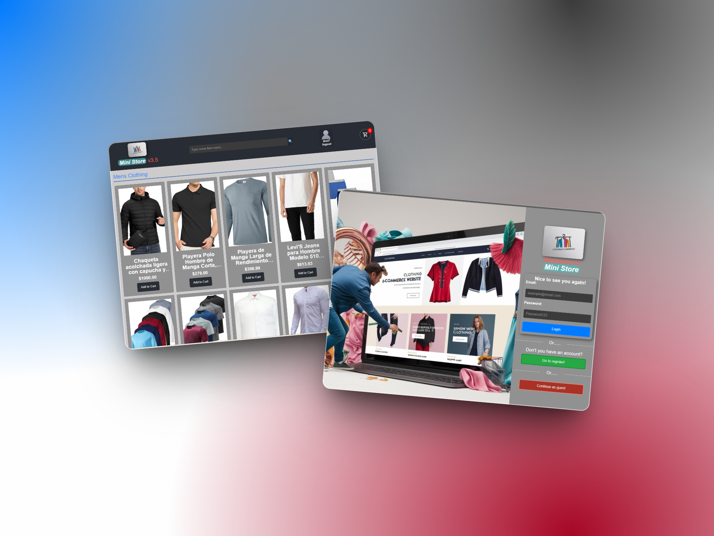

# E-commerce Completo (Full-Stack)

## Preview

[](https://reactjs.org/)
[](https://www.djangoproject.com/)
[](https://redux-toolkit.js.org/)
[](https://www.django-rest-framework.org/)



Una aplicación de e-commerce full-stack moderna que utiliza React para el frontend (con gestión de estado de Redux) y Django REST Framework para el backend.

## 📋 Tabla de Contenidos

- [Arquitectura del Sistema](#-arquitectura-del-sistema)
- [Componentes Centrales (Estado de Redux)](#-componentes-centrales-estado-de-redux)
- [Stack Tecnológico](#-stack-tecnológico)
- [Características (Features)](#-características-features)
- [Instalación](#-instalación)
- [Documentación](#-documentación)

## 🏗 Arquitectura del Sistema

La aplicación sigue una arquitectura cliente-servidor con una clara separación de responsabilidades:

* **Frontend:** Una Single-Page Application (SPA) en React.
* **Backend:** Una API RESTful construida con Django REST Framework.
* **Comunicación:** Interacción vía HTTP, con autenticación basada en JWT.
* **Estado (Frontend):** Gestión de estado centralizada con Redux Toolkit.
* **Enrutamiento (Frontend):** Enrutamiento del lado del cliente con React Router.

## 🧩 Componentes Centrales (Estado de Redux)

El estado de la aplicación frontend se divide en *slices* de Redux para una gestión modular:

| Slice            | Propósito Principal                                                                |
| ---------------- | ----------------------------------------------------------------------------------- |
| `userSlice`    | Gestiona la autenticación, tokens (JWT) y perfil del usuario.                      |
| `productSlice` | Maneja la lista de productos, búsqueda y estado de carga.                          |
| `cartSlice`    | Administra los ítems en el carrito de compras (sincronizado con `localStorage`). |
| `orderSlice`   | Gestiona el proceso de creación de órdenes y el estado de checkout.               |
| `addressSlice` | Maneja el CRUD de las direcciones de envío del usuario.                            |

## 🛠 Stack Tecnológico

### Frontend Technologies

| Technology        | Purpose                       |
| ----------------- | ----------------------------- |
| React 18          | UI framework                  |
| Redux Toolkit     | State management              |
| React Router      | Client-side routing           |
| Axios             | HTTP client with interceptors |
| styled-components | CSS-in-JS styling             |

### Backend Technologies

| Technology                    | Purpose                |
| ----------------------------- | ---------------------- |
| Django 4.x                    | Web framework          |
| Django REST Framework         | REST API               |
| djangorestframework-simplejwt | JWT authentication     |
| django-cors-headers           | CORS handling          |
| SQLite                        | Database (development) |

### Data Collection

| Technology    | Purpose            |
| ------------- | ------------------ |
| Selenium      | Browser automation |
| BeautifulSoup | HTML parsing       |

## ✨ Características (Features)

* **Autenticación JWT:** Flujo completo de login, registro y refresco de token automático mediante interceptores de Axios.
* **Pipeline de Datos de Producto:** Los productos se obtienen mediante un script de scraping (Selenium/BeautifulSoup) de Amazon México.
* **Proceso de Checkout Seguro:** El cálculo del precio total se fuerza en el backend para prevenir manipulación del cliente.
* **Persistencia de Estado:** El carrito de compras (`cartSlice`) y el token de refresco se persisten en `localStorage`.

### 🔐 Autenticación (User Slice)

El `userSlice` maneja el estado de autenticación del usuario.

```javascript
// Fuente: 01-frontend/mini-store/src/redux/slices/userSlice.js
// (Fragmento representativo)
const userSlice = createSlice({
  name: 'user',
  initialState: {
    currentUser: null,
    accessToken: null,
    status: 'idle', // 'idle' | 'loading' | 'succeeded' | 'failed'
    error: null
  },
  reducers: {
    logout: (state) => {
      state.currentUser = null;
      state.accessToken = null;
      localStorage.removeItem('refresh');
    },
    // ...otros reducers y extraReducers (fetchUser, createUser, etc.)
  }
});
```

## 📦 Instalación

### Backend (Django)

**Bash**

```bash
# Navegar a la carpeta del proyecto backend
cd 02-backend/ecommerce_project

# Instalar dependencias
pip install -r requirements.txt

# Aplicar migraciones
python manage.py migrate

# Iniciar el servidor
python manage.py runserver
```

> Nota
>
> Para cargar los productos a la DB, utilizar el fixture en e-commerce-completo\02-backend\ecommerce_project\product\fixtures\Product.json
>
> python manage.py loaddata product\fixtures\Product.json

### Frontend (React)

**Bash**

```bash
# Navegar a la carpeta del proyecto frontend
cd 01-frontend/mini-store

# Instalar dependencias
npm install

# Iniciar el servidor de desarrollo
npm start
```

## 📝 Documentación

> [!Note]
> Puedes consultar la documentación completa, indexada y generada por DeepWiki [aquí](https://deepwiki.com/YisusDU/e-commerce-completo).
